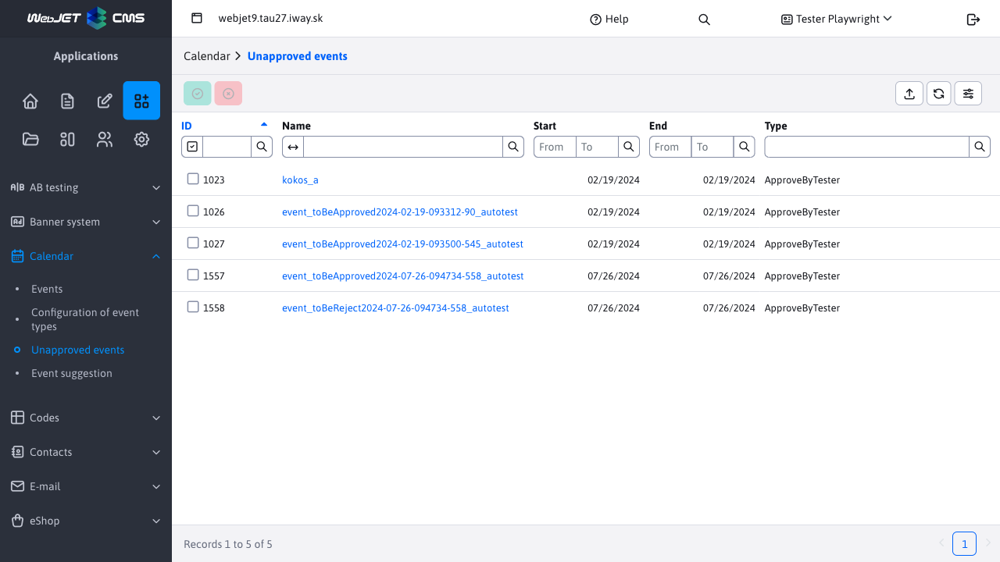
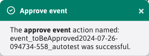
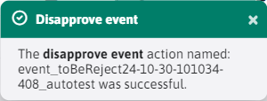

# Unapproved events

The Calendar Events -> Unapproved Events section is used for the approval/rejection process of calendar [events](../README.md) that are waiting for approval. The currently logged in user can only see/approve events that are waiting for approval and is their approver. Who approves the event is determined by the [event type](../calendar-types/README.md).

!>**Note:** once an event is approved/rejected, it will no longer **be displayed** in the Unapproved Events section, so you will not be able to change your choice. However, the event will still be visible in the [Event List](../README.md) section.

## Event approval

Event approval is triggered by the  button. Upon successful approval, an informative message will be displayed.

## Disapproval (rejection) of an event

Rejecting an event is triggered by the . After successful rejection, an informative message is displayed.

