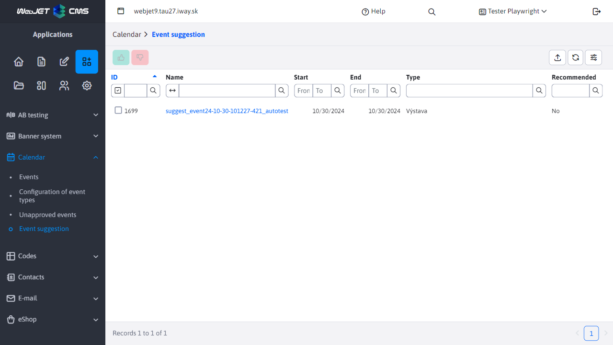
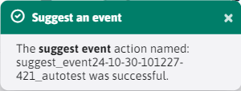

# Event recommendation

The Calendar Events -> Recommended Events section is used for the process of recommending/not recommending calendar [events](../README.md).

It shows events that are approved (automatically or by the administrator) and whose start date is in the future.

**Warning:** after the recommendation/non-recommendation, the event continues to **will display** in the table so that their recommendation status can be changed. However, when the start of the event gets into the past, **stop displaying**. However, events will still be visible in the [List of events](../README.md)
## Event recommendation

The event recommendation is triggered by the button . After a successful recommendation, an informative message will be displayed.

## Non-recommendation of the event

The non-reject event is triggered by the button . An informative message will be displayed after a successful non-recommendation.

