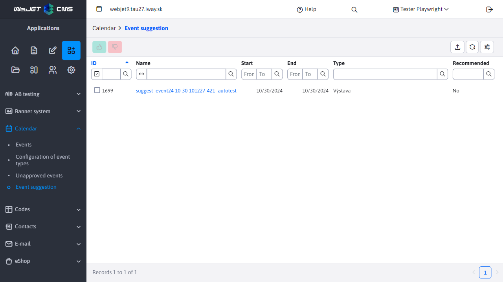
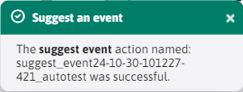
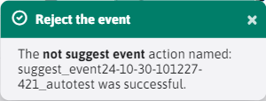

# Event recommendation

The Calendar Events -> Recommended Events section is used for the process of recommending/not recommending calendar [events](../README.md).

Events that are approved (automatically or by an administrator) and whose start time is in the future are displayed.

!>**Note:** after recommending/not recommending, the event will still **be displayed** in the table, so their recommendation status can be changed. However, once the event's start time is in the past, they will **stop being displayed**. However, the events will still be visible in the [Event List](../README.md)

## Event recommendation

Event recommendation is triggered by the  button. After a successful recommendation, an informative message will be displayed.

## Event deprecation

The event is not recommended by pressing the . After a successful not recommendation, an informative message will be displayed.

