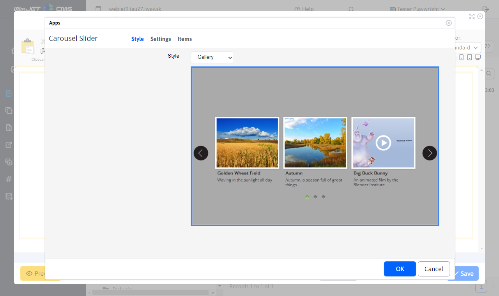
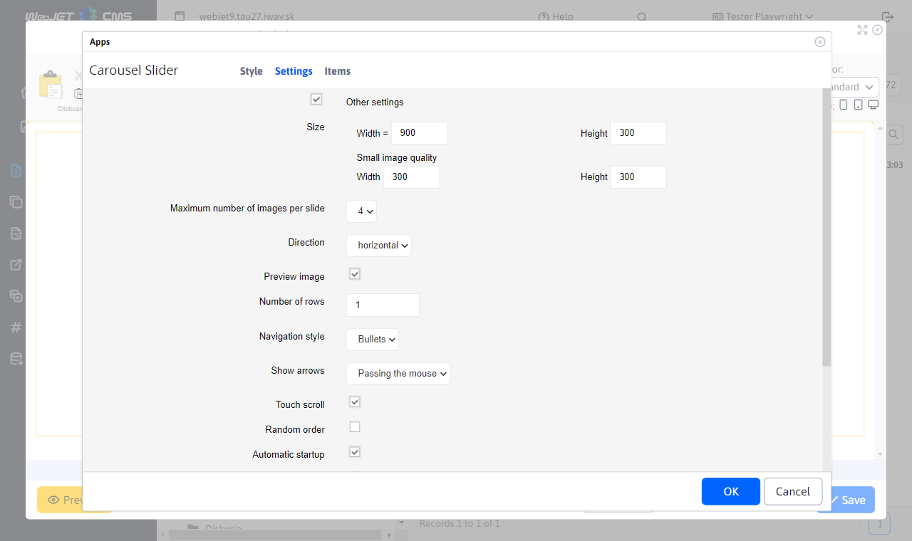
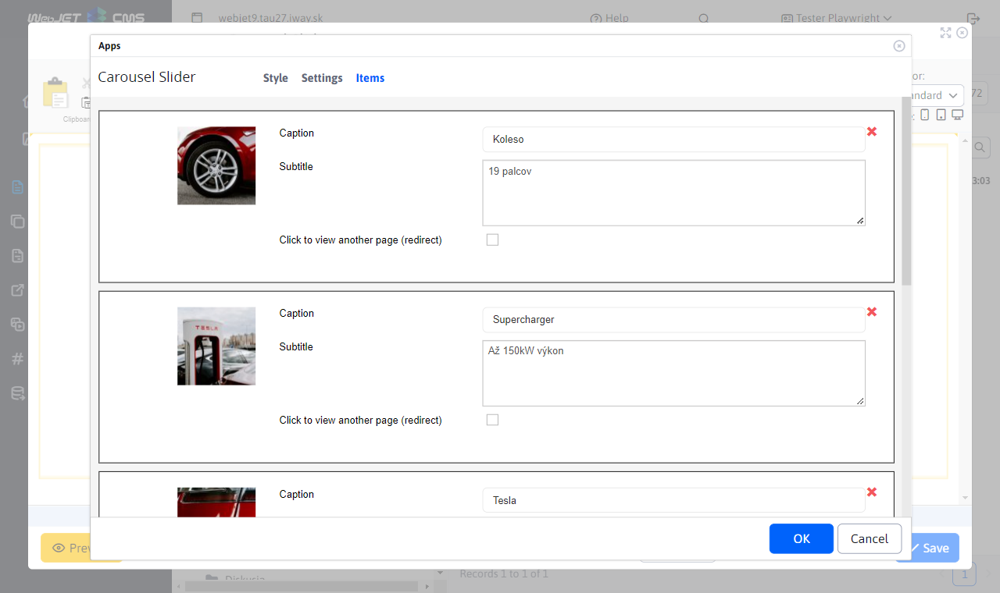
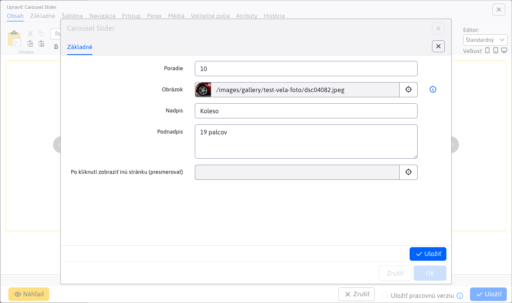
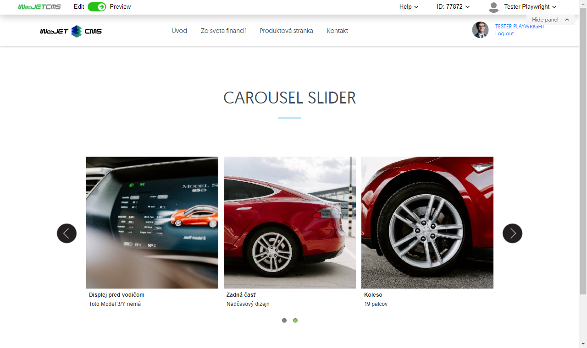

# Carousel Slider

Bring your page to life with an interactive image carousel. Click on a small version of the photo to see a larger version of the original, adding interest and interactivity. Choose from a wide range of design styles that can also include headlines and additional text. Interest and engage your visitors with eye-catching image slideshows.

## Application settings

Available cards:
- **Generated CSS styles**
- **Expanded**
- **Items**

### Generated CSS styles

In this section, you can choose the style of the Carousel Slider application.

### Expanded

In this section you can set advanced settings:
- **Dimensions**
  - Width
  - Height
- **Small image quality**
  - Width
  - Height
- Maximum number of images per slide
- Direction (horizontal, vertical)
- Image preview
- Number of lines
- Navigation style (none, bullets)
- Show arrows (none, always, on mouseover)
- Scroll by touch
- Random order
- Automatic start
- Pause on mouseover
- Circular display
- Show shadow
- Loop (continuously, stop after cycle)
- Interval

### Items

In this section you can see and manage the application items, so classic actions like add/edit/delete...

You can set the following parameters for each item:
- **Image**, image selection using the explorer is supported, as well as direct entry of the image path
- **Title**, picture caption
- **Subtitle**, image caption
- **Click to view another page (redirect)**, select the page you will be redirected to (direct path entry is also supported)

## View application

