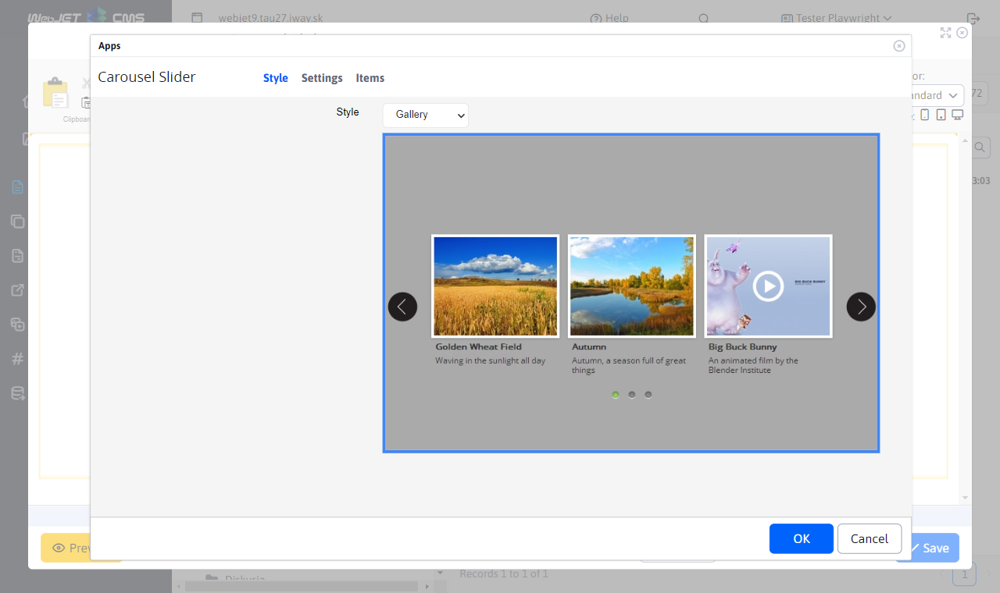
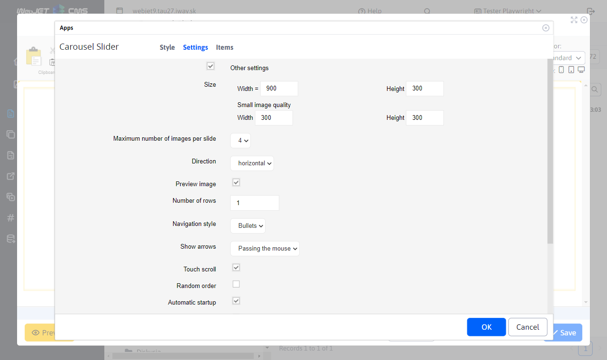
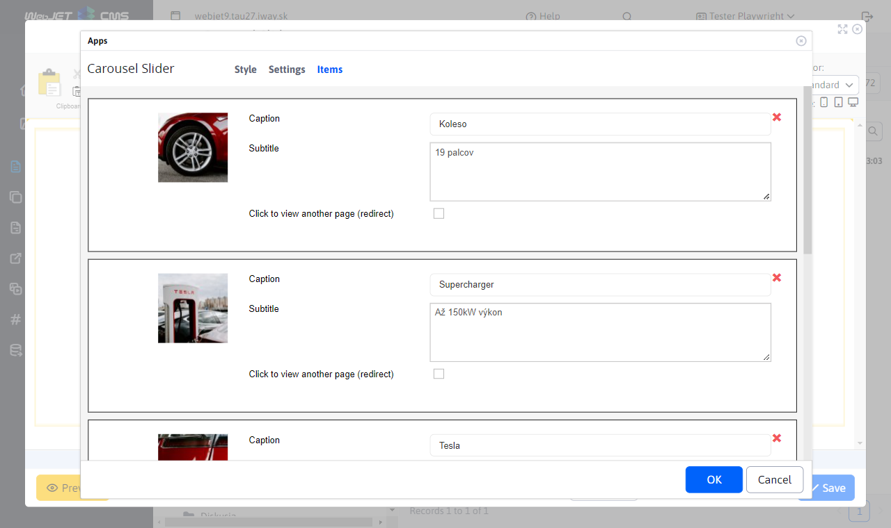
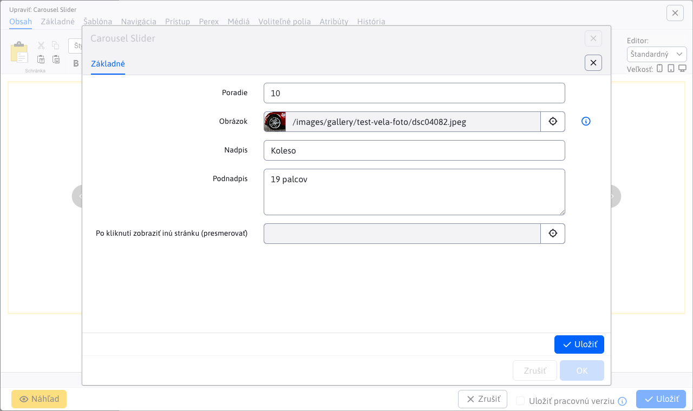
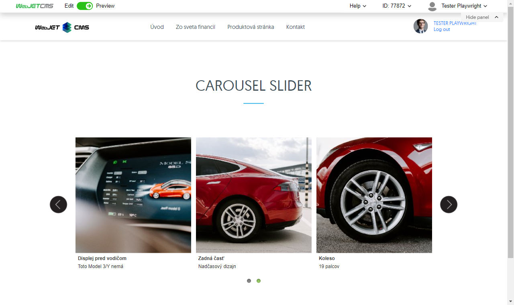

# Carousel Slider

Bring your page to life with an interactive image carousel. Clicking on a small version of a photo will reveal a larger version of the original, adding interest and interactivity. Choose from a wide range of design styles, which can also include headings and additional text. Engage and engage your visitors with eye-catching image slideshows.

## Application settings

Available cards:

- **Generated CSS styles**
- **Advanced**
- **Items**

### Generated CSS styles

In this section, you can choose the style of the Carousel Slider application.

### Advanced

In this section, you can set advanced settings:

- **Dimensions**
  - Width
  - Height
- **Small image quality**
  - Width
  - Height
- Maximum number of images per slide
- Direction (horizontal, vertical)
- Image preview
- Number of lines
- Navigation style (none, bullets)
- Show arrows (none, always, on mouseover)
- Touch scrolling
- Random order
- Automatic start
- Pause on mouseover
- Circular display
- Show shadow
- Loop (continuous, stop after cycle)
- Interval

### Items

In this section, you can see and manage application items, so classic actions like adding/editing/deleting...

You can set the following parameters for individual items:

- **Image**, image selection using explorer is supported, as well as direct entry of the image path
- **Title**, image title
- **Subtitle**, subtitle of the image
- **When clicked, display another page (redirect)**, select the page to which you will be redirected (direct path entry is also supported)

## View the application

