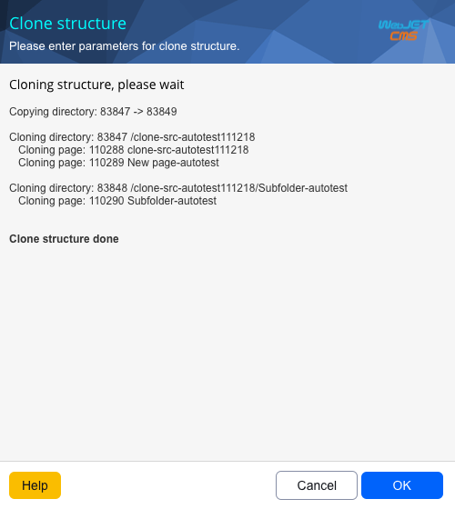
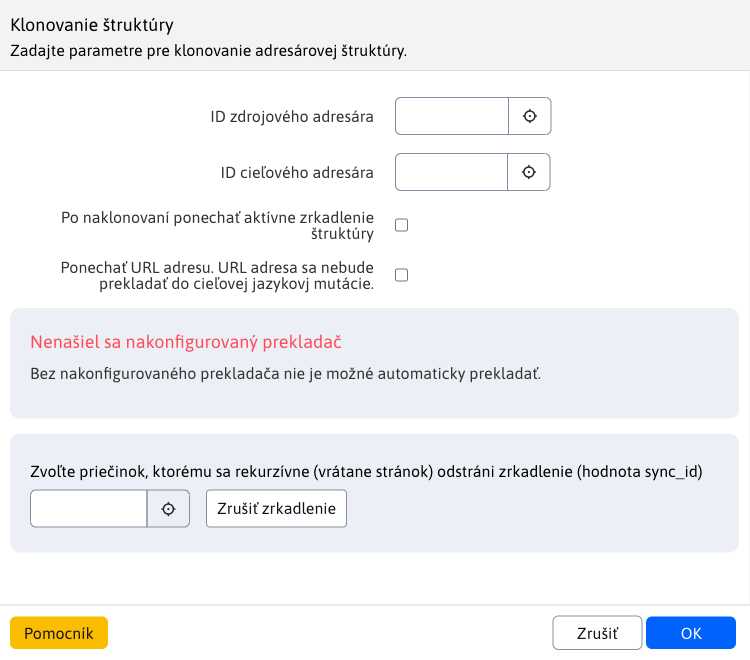
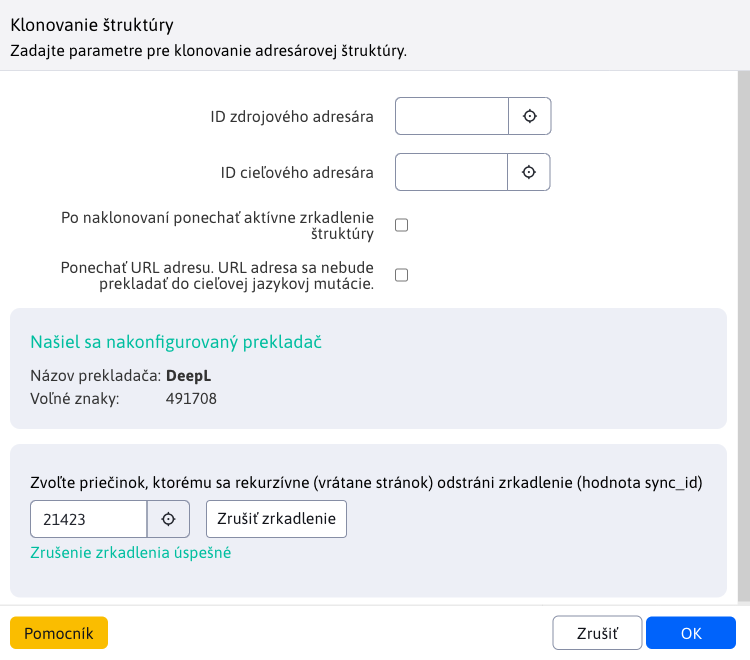

# Cloning structure

Using Structure Cloning, we can clone the entire contents of a directory in pages to another directory without having to recreate the entire directory structure. This option is available in the **Web pages** Like **Cloning structure**. When you select this option, the cloning action window appears. It is typically used to create a new language version of a web site from an existing version. The language is taken from the source and destination folder settings.

To perform the cloning action, you need to specify the source folder ID (which folder to clone) and the destination folder ID (where to clone the source folder to). You can specify the folder IDs directly if you remember them, or you can use the **Select**, which opens a new window with a tree structure of folders, where you can select a specific folder by clicking on its name.

Cloning itself uses [Mirroring the structure](../docmirroring/README.md) a [Automatic translation](../../../admin/setup/translation.md). This means that when you start cloning, the selected folders (if they are not already) are automatically linked by the configuration variable `structureMirroringConfig`. From the source folder, all sub-folders (and all their nestings) and web pages are cloned into the destination folder, with the original and cloned folders/pages being linked together. The language is taken from the settings of the source and destination folders. Also, these folders/pages are also automatically translated if a translator is set up.

## Options

### Source directory ID

Set the ID of the folder to clone from.

### Destination directory ID

Set the ID of the folder to clone to. In this folder, pages and sub-folders will be created according to the source folder.

### Keep mirroring active

If you choose the option **After cloning, leave active mirroring of the structure** preserves the set [mirroring](../docmirroring/README.md) between the source and destination folders. Then when a new folder or web page is created it will be transferred between the mirrored folders.

You can also disconnect the setting later by editing the conf. variable `structureMirroringConfig` from which you delete the row with the set folder IDs.

### Leave URL

By selecting the option **Leave URL** it is safe to assume that the URL of pages and folders will not be translated into the language of the destination folder. This means that the new language mutation will have **the same URLs but a different prefix with which these URLs begin**.

Example: let's have folders SK (with Slovak language set) and EN (with Slovak language set). The SK folder contains a sub-folder **Property** which has a main page with the same name. The address of such a page is **/sk/majetok/**. If we use the cloning structure **without leaving the URL**, from the SK folder to the EN folder, a copy of this page will have the URL **/en/property/**. If we use the cloning structure **leaving the URL**, from the SK folder to the EN folder, a copy of this page will have the URL **/en/majetok/**. As we can see, the url has not been translated, only the prefix has changed from /sk to /en, which represents the parent folder.

## Translator

Since cloning uses [Automatic translation](../../../admin/setup/translation.md), it shows what translator is configured and how many free characters are left for translation. If no translator is configured (e.g., if the license key for the translator is not entered `DeepL`) or there are no free characters left to translate, we will be alerted when cloning. In this case **will not** automatically translate the cloned structure.

## Cancellation of mirroring

The window offers the option [cancel mirroring](../docmirroring/README.md) the selected folder. Just select the folder at the bottom of the window and press the <button class="btn btn-sm btn-outline-secondary" type="button">Cancel mirroring</button>. Then the value for the selected folder, all subfolders and their pages is deleted. `sync_id` which provided mirroring.

!>**Warning:** during a mirroring action, it will not be possible to start cloning, as these actions would interfere with each other.
