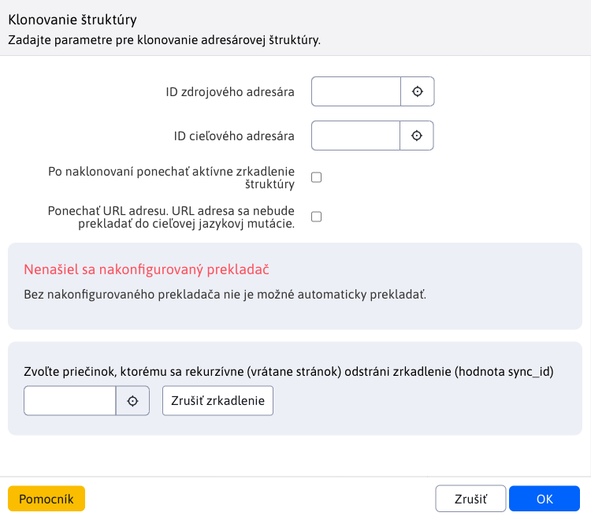
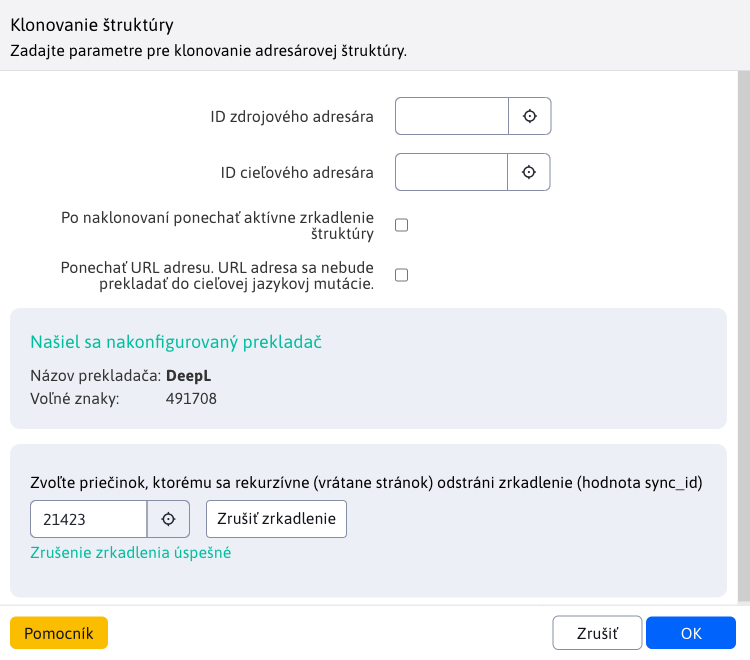

# Cloning a structure

Using Structure Cloning, we can clone the entire contents of a directory in the site to another directory without having to recreate the entire directory structure. This option is available in the **Websites** section as **Structure Cloning**. After selecting this option, a window for cloning actions will appear. Typically, it is used to create a new language mutation of a website from an existing version. The language is taken from the source and target folder settings.


To perform a cloning action, you need to enter the source folder ID (which folder you are cloning) and the destination folder ID (where the source folder is being cloned to). You can enter the folder IDs directly if you remember them, or you can use the **Select** option, which opens a new window with a folder tree structure, where you select a specific folder by clicking on its name.

The cloning itself uses [Structure Mirroring](../docmirroring/README.md) and [Automatic Translation](../../../admin/setup/translation.md). This means that when cloning is started, the selected folders (if they are not already) are automatically linked using the configuration variable ```structureMirroringConfig```. All subfolders (including all their nesting) and web pages are cloned from the source folder to the target folder, with the original and cloned folders/pages being linked to each other. The language is taken from the settings of the source and target folders. These folders/pages are also automatically translated if a translator is set.

## Options

### Source directory ID

Set the ID of the folder to clone from.

### Destination directory ID

Set the ID of the folder to clone to. In this folder, pages and subfolders will be created based on the source folder.

### Keep mirroring active

If you select the option **Keep structure mirroring active after cloning**, the set [mirroring](../docmirroring/README.md) between the source and target folders will be preserved. Subsequently, when a new folder is created, or a web page is transferred between the mirrored folders.

You can also undo the setting later by editing the config variable `structureMirroringConfig` and deleting the line with the set folder IDs.

### Keep URL address

By selecting the **Keep URL** option, you are ensuring that the URLs of pages and folders will not be translated into the target folder's language variant. This means that the new language variant will have **the same URLs but a different prefix that they start with**.

Example:
Let's have folders SK (with Slovak language set) and EN (with Slovak language set).
The SK folder contains a subfolder **assets**, which has a main page with the same name. The address of such a page is **/sk/assets/**.
If we use structure cloning **without leaving the URL**, from the SK folder to the EN folder, the copy of this page will have the URL **/en/property/**.
If we use the structure cloning **while keeping the URL**, from the SK folder to the EN folder, the copy of this page will have the URL **/en/majetok/**. As we can see, the url was not translated, only the prefix was changed from /sk to /en, which represents the parent folder.


## Translator

Since cloning uses [Automatic translation](../../../admin/setup/translation.md), information is displayed about which translator is configured and how many free characters are left for translation. If no translator is configured (e.g. if the license key for translator `DeepL` is not specified) or there are no free characters left for translation, we will be notified when cloning. In this case, the cloned structure **will** not be automatically translated.



## Canceling mirroring

The window offers the option to [cancel mirroring](../docmirroring/README.md) the selected folder. Simply select the folder at the bottom of the window and press the <button class="btn btn-sm btn-outline-secondary" type="button">Cancel mirroring</button> button. The value `sync_id` that provided mirroring for the selected folder and all subfolders as their pages will then be deleted.



!>**Warning:** During the unmirroring action, cloning cannot be started, as these actions would conflict with each other.