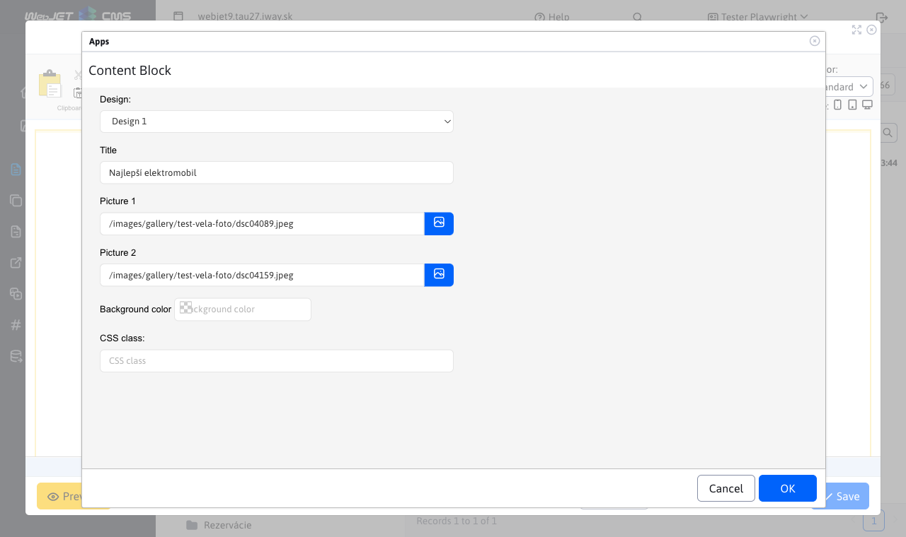
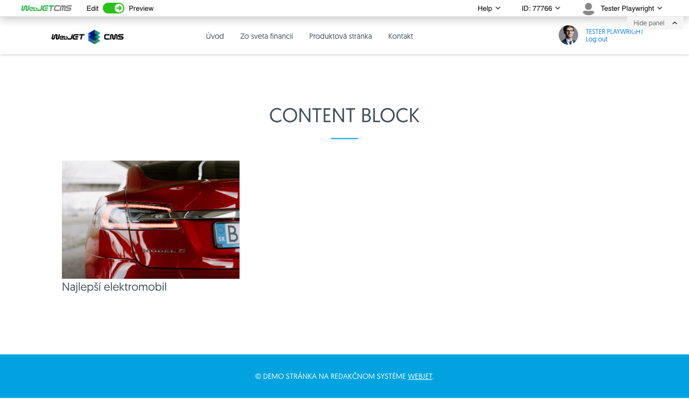

# Content Block

It is used to insert prepared HTML code. You enter basic data such as title, image, color and a defined block of HTML code is generated in the page. The code block will be prepared by the web designer according to your requirements.

## Application settings

In this section it is possible to set:
- Design
- Title
- Image1
- Figure 2
- Background colour
- CSS class

## View application

