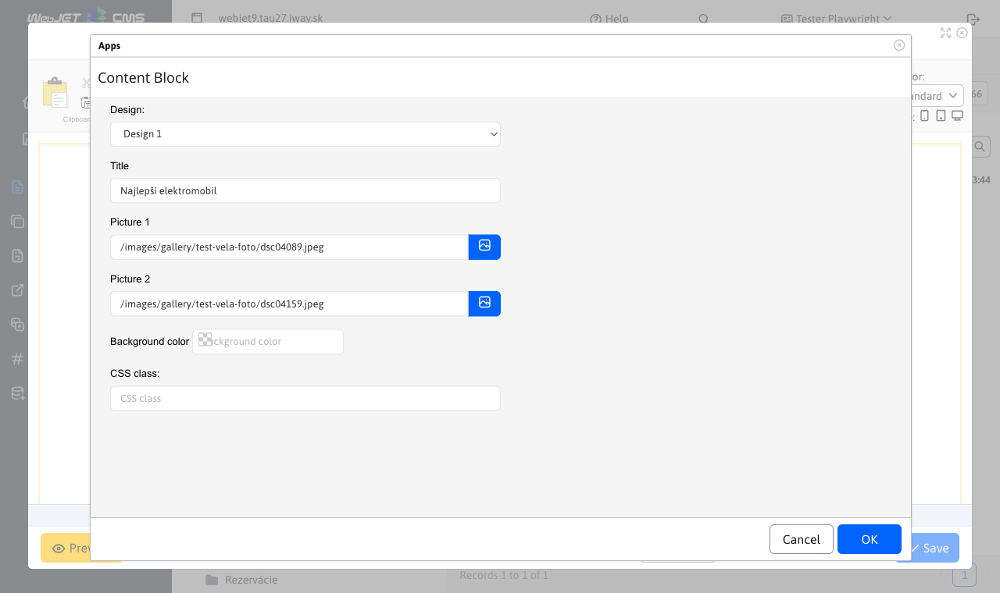
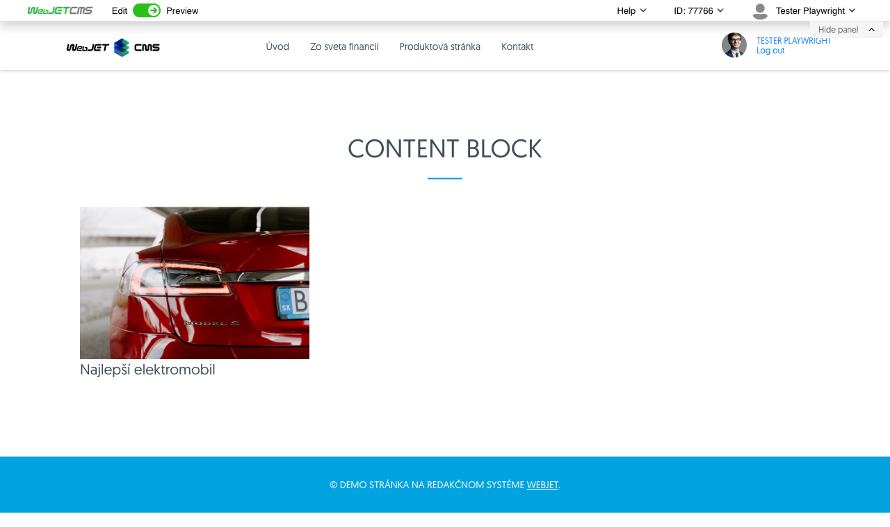

# Content Block

It is used to insert prepared HTML code. You enter basic data such as title, image, color and a defined block of HTML code is generated on the page according to the selected type. The code for the block will be prepared for you by the website designer according to your requirements.

## Application settings

In this section you can set:
- Design
- Title
- Figure 1
- Figure 2
- Background color
- CSS class

## View the application

## Setting

The total number of available blocks can be set in the configuration variable `contentBlockTypeCount`, set to `5` by default.
