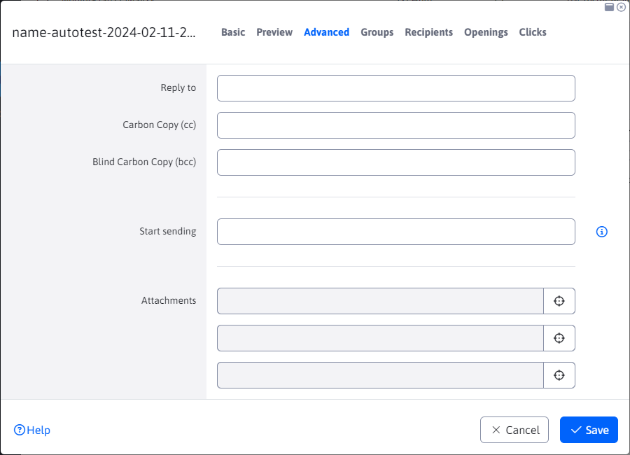
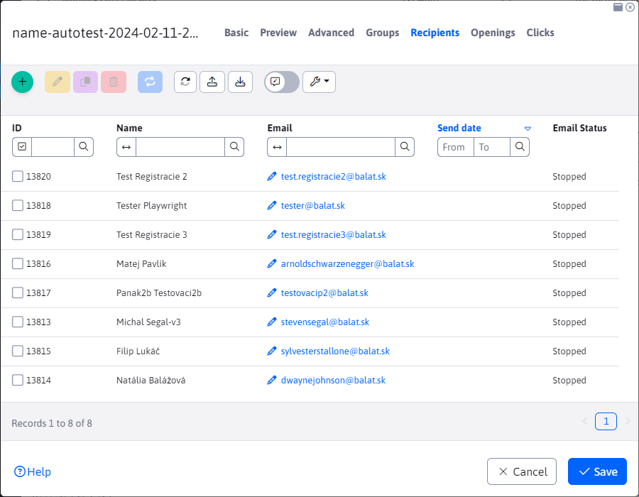
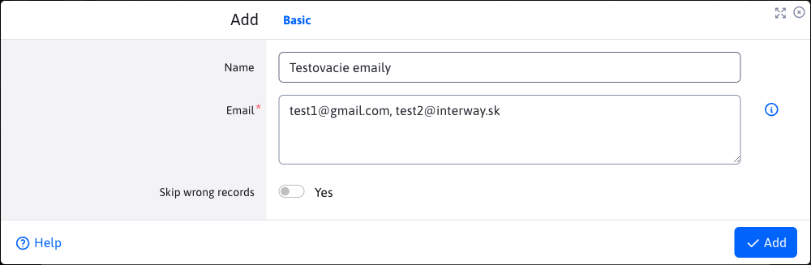
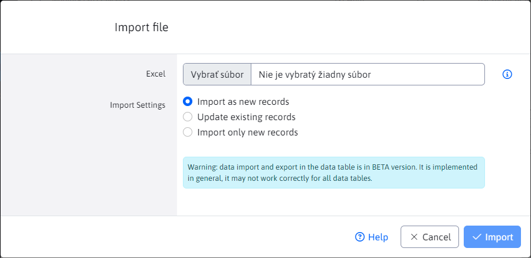
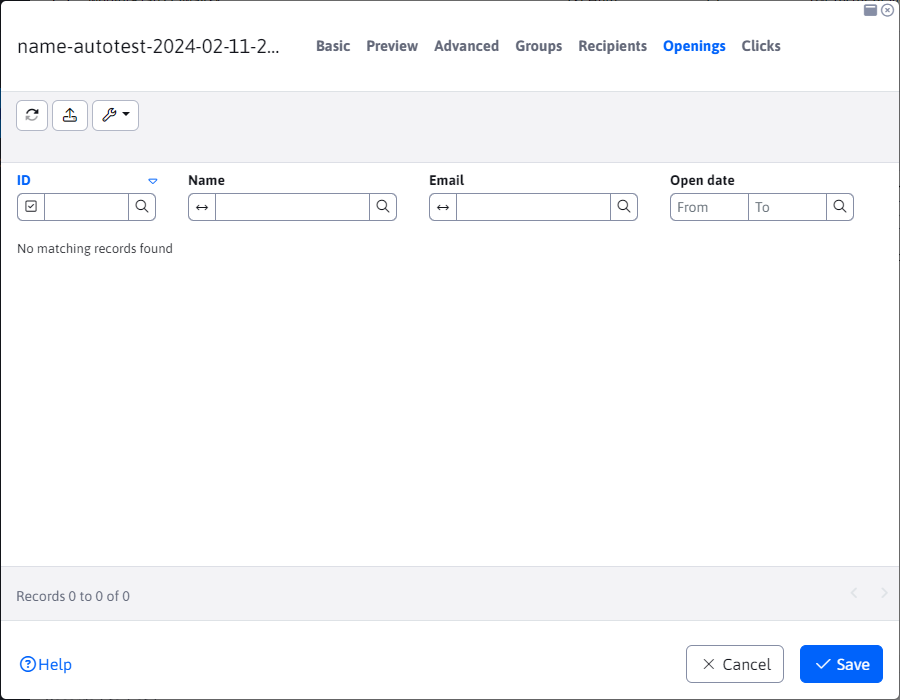

# Campaigns

The bulk email app allows you to send bulk **personalised** email messages to multiple users. Each message is sent separately, individual recipients do not see the email addresses of other recipients.

The advantage is that every email can be personalized - if you put the !name! the recipient's real name will be inserted instead.

Email can be sent to visitors who are registered in the admin part of the Web JET system, or create a file with a list of names and email addresses and then import them as email recipients.

## Tab - Basic

When creating a new record, we have only one tab to choose from with the basic information we need to fill in, namely "Subject" and "Web page". The sender details will be filled in automatically according to the logged in user, but you can of course change them.

The text of the email is taken from the selected web page (including its design). We recommend creating a folder in the Web pages section, e.g. `Newsletter` with the appropriate template set. In this folder, first create a web page with the text of the email and then select it in the campaign.

You can insert the following tags in the text of the web page to insert user data:
- `!RECIPIENT_NAME!` - name and surname of the recipient
- `!RECIPIENT_EMAIL!` - email address of the recipient
- `!EMAIL_ID!` - unique email ID

If the recipient is from the WebJET CMS user database it is also possible to use other tags of the registered user:
- `!LOGGED_USER_NAME!` - first and last name (if conf. variable `fullNameIncludeTitle` set to true includes the title)
- `!LOGGED_USER_FIRSTNAME!` - name
- `!LOGGED_USER_LASTNAME!` - surname
- `!LOGGED_USER_TITLE!` - title
- `!LOGGED_USER_LOGIN!` - login name
- `!LOGGED_USER_EMAIL!` - email address
- `!LOGGED_USER_COMPANY!` - firm
- `!LOGGED_USER_CITY!` - city
- `!LOGGED_USER_ADDRESS!` - address (street)
- `!LOGGED_USER_COUNTRY!` - state
- `!LOGGED_USER_PHONE!` - telephone
- `!LOGGED_USER_ZIP!` - POSTCODE
- `!LOGGED_USER_ID!` - User ID
- `!LOGGED_USER_BIRTH_DATE!` - date of birth
- `!LOGGED_USER_FIELDA!` - free field A
- `!LOGGED_USER_FIELDB!` - free field B
- `!LOGGED_USER_FIELDC!` - free field C
- `!LOGGED_USER_FIELDD!` - free field D
- `!LOGGED_USER_FIELDE!` - free field E
- `!LOGGED_USER_GROUPS!` - list of user groups

## Card - Advanced

You can set the email message fields for reply, copy and hidden copy.

If you enter a date in the start date field, the emails will start sending after the specified time (so you can schedule your email campaign in advance).

You can attach up to 3 attachments (files) to your email.

## Card - Groups

In the Groups tab, selecting/checking a specific user group will **after saving the campaign** add users belonging to these groups as recipients. Which means they will receive emails from this campaign.

Actions to watch out for:
- when changing the list of beneficiaries, it is necessary **re-save the campaign** (if it has not been saved yet), for correct counting of recipients and sent emails.
- if you change the recipient list AFTER the emails are sent, the resulting statistics will not be correct and may give the impression of a sending problem.
When the campaign is saved, the real list of recipients and already sent emails is calculated from the database table `emails`.

## Tab - Beneficiaries

In the Recipients tab we can see a summary of all recipients who will receive the campaign emails. Recipients can be added, duplicated or deleted using the buttons in the table. When inserting a record via the button `+` you can enter multiple email addresses separated by a comma, semicolon or newline.

Note: the recipient list is treated against duplicate emails. When importing/adding an existing email, it will be skipped. Also, it is not possible to add an email address to a campaign that is in the list [Unsubscribed emails](../unsubscribed/README.md).

### Email status

Important is the "Email Status" column which can contain values:
- New - newly added email, you need to save the campaign to add this email to the campaign.
- Saved - the email is saved, waiting in the queue to be sent
- Sent - the email is sent, the exact date and time the email was sent is stored in the Send Date column
- Stopped - the email is ready to send, select the campaign in the campaign list table and click the button `Spustiť odosielanie` to send an email.
- Sending error - the number of attempts to send an email was exceeded (default 3 attempts). Either the email is incorrect or there is another error in the campaign.

### Manual addition

To manually add emails to your campaign, click on the "Add" button. The "Email" field is required, in which you must enter one or more emails separated by a comma, semicolon or newline. The entered emails will then be added to the recipients of the campaign.

The "Name" field is optional. If you do not fill it in, the recipient's name will be retrieved from the user database based on an email match (if any). If no such email is found in the database, the value "- -" is inserted as the name. If you fill in the "Name" field, it will be set to all the emails you are currently entering via the "Email" field.

### Import from xlsx

You can import recipients in bulk from an xlsx file by standard import.

In excel in the first line you need to have the following names defined:
- `Meno|recipientName` - name and surname of the recipient
- `E-mail|recipientEmail` - email address of the recipient

Note: you can get the correct import file simply by exporting the recipients. You can then delete the ID column and fill in the names and email addresses for the import of the recipients.

## Tab - Openings

The open tab records the recipient opening the email. This is done using an embedded image. Not all recipients will confirm the image has been retrieved from the server, so the list is not complete.

## Tab - Clicks

Displays a list of clicks on a link in an email. A recipient can click on a link multiple times, so multiple clicks from a single recipient can be recorded in the table.

