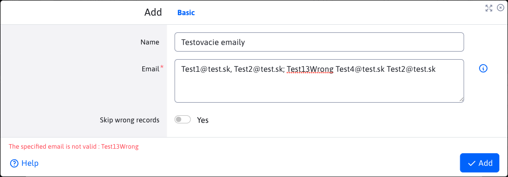
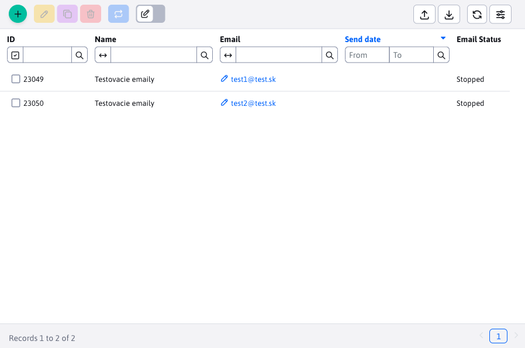
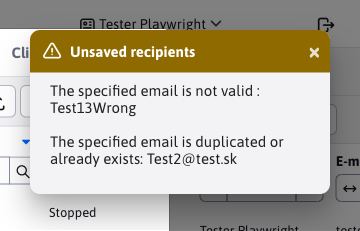
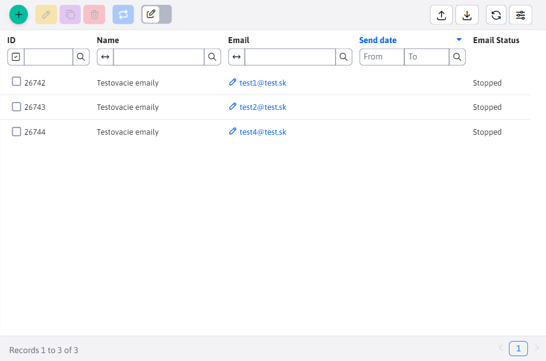

# Campaigns

The bulk email app allows you to send bulk **personalised** email messages to multiple users. Each message is sent separately, individual recipients do not see the email addresses of other recipients.

The advantage is that each email can be personalised - if you put a tag in the body of the email `!name!` the recipient's real name is inserted instead.

Email can be sent to visitors who are registered in the admin part of the Web JET system, or create a file with a list of names and email addresses and then import them as email recipients.

## Basic

When creating a new record, we have in the tab **Basic** there is only one tab to choose from with the basic information we need to fill in, namely "Subject" and "Web page". The sender details will be filled in automatically according to the logged in user, but you can of course change them.

The text of the email is taken from the selected web page (including its design). We recommend creating a folder in the Web pages section, e.g. `Newsletter` with the appropriate template set. In this folder, first create a web page with the text of the email and then select it in the campaign.

You can insert the following tags in the text of the web page to insert user data:
- `!RECIPIENT_NAME!` - name and surname of the recipient
- `!RECIPIENT_EMAIL!` - email address of the recipient
- `!EMAIL_ID!` - unique email ID

If the recipient is from the WebJET CMS user database it is also possible to use other tags of the registered user:
- `!LOGGED_USER_NAME!` - first and last name (if conf. variable `fullNameIncludeTitle` set to true includes the title)
- `!LOGGED_USER_FIRSTNAME!` - name
- `!LOGGED_USER_LASTNAME!` - surname
- `!LOGGED_USER_TITLE!` - title
- `!LOGGED_USER_LOGIN!` - login name
- `!LOGGED_USER_EMAIL!` - email address
- `!LOGGED_USER_COMPANY!` - firm
- `!LOGGED_USER_CITY!` - city
- `!LOGGED_USER_ADDRESS!` - address (street)
- `!LOGGED_USER_COUNTRY!` - state
- `!LOGGED_USER_PHONE!` - telephone
- `!LOGGED_USER_ZIP!` - POSTCODE
- `!LOGGED_USER_ID!` - User ID
- `!LOGGED_USER_BIRTH_DATE!` - date of birth
- `!LOGGED_USER_FIELDA!` - free field A
- `!LOGGED_USER_FIELDB!` - free field B
- `!LOGGED_USER_FIELDC!` - free field C
- `!LOGGED_USER_FIELDD!` - free field D
- `!LOGGED_USER_FIELDE!` - free field E
- `!LOGGED_USER_GROUPS!` - list of user groups

## Advanced

In the charts **Advanced** you can set the email message fields for reply, copy and hidden copy.

If you enter a date in the start date field, the emails will start sending after the specified time (so you can schedule your email campaign in advance).

You can attach up to 3 attachments (files) to your email.

## Groups

In the charts **Groups** selecting/checking a specific user group will **after saving the campaign** add users belonging to these groups as recipients. Which means they will receive emails from this campaign.

Actions to watch out for:
- when changing the list of beneficiaries, it is necessary **re-save the campaign** (if it has not been saved yet), for correct counting of recipients and sent emails.
- if you change the recipient list AFTER the emails are sent, the resulting statistics will not be correct and may give the impression of a sending problem.

When the campaign is saved, the real list of recipients and already sent emails is calculated from the database table `emails`.

## Beneficiaries

In the charts **Beneficiaries** we can see an overview of all recipients who will receive the campaign emails. Recipients can be added, edited, duplicated or deleted in the table.

!>**Warning,** the list of recipients is treated against certain non-conforming values:
- Duplication protection, checking for duplication in the entered emails as well as with those already existing in the campaign
- protection against inappropriate email, the email must comply with the standard format **meno@domena.sk** (special exception for [Import from xlsx](#import-from-xlsx))
- protection against unsubscribed emails, it is not possible to add a recipient whose email address is in the list [Unsubscribed emails](../unsubscribed/README.md)

### Email status

Important is the "Email Status" column which can contain values:
- New - newly added email, you need to save the campaign to add this email to the campaign.
- Saved - the email is saved, waiting in the queue to be sent
- Sent - the email is sent, the exact date and time the email was sent is stored in the Send Date column
- Stopped - the email is ready to send, select the campaign in the campaign list table and click the button **Start sending** to send an email.
- Sending error - the number of attempts to send an email was exceeded (default 3 attempts). Either the email is incorrect or there is another error in the campaign.

### Manual addition

To manually add emails to your campaign, click on the "Add" button. Required is the "Email" field, in which you must enter one or more emails separated by **comma, semicolon, space or newline**. You can use multiple types of compartments at the same time, such as. `test1@test.sk, test2@test.sk; test3@test.sk  test4@test.sk`. The entered emails will then be added to the recipients of the campaign.

Field **Name** is optional. If you do not fill it in, the recipient's name will be retrieved from the user database based on an email match (if any). If there is no such email in the database, the value is inserted as the name `- -`. If the field **Name** you fill in, it will be set to all the emails you are currently entering via the field **E-mail**.

Manual addition offers the possibility **Skip erroneous entries**. If you enter E-mail as `Test1@test.sk, Test2@test.sk; Test13Wrong Test4@test.sk Test2@test.sk` and the option to Skip erroneous records **is switched off**, adding recipients stops at the first non-compliant value and an error is displayed:

The save ended on the third email `Test13Wrong` due to a value in the wrong format. The previous two emails were satisfactory and were saved (you can reload the data in the table to view it).

**If the option is on**, the non-compliant values are skipped and a notification is displayed telling you which values were not saved and why:

Since only 3 of the 5 emails were matched, only 3 recipients were added to the campaign.

### Import from xlsx

The bulk way to add/update recipients is via a standard import of recipients from an xlsx file.

In the file in the first line you need to have the following names defined:
- `Meno|recipientName` - name and surname of the recipient
- `E-mail|recipientEmail` - email address of the recipient

You can get the correct import file simply by exporting the recipients. You can then delete the ID column and fill in the names and email addresses for importing the recipients.

!>**Warning:**

- Importing from an xlxs file does not support adding multiple emails in one cell as in the case of manual addition. There must only ever be one email address in a cell.
- Importing from an xlxs file supports the email format exception. When manually adding, each mail must have the format **meno@domena.sk**. However, if you are copying emails from e.g. Outlook, the copied value may have the format `"Ján Tester <jan_tester@test.com>"`. If the value contains characters `<>`, **(in that exact order)**, the value in between shall be used. In this case, it would just be the value `jan_tester@test.com`. This value must have the format **meno@domena.sk**.

## Openings

In the charts **Openings** the opening of the email by the recipient is recorded. This is done by means of an embedded image. Not all recipients will confirm that the image has been retrieved from the server, so the list is not complete.

##

Card **Click** shows a list of clicks on a link in an email. A recipient can click on a link multiple times, so multiple clicks from a single recipient can be recorded in the table.

