# Campaigns

The bulk email application allows you to send bulk **personalized** email messages to multiple users. Each message is sent separately, individual recipients do not see the email addresses of other recipients.

The advantage is that each email can be personalized - if you insert the ```!name!``` tag into the body of the email, the recipient's real name will be inserted instead.

You can send an email to visitors who are registered in the admin part of the Web JET system, or create a file with a list of names and email addresses and then import them as email recipients.


The table contains special icons:

-<i class="ti ti-eye"></i> - view page - displays a preview of the web page that is used as the content of the email
-<i class="ti ti-player-play"></i> - start sending - starts sending campaign emails
-<i class="ti ti-player-stop"></i> - stop sending - stops sending campaign emails
-<i class="ti ti-repeat"></i> - resend all emails - all emails in the campaign will be marked as new and will be resent

## Basic

When creating a new record, we only have one tab to choose from in the **Basic** tab with the basic information we need to fill in, namely **Subject** and **Website**.

**Subject** will be automatically filled in after selecting **Website with email text**. The web site name will be preset in the subject, which you can of course change. If you change the value of **Website with email text** and **Subject** already contains a value, you will be prompted with a notification whether you wish to change the current subject to a new one.

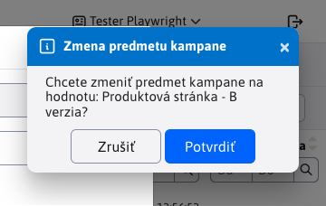

The sender information is automatically filled in based on the logged in user, but you can of course change it. If you want other values ​​to be used as default, you can use the configuration variables `dmailDefaultSenderName` and `dmailDefaultSenderEmail`.

The email text is taken from the selected website (including its design). We recommend creating a folder in the Websites section, e.g. ```Newsletter```, with a suitable template set. In this folder, first create a website with the email text and then select it in the campaign.


You can insert the following tags into the text of a web page to insert user data:

- ```!RECIPIENT_NAME!``` - ​​recipient's first and last name
- ```!RECIPIENT_EMAIL!``` - ​​recipient's email address
- ```!EMAIL_ID!``` - ​​unique email ID

If the recipient is from the WebJET CMS user database, other registered user tags can also be used:

- ```!LOGGED_USER_NAME!``` - ​​first and last name (if config variable ```fullNameIncludeTitle``` is set to true it also contains title)
- ```!LOGGED_USER_FIRSTNAME!``` - ​​name
- ```!LOGGED_USER_LASTNAME!``` - ​​last name
- ```!LOGGED_USER_TITLE!``` - ​​title
- ```!LOGGED_USER_LOGIN!``` - ​​login name
- ```!LOGGED_USER_EMAIL!``` - ​​email address
- ```!LOGGED_USER_COMPANY!``` - ​​company
- ```!LOGGED_USER_CITY!``` - ​​city
- ```!LOGGED_USER_ADDRESS!``` - ​​address (street)
- ```!LOGGED_USER_COUNTRY!``` - ​​state
- ```!LOGGED_USER_PHONE!``` - ​​phone
- ```!LOGGED_USER_ZIP!``` - ​​Postal code
- ```!LOGGED_USER_ID!``` - ​​User ID
- ```!LOGGED_USER_BIRTH_DATE!``` - ​​date of birth
- ```!LOGGED_USER_FIELDA!``` - ​​free field A
- ```!LOGGED_USER_FIELDB!``` - ​​free field B
- ```!LOGGED_USER_FIELDC!``` - ​​free field C
- ```!LOGGED_USER_FIELDD!``` - ​​free field D
- ```!LOGGED_USER_FIELDE!``` - ​​free field E
- `!LOGGED_USER_GROUPS!` - ​​list of user groups

## Advanced

In the **Advanced** tab, you can set up the email message fields for reply, copy, and blind copy.

If you enter a date in the start sending field, emails will only start sending after the specified time (so you can plan your email campaign in advance).

You can attach a maximum of 3 attachments (files) to an email.

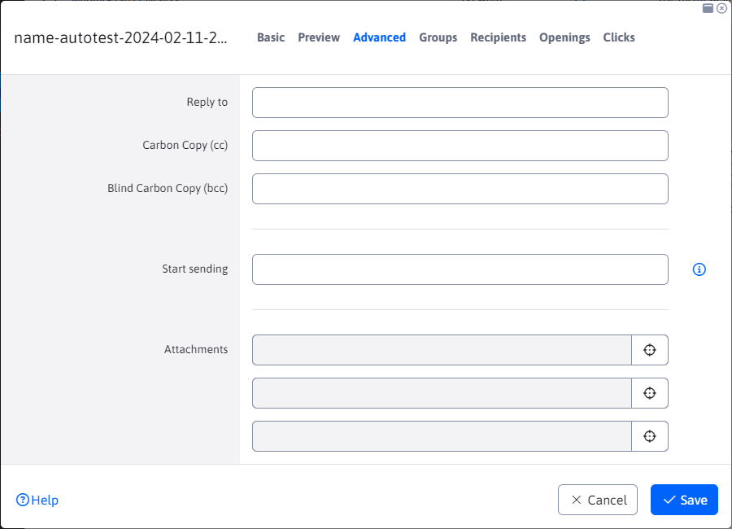

## Recipients

In the **Recipients** tab, we see an overview of all recipients who will receive campaign emails. Recipients can be added, edited, duplicated or deleted in the table. When saving the campaign, the real list of recipients and already sent emails from the database table `emails` is calculated.

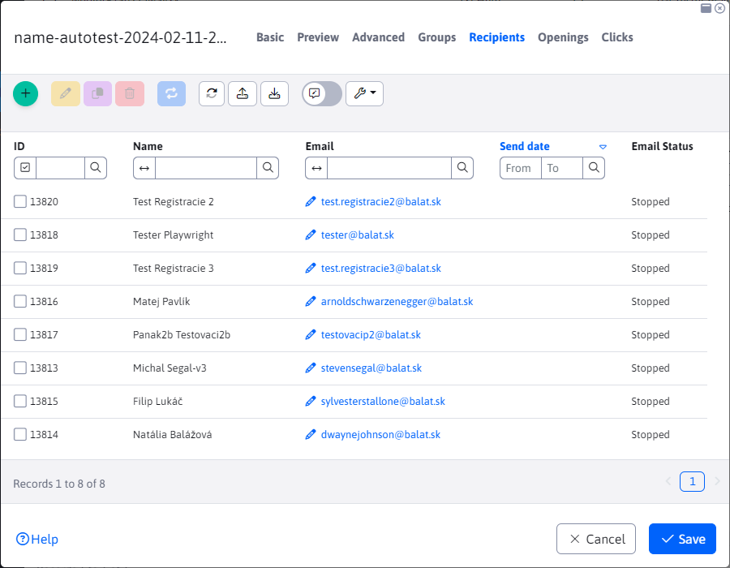

!>**Warning,** the recipient list is treated against certain non-compliant values:
- protection against duplication, checks for duplication in entered emails as well as with those that already exist in the campaign
- protection against inappropriate email, email must comply with the standard format **name@domain.sk** (special exception for [Import from xlsx](#import-from-xlsx))
- protection against unsubscribed emails, it is not possible to add a recipient whose email address is in the [Unsubscribed emails] list (../unsubscribed/README.md)


!>**Warning** if you change the recipient list AFTER sending emails, the resulting statistics will not be correct and may give the impression of a sending problem.

### Email Status

The "Email Status" column is important and can contain the following values:

- New - newly added email, you need to save the campaign to add this email to the campaign.
- Saved - the email is saved, waiting in the queue to be sent
- Sent - the email is sent, the exact date and time the email was sent is stored in the Sent Date column
- Stopped - the email is ready to be sent, select the campaign in the campaign list table and click the **Start sending** button to send the email.
- Sending error - the number of attempts to send the email has been exceeded (3 attempts by default). Either the email is incorrect or there is another error in the campaign.

### Manual addition

You can manually add emails to the campaign by clicking the "Add" button. The "Email" field is mandatory, in which you must enter one or more emails separated by **comma, semicolon, space or new line**. You can use multiple types of separation at the same time, such as ```test1@test.sk, test2@test.sk; test3@test.sk  test4@test.sk```. The entered emails will then be added to the campaign recipients.

The **Name** field is optional. If you do not fill it in, the recipient's name will be retrieved from the user database based on the email match (if any). If such an email is not found in the database, the value ```- -``` will be inserted as the name. If you fill in the **Name** field, it will be set to all emails that you are currently entering via the **Email** field.

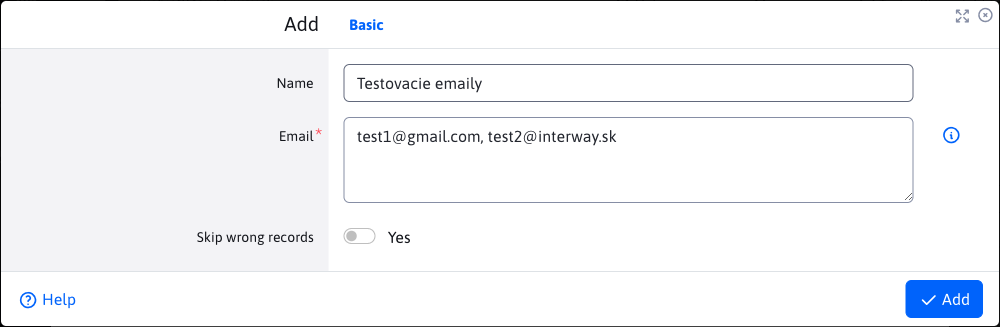

Manual addition offers the option **Skip invalid entries**. If you enter ```Test1@test.sk, Test2@test.sk; Test13Wrong Test4@test.sk Test2@test.sk``` as the Email and the Skip invalid entries option **is disabled**, adding recipients will stop at the first invalid value and an error will be displayed:

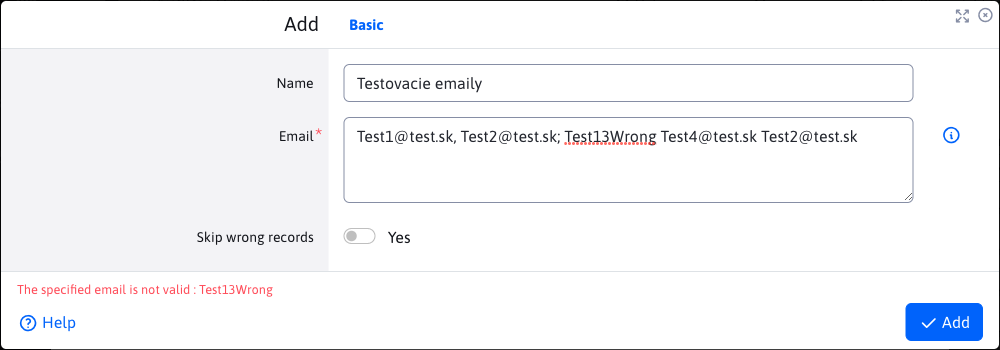

The save ended on the third email ```Test13Wrong``` due to a value in the wrong format. The previous two emails were valid and saved (you can reload the data in the table to view it).

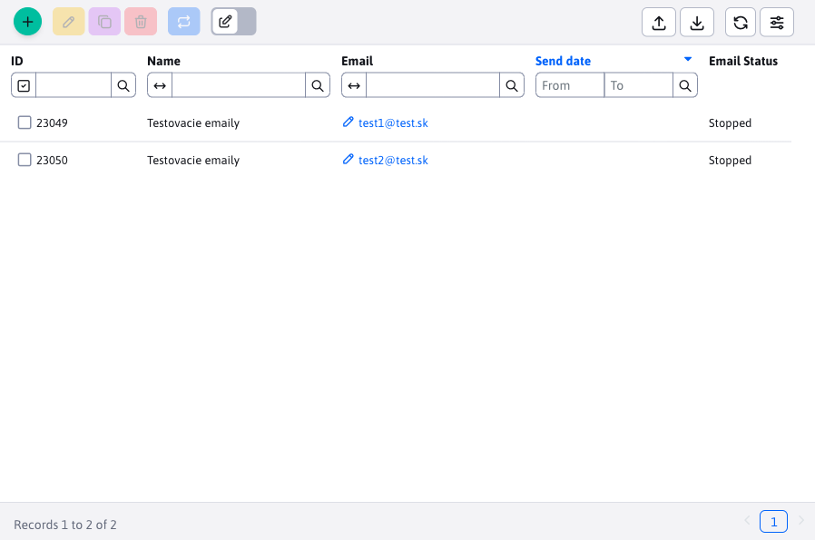

**If the option is enabled**, non-compliant values ​​will be skipped and a notification will be displayed with information about which values ​​and why they were not saved:

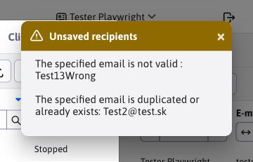

Since only 3 of the five emails entered were suitable, only three recipients were added to the campaign.

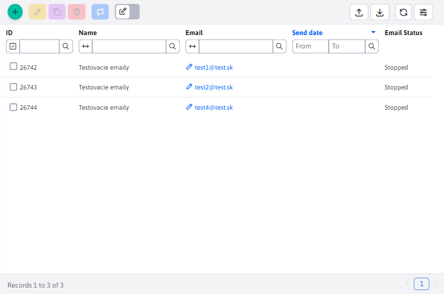

### Adding from a group

To add emails to a campaign in bulk, use the , you must confirm your choice by pressing the . If you do not want to save your change, you must close the dialog box.

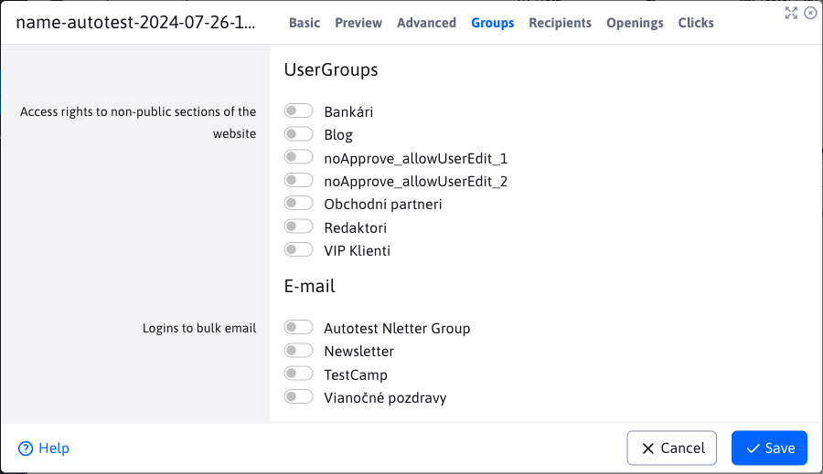

!>**Warning:** your changes **are saved immediately**. This means there is no waiting for the campaign to be saved! Be careful with this, because even if you do not save the edited campaign, recipients added/removed by selecting a group will remain changed.

Your changes will be reflected immediately in the **Recipients** tab. Emails added from a group will always contain a value in the **Groups** column. It may happen that there are emails among the recipients that belong to a group even though no group has been added to the campaign.
This situation occurs if you manually add an email belonging to a group. WebJET automatically recognizes it and displays all the groups it belongs to in the **Group** column.

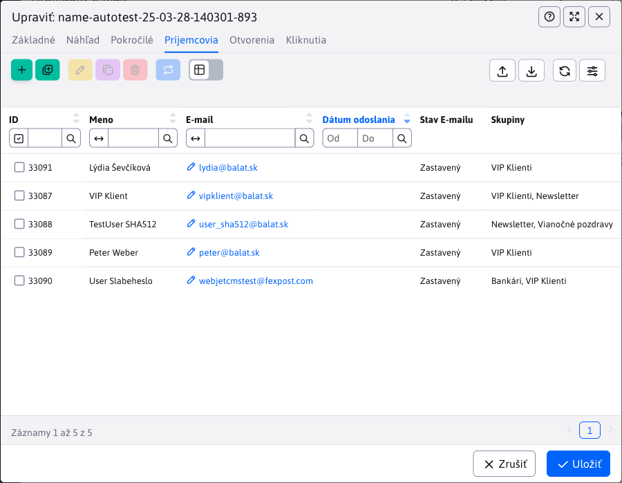

!>**Note:** some emails may belong to multiple groups. To add an email to the recipients list, you only need to add one of these groups. If an email belongs to 3 groups and you add them all, **there will be no duplicate emails**, as duplicate emails are not allowed.

### Import from xlsx

The bulk way to add/update recipients is via the standard import of recipients from an xlsx file.

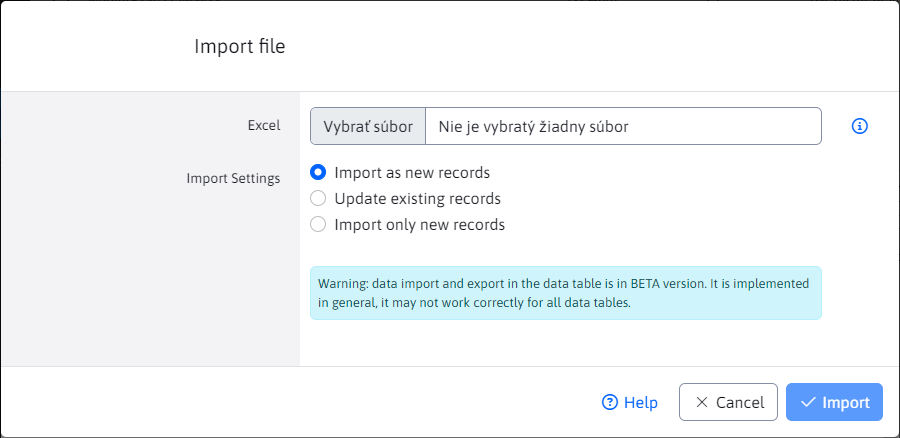

The following names must be defined in the first line of the file:

- ```Meno|recipientName``` - ​​recipient's first and last name
- ```E-mail|recipientEmail``` - ​​recipient's email address

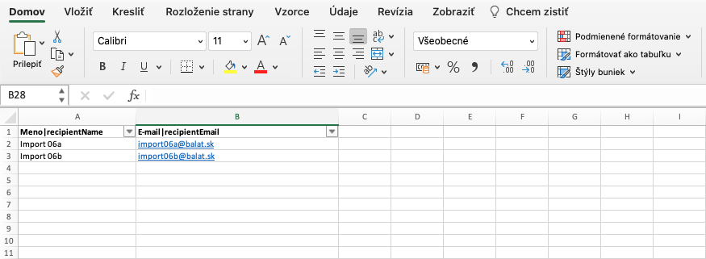

To get the correct file for import, simply export the recipients. You can then delete the ID column and fill in the names and email addresses for the recipient import.

!>**Warning:**

- Importing from an xlxs file does not support adding multiple emails in one cell as in the case of manual addition. There must always be only one email address in a cell.
- Import from xlxs file supports email format exception. When adding manually, each email must have the format **name@domain.sk**. However, if you copy emails e.g. from the `Outlook` application, the copied value may have the format ```"Ján Tester <jan_tester@test.com>"```. In case the value contains the characters ```<>```, **(exactly in this order)**, the value between them will be used. In this case, it would be the value ```jan_tester@test.com```. This value must have the format **name@domain.sk**.

## Openings

The **Opens** tab records when the recipient opens the email. This is done using an embedded image. Not all recipients will confirm that the image has been loaded from the server, so the list is not complete.

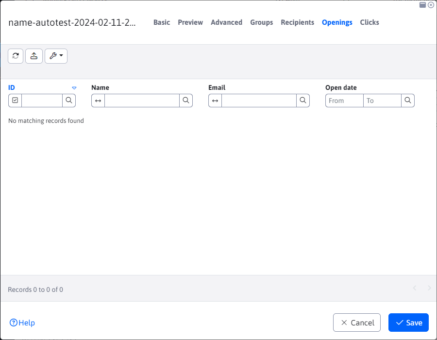

##

The **Clicks** tab shows a list of clicks on a link in an email. A recipient can click on a link multiple times, so the table may record a click from a single recipient more than once.

