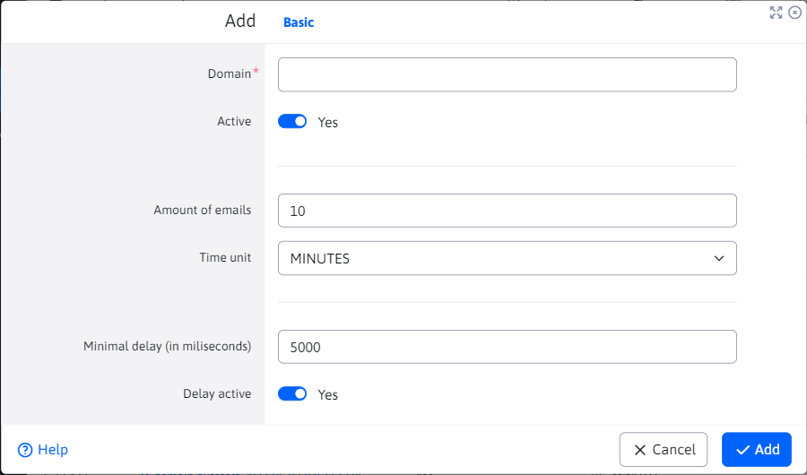

# Domain limits

The Domain Limits application allows you to set limits on the number of emails sent per domain. This will improve the delivery of emails, because mail servers with a high number of emails sent from one IP address may block the emails or put them straight into the spam folder.

In the table, limits that are inactive and not applied when sending emails are highlighted in red. For unspecified domains, the values specified for the domain are used `*`, i.e. setting limits with the domain `*` is applied to all unlisted domains.

In the "Domain" field, enter the domain name after the email address (e.g. gmail.com, centrum.sk, seznam.sk).

The "Quantity of emails" field defines the maximum number of emails sent to a given domain in a Time Unit interval. So you can set e.g. 10 emails per minute.

The "Minimum gap (in milliseconds)" field sets the minimum interval between emails. Setting the value to 5000 will result in a minimum interval of 5000 ms (5 seconds) between email sends to the specified domain.

