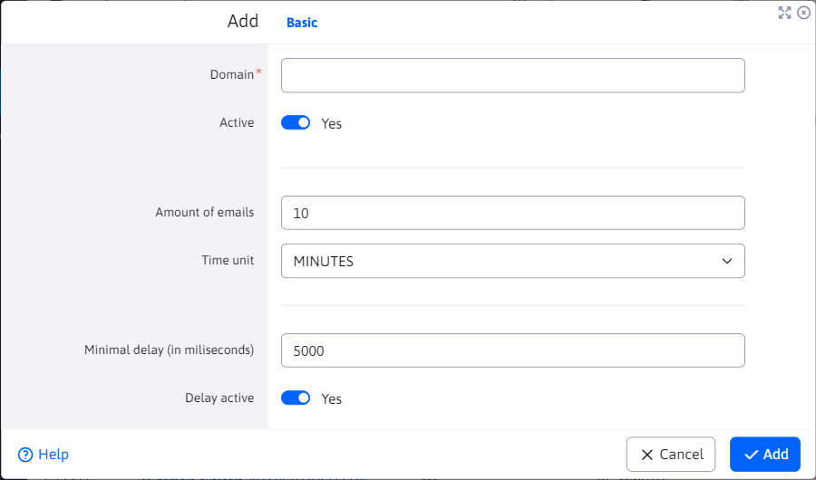

# Domain limits

The Domain Limits application allows you to set limits on the number of emails sent per domain. This will improve email delivery, as mail servers may block emails or send them to the spam folder if there is a high number of emails sent from a single IP address.

In the table, limits that are inactive and do not apply when sending emails are highlighted in red. For domains that are not precisely specified, the values ​​specified for the domain ```*``` will be used, so setting limits with the domain ```*``` will apply to all unspecified domains.


In the edit box, in the "Domain" field, enter the domain name after the at sign of the email address (e.g. gmail.com, centrum.sk, zoznam.sk).

The "Email Quantity" field defines the maximum number of emails sent to a given domain in a Time Unit interval. So you can set, for example, 10 emails per minute.

The "Minimum gap (in milliseconds)" field sets the minimum interval between individual emails. Setting the value to 5000 will set the minimum interval to 5000 ms (5 seconds) between sending emails to the specified domain.

