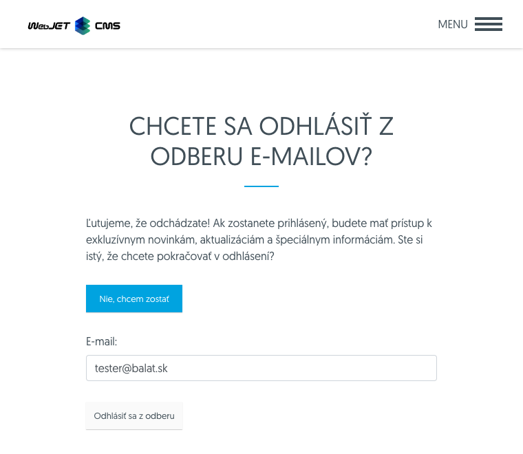

# Login and logout form

You can easily add a form to your website for logging in or unsubscribing from bulk email.

## Login

Create a page ```/prihlasenie-do-mailingu.html``` with the following HTML code. Insert an email login application:

```html
<p>Vyberte si prosím informácie, ktoré chcete dostávať emailom:</p>
!INCLUDE(/components/dmail/subscribe.jsp, senderEmail=meno@domena.sk, senderName="Ľuboš Balát")!
```

When embedding a login application, you can use a simpler mass email registration form. It only displays a field for entering an email address, it is suitable to insert it in the footer of the page.

Registers to all email groups that have **Allow users to add/remove from group** and **Require email address confirmation** enabled. Does not contain ```captcha``` element, so email address confirmation is required. The form uses ```Bootstrap v5``` to display the form and dialog box.

If you use the **Registration Form - Simple** application on your website, it is necessary that the user group for mass email registration has the following options set:

- Allow users to add/remove from the group themselves
- Require email address confirmation

The visitor will be registered to groups that have these options set. If there is no group with such settings, the form will not be displayed.

## Logout

Create a page ```/odhlasenie-z-mailingu.html``` with the following HTML code. Insert an email unsubscribe application:

```html
!INCLUDE(/components/dmail/unsubscribe.jsp, senderEmail=name@your-domain.com, senderName="Your Name", confirmUnsubscribe=true)!
```
To unsubscribe, you can create a link to the unsubscribe page directly in the email:

```html
<a href="/odhlasenie-z-mailingu.html?email=!RECIPIENT_EMAIL!&save=true">Kliknite pre odhlásenie</a>
```

When sending an email, the email header for unsubscribe [List-Unsubscribe=One-Click](https://support.google.com/a/answer/81126#subscriptions) is automatically set in supported email clients. The unsubscribe link is set according to the domain of the website address of the email being sent, if necessary, the domain can be changed by setting the conf. variable `dmailListUnsubscribeBaseHref`. To display the direct unsubscribe button in the email client, the email/your domain must meet several criteria (we recommend setting these criteria also for better email deliverability):

- Set up [DKIM](https://www.dkim.org) domain keys with a valid [SPF](https://sk.wikipedia.org/wiki/Sender_Policy_Framework) record. We recommend using [Amazon SES](../../../../install/config/README.md#nastavenie-amazon-ses) for sending and set `DKIM` there, `SPF` will also be set automatically.
- [DMARC](https://dmarc.org) record set. Create a new `TXT` record in DNS for domain `_dmarc.vasadomena.sk` with a value of at least `v=DMARC1; p=none; sp=none`.

Additionally, in the `gmail` mailbox, the unsubscribe button will only appear if you, as the sender, are included in the bulk email category.



### Application settings

In addition to the sender's email and name, the following options can be set in the application editor:

- **Always show logout confirmation**:
If this option is selected, the user must confirm the logout on the displayed form.
If this option is not selected, the user will be logged out directly after clicking the link in the email (without any further steps).


- **Text displayed before logging out**
Custom text can be used on the page where the application is embedded.
If you leave the text blank, no text or button with the text `Nie, chcem zostať` will be displayed. You can also insert any text into the web page before the logout application.

## Email with login text

If you need to modify the text of the email that is sent to confirm login/logout, you can modify the standard HTML code in the system configuration in the Text Editing section. The keys with the texts are ```dmail.subscribe.bodyNew``` for login and ```dmail.unsubscribe.bodyNew``` for logout.

If you need to format the text in an advanced way, it is possible to create a web page in WebJET with the text of the emails. You can add the parameter ```subscribe.jsp a unsubscibe.jsp``` to the applications ```emailBodyId``` with the ID of the page with the text of the email. The page may look like this:

```
Váž. p. !name!,

ďakujeme vám za záujem dostávať náš newsletter. Prosím potvrďte vašu voľbu kliknutím na nasledovnú linku:

/prihlasenie-do-mailingu.html?hash=!HASH!

Mohlo sa stať že vašu emailovú adresu zadal niekto iný, v tom prípade môžete ignorovať tento email, žiadne informácie nebudete dostávať.
```
