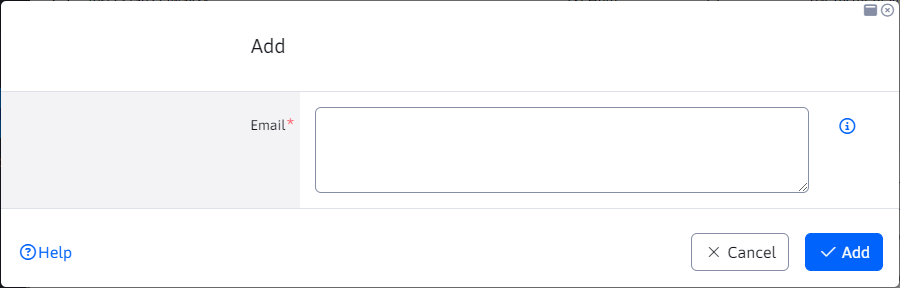

# Unsubscribed emails

The Bulk Email application contains an Unsubscribed Emails node that keeps a list of unsubscribed emails. No emails/campaigns will be sent to addresses on this list through the Bulk Email application.

The unsubscribed email list is always checked before sending, so even if you re-import the email into a mass email, the campaign will not be sent to email addresses from the unsubscribed email list.


You can fill the list manually, by importing from an Excel file, or automatically via a link in an email message. Simply add the following HTML code to the email message:

```html
<a href="/odhlasenie-z-mailingu.html?email=!RECIPIENT_EMAIL!&save=true">Kliknite pre odhlásenie</a>
```

while the page with the address ```/odhlasenie-z-mailingu.html``` contains a logout application:

```html
!INCLUDE(/components/dmail/unsubscribe.jsp, senderEmail=name@your-domain.com, senderName="Your Name", confirmUnsubscribe=true)!
```

[Clicking on the link](../form/README.md#unsubscribe) will ensure that the recipient's email address is unsubscribed from the email campaign.


When creating, editing, or duplicating a record, it is mandatory to enter an email address for logging out in the editor.


