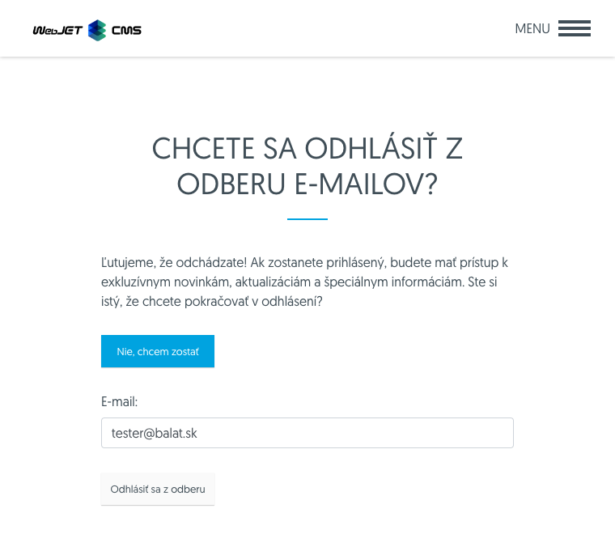

# Unsubscribed emails

The Bulk Email application contains an Unsubscribed Emails node, which records a list of unsubscribed emails. No emails/campaigns will be sent to the addresses in this list via the Bulk Email application.

The unsubscribe list is always checked before sending, so even if you re-import the email into the bulk email, the campaign will not be sent to the email addresses on the unsubscribe list.


You can populate the list manually, by importing from an Excel file and automatically by linking it in an email message. Just add the following HTML code to the email message:

```html
<a href="/odhlasenie-z-mailingu.html?email=!RECIPIENT_EMAIL!&save=true">Kliknite pre odhlásenie</a>
```

whereby the page with the address `/odhlasenie-z-mailingu.html` includes an opt-out app:

```html
!INCLUDE(/components/dmail/unsubscribe.jsp, senderEmail=name@your-domain.com, senderName="Your Name", confirmUnsubscribe=true)!
```

[Click on the link](../form/README.md#logout) ensure that the recipient's email address is unsubscribed from the mail campaign.



When creating, editing, duplicating a record, it is mandatory to enter an email to log out in the editor.


