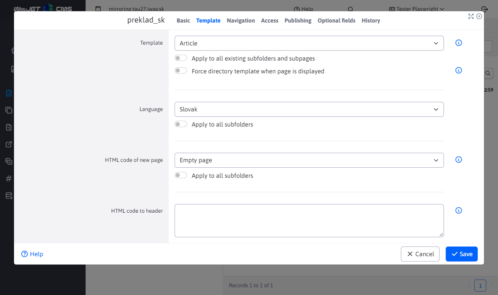
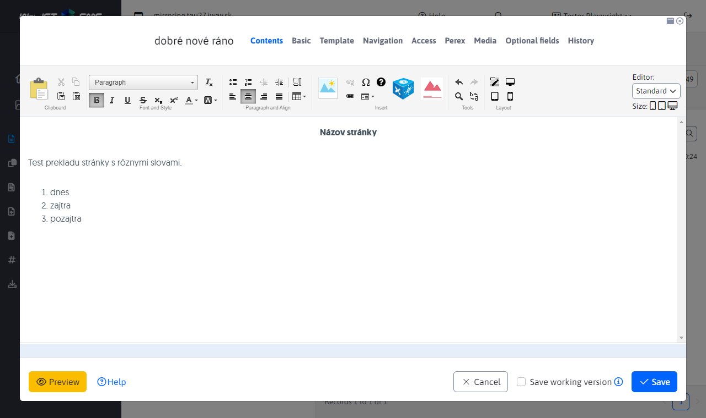

# Mirroring the structure

The mirroring structure interlinks directories and language pages. A change in one language is automatically reflected in the other. It also links the web pages in the public part, so if I am on a page `SK/O nás` and click on `EN` version in the header of the page, I get to the mirrored page `EN/About Us`.

The functionality is for the purpose of relieving editors of the burden of creating pages and the possibility of linking content in the public part of the site. The structure of the language mutations is identical and **the workload when adding new sections will be reduced** or reordering. The goal is that the structure in the language mutations does not diverge over time.

## Settings

Within the WebJET CMS, structure mirroring is activated by setting the configuration variable `structureMirroringConfig` with a definition of which directories are to be bound in this way.

The format of the entry is as follows:

```txt
groupId-sk,groupId-en,groupId-cz:poznamka (napr meno domeny)
ineGroupId1,ineGroupId2:poznamka inej domeny
```

whereby as `groupId-sk,groupId-en,groupId-cz` you enter the directory ID in the Web page section. For a multi-domain WebJET, you can enter multiple lines of configuration - each domain on a new line. The directory IDs you enter may or may not be the root directories in the WebJET.

For the sign `:` it is possible to enter a note, e.g. a domain name, etc.

## Course of mirroring

As an example, consider the situation of mirroring SK and EN structures. In WebJET CMS in the WEB Pages section create 2 root directories SK and EN. Then set the configuration variable `structureMirroringConfig`.

Creating a directory/page in the SK or EN directory will automatically create a new directory/page in the second language and link them together. The automatically created directory/page in the second language will be set to not display to allow enough time for translation.

- Page - Show to NO
- Directory - Display method in menu - DO NOT SHOW

If you don't like the setting of disabling the display of a web page/folder (e.g. during the creation of a web site when you don't mind that the section starts to be displayed immediately), set the conf. variable `structureMirroringDisabledOnCreate` to the value of `false`.

The following operations are mirrored in further work:
- Creating a directory/page
- Delete a directory/page
- Change the order of a directory/page in the structure (except for root folders)
- Move a directory/page to another directory

The remaining directory/page properties are preserved and do not affect their equivalent in the second language.

## Creating a link to language mutations in the page header

The application allows you to insert links in the page header to all languages that point to the equivalent of the currently displayed page in other languages. If the page in the language mutation **is set to not show**, the link goes to **to the homepage of the language version**.

The link is in the form `SK | CZ | EN` generated as `ul-li` List. To generate it, insert the following application into the header:

```html
!INCLUDE(/components/structuremirroring/language_switcher.jsp)!
```

The names SK, CZ, EN are generated from the specified directory IDs in the mirroring configuration, the value specified in the field is used **Navigation bar and menu**.

If you need to display flags instead of text links, set the parameter `flagsPath` on the way to the pictures of flags. The images must be named according to the language code, e.g. `sk.png`, `en.png`, `cz.png`:

```html
!INCLUDE(/components/structuremirroring/language_switcher.jsp, flagsPath=/images/flags/)!
```

## Automatic translation

WebJET can automatically translate the name of a directory or page when it is created. The following setting is required:
- [configure the translator](../../../admin/setup/translation.md)
- the root directory of each language mutation, it is necessary to set the Language field in the directory properties in the Template tab to the language of the directory

The translator searches the folders recursively towards the root of the Language setting field when the page is created, and uses it as the source or target language when it is not empty. If no language is found, the language set in the source and destination folder template is used.



It is translated **Name of the website**, menu item name, URL address and **Table of Contents** web site.

### New page

When you create a page, automatic translation is always triggered. If you create a new page with the name "good morning" in the folder `preklad_sk` where the Slovak language is set, in the directory `preklad_en` a page will be created `good morning`, the content of the site will also be translated into English.

Web page in folder `preklad_sk`:



Generated page with English translation in folder `preklad_en`:


### Modification of an existing website

If a page already exists in the target language, it is necessary to distinguish whether it should be automatically re-translated when changing to another language. Usually after automatic translation the page is manually checked by the editor, corrected linguistically, incorrect words are corrected.

WebJET needs to know if the translated page has already been modified by the actual user. There is a configuration variable `structureMirroringAutoTranslatorLogin` where you can enter the login name of a (virtual) user, which is used to record the automatic translation - the page in another language is saved as if by this user. When the original language version is saved again, the text of the web page is translated again as long as the author of this page is still this virtual user - i.e. another (real) user has not yet changed the translated web page.

In users, create a new (virtual) user with rights to edit the necessary web pages and enter his login name in the conf. variable `structureMirroringAutoTranslatorLogin`. You should never log in with such a user and use them for editorial work, they are just a technical/virtual user. The default login is `autotranslator` if you use this login you do not need to set the conf. variable.

Automatic translation of an existing page is performed under the following conditions:
- If the configuration variable `structureMirroringAutoTranslatorLogin` is set and the user exists in the database.
  - And the author of the landing page is identical to `structureMirroringAutoTranslatorLogin` - so the page has not yet been corrected by a real user.
- If the configuration variable `structureMirroringAutoTranslatorLogin` is not set, or there is no user in the database with such a login name, the decision is based on whether the page is displayed. The automatic translation is only triggered in language versions that **not yet displayed**, i.e. they are worth `available` set to `false`.

At the set value `structureMirroringAutoTranslatorLogin` the detection is more reliable because even an unpublished version of the web page may have already been corrected by another user, but not yet published. Your change would result in an overwriting of the text, which is an undesirable state. We recommend that you create a (virtual) user and set his login name to `structureMirroringAutoTranslatorLogin` for more reliable change detection.

When you save a page, the changes are applied to all copies. So if I create an EN and a DE version from the SK version (which are not published yet, or have not been changed by a real editor), then when I change the EN version, the text is translated into the DE version. The SK version will not be affected, because it is typically already published or created by a real (not `structureMirroringAutoTranslatorLogin`) to users.

If the conf. variable is set `syncGroupAndWebpageTitle` to the value of `true` (which is the default value) automatically synchronizes the folder name with the name of the main page in the folder. When the main page name is changed, the folder is renamed as well, even in translated versions.

## Cancellation of mirroring

Unmirroring requires that you remove the link from the configuration variable `structureMirroringConfig`. But the value is still set in the database `sync_id` which linked folders/pages in different languages. These values must be removed, otherwise the folders/pages will remain linked/synchronized. For this purpose, it needs to use [Cancellation of mirroring](../clone-structure/README.md#cancellation-of-mirroring).

## Technical information

More technical information can be found in [documentation for the developer](../../../developer/apps/docmirroring.md).
