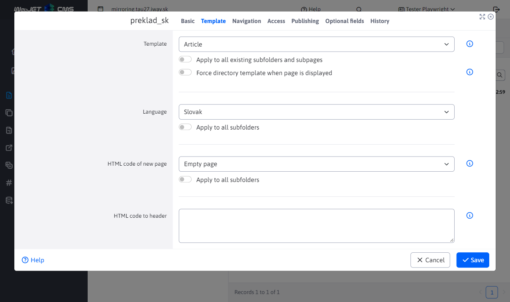
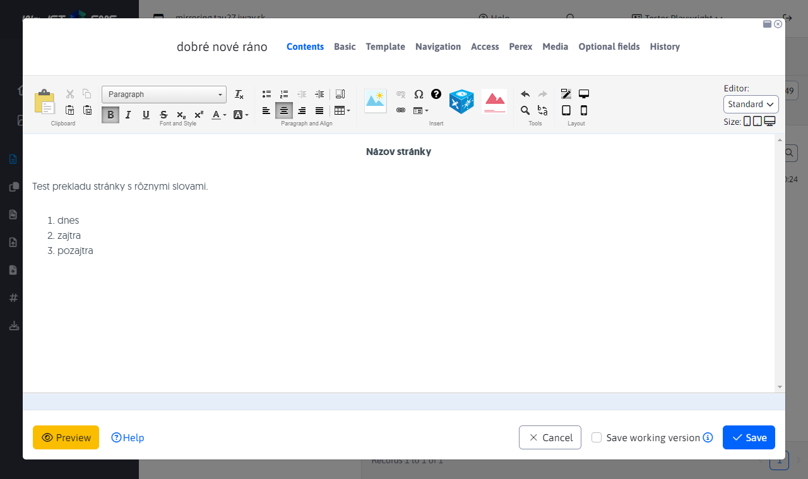

# Mirroring the structure

Mirroring the structure links directories and pages of language mutations. A change in one language mutation is automatically reflected in the other. It also links web pages in the public part, so if I am on page ```SK/O nás``` and click on the ```EN``` version in the page header, I will be taken to the mirrored page ```EN/About Us```.

The functionality is intended to relieve editors of the burden of creating pages and the possibility of linking content in the public part of the website. The structure of the language mutations is identical and **reduces the laboriousness of adding new sections** or changing the order. The goal is to ensure that the structure in the language mutations does not fall apart over time.

## Setting

Within WebJET CMS, structure mirroring is activated by setting the configuration variable ```structureMirroringConfig``` with the definition of which directories should be linked in this way.

The format of the entry is as follows:

```txt
groupId-sk,groupId-en,groupId-cz:poznamka (napr meno domeny)
ineGroupId1,ineGroupId2:poznamka inej domeny
```

where ```groupId-sk,groupId-en,groupId-cz``` is the directory ID in the Web pages section. With multi-domain WebJET, you can enter multiple configuration lines - each domain on a new line. The entered directory IDs may or may not be the root directories in WebJET.

After the ```:``` character, it is possible to enter a note, e.g. a domain name, etc.

## Mirroring progress

As an example, let's take the situation of mirroring the SK and EN structure. In WebJET CMS, in the WEB Pages section, create 2 root directories, SK and EN. Then set the configuration variable ```structureMirroringConfig```.

By creating a directory/page in the SK or EN directory, a new directory/page in the second language mutation is automatically created and they are linked to each other. The automatically created directory/page in the second language mutation is set to not be displayed to allow enough time for its translation.

- Page – Display on NO
- Address book - Display method in menu - DO NOT DISPLAY

If you are not comfortable with the setting of disabling the display of a web page/folder (e.g. during the creation of a website when it is not a problem that the section starts to be displayed immediately), set the config variable `structureMirroringDisabledOnCreate` to the value `false`.

The following operations are mirrored in further work:

- Create a directory/page
- Deleting a directory/page
- Change the order of a directory/page in the structure (except root folders)
- Moving a directory/page to another directory

The remaining properties of directories/pages remain intact and do not affect their equivalent in the second language mutation.

## Creating a link to language mutations in the page header

The application allows you to insert links to all language mutations in the page header, which point to the equivalent of the currently displayed page in other language mutations. If the page in the language mutation **is set to not be displayed**, the link points **to the initial page of the language mutation**.

The link is in the form ```SK | CZ | EN``` generated as a ```ul-li``` list. To generate it, insert the following application into the header:

```html
!INCLUDE(/components/structuremirroring/language_switcher.jsp)!
```

The names SK, CZ, EN are generated from the specified directory IDs in the mirroring configuration, the value entered in the **Navigation bar and menu** field is used.

If you need to display flags instead of text links, set the `flagsPath` parameter to the path to the flag images. The images must be named according to the language code, e.g. `sk.png`, `en.png`, `cz.png`:

```html
!INCLUDE(/components/structuremirroring/language_switcher.jsp, flagsPath=/images/flags/)!
```

## Setting the `hreflang` attribute

You can easily insert links to language mutations into your page template using the app:

```html
!INCLUDE(/components/structuremirroring/hreflang.jsp)!
```

This application will create links with the attribute `hreflang` for all language mutations of the current page. If the page in the language mutation is set to not be displayed, the link will not be generated. It will also not be displayed if the folder in which the web page is located is internal, or is not displayed in the menu.

Example output:

```html
   <link rel="alternate" hreflang="sk" href="https://webjetcms.com/slovensky/domov/podstranka-1.html" />
   <link rel="alternate" hreflang="en" href="https://webjetcms.com/english/domov/subpage-1.html" />
   <link rel="alternate" hreflang="de" href="https://webjetcms.com/deutsch/heim/unterseite-1.html" />
```

## Automatic translation

WebJET can automatically translate the name of a directory or page when it is created. The following settings are required:

- [configure translator](../../../admin/setup/translation.md)
- for the root directories of individual language mutations, it is necessary to set the Language field to the language of the given directory in the directory properties in the Template tab

When creating a page, the translator searches the folders recursively towards the root of the Language field setting and, if it is not empty, uses it as the source or target language. If the language is not found, the language set in the source and target folder template is used.



The **Website name**, menu item name, URL address, and **Content** of the website are translated.

### New page

When creating a page, automatic translation is always triggered. If you create a new page called "good morning" in the `preklad_sk` folder, where the Slovak language is set, then the page `good morning` will be created in the `preklad_en` directory, the page content will also be translated into English.

Web page in folder `preklad_sk`:



Generated page with English translation in folder `preklad_en`:


### Editing an existing website

If a page already exists in the target language, it is necessary to distinguish whether it should be automatically retranslated when another language mutation is changed. Usually, after automatic translation, the page is manually checked by an editor, linguistically corrected, and incorrect words are corrected.

WebJET needs to know whether the translated page has already been edited by a real user. There is a configuration variable `structureMirroringAutoTranslatorLogin` where you can enter the login name of the (virtual) user who is used to record automatic translation - the page in another language will be saved as if by this user. When re-saving the original language version, the text of the web page will be translated repeatedly as long as the author of this page is still this virtual user - i.e. another (real) user has not yet changed the translated web page.

In users, create a new (virtual) user with rights to edit the necessary web pages and enter his login name in the conf. variable `structureMirroringAutoTranslatorLogin`. You should never log in with such a user and use him for editorial activities, he is only a technical/virtual user. The default login name is `autotranslator`, if you use this login name you do not need to set the mentioned conf. variable.

Automatic translation of an existing page will be performed under the following conditions:

- If the configuration variable `structureMirroringAutoTranslatorLogin` is set and the given user exists in the database.
  - And the author of the target page is identical to `structureMirroringAutoTranslatorLogin` - ​​so the page has not yet been corrected by a real user.
- If the configuration variable `structureMirroringAutoTranslatorLogin` is not set, or there is no user with such a login in the database, the decision is made based on whether the page is displayed. Automatic translation will only be run in language versions that are **not yet displayed**, i.e. have the value `available` set to `false`.

With the value set to `structureMirroringAutoTranslatorLogin`, detection is more reliable, because even the unpublished version of the website could have been corrected/corrected by another user, but not published yet. Your change would overwrite the text, which is an undesirable situation. We recommend creating a (virtual) user and setting their login name to `structureMirroringAutoTranslatorLogin` for more reliable detection of changes.

When saving the page, the changes are applied to all copies. So if I create an EN and DE version from the SK version (which are not yet published, or have not been changed by a real editor), then when changing the EN version, the text will be translated into the DE version. The SK version will not be affected, because it is typically already published, or created by a real (not `structureMirroringAutoTranslatorLogin`) user.

If the config variable `syncGroupAndWebpageTitle` is set to the value `true` (which is the default value), the folder name is automatically synchronized with the name of the main page in the folder. When the name of the main page is changed, the folder is also renamed, even in translated versions.

## Canceling mirroring

Canceling mirroring requires that you remove the link from the `structureMirroringConfig` configuration variable. However, the value `sync_id` will still be set in the database, which linked folders/pages in different language mutations. These values ​​must be removed, otherwise the folders/pages will remain linked/synchronized. For this purpose, you need to use [Cancel mirroring](../clone-structure/README.md#cancel-mirroring).

## Technical information

More technical information can be found in the [developer documentation](../../../developer/apps/docmirroring.md).