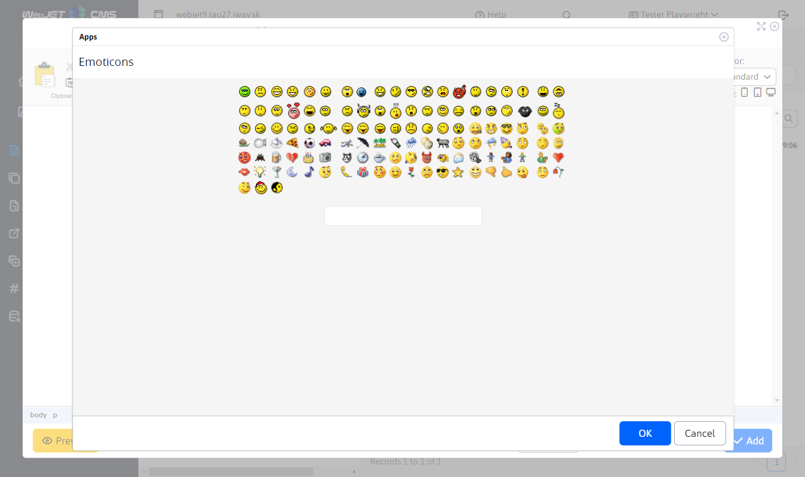
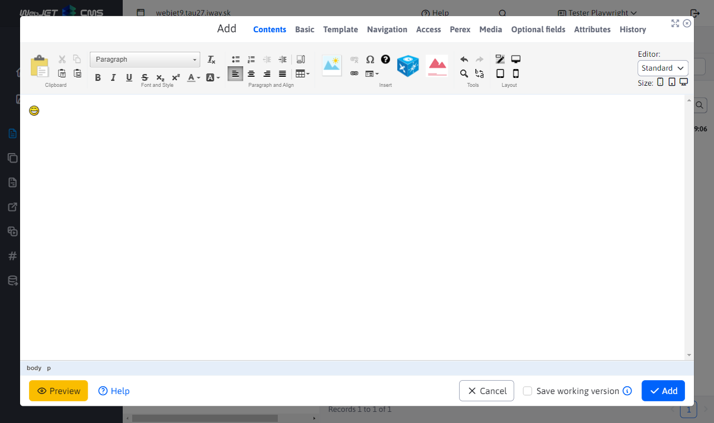

# Emoticons

Inserts a "smiley face" image (emoticon) into the page.

## Application settings

In this section, you can select from a list of emoticons that you want to insert.

## View application

