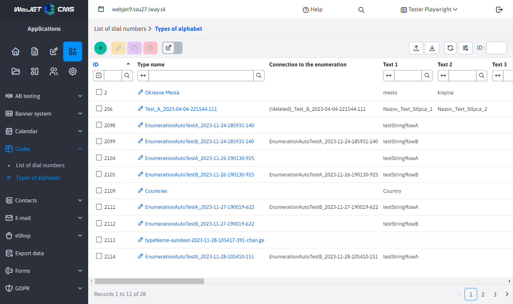
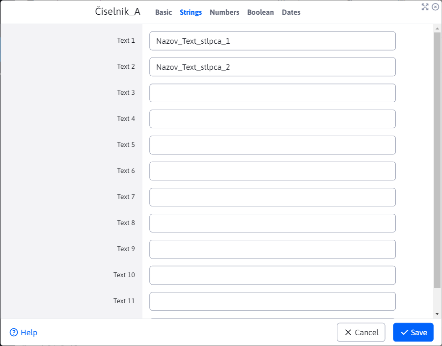
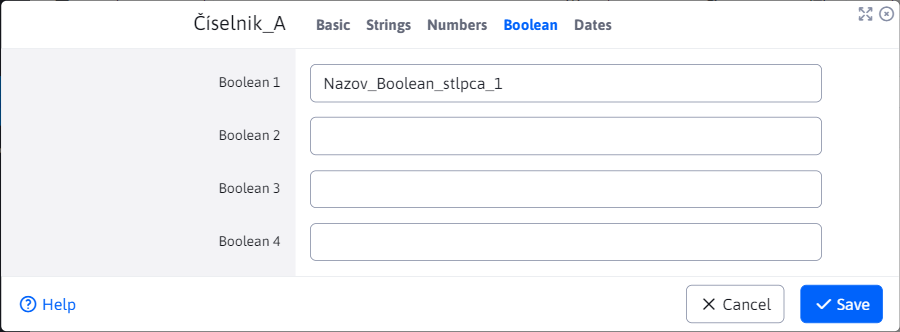
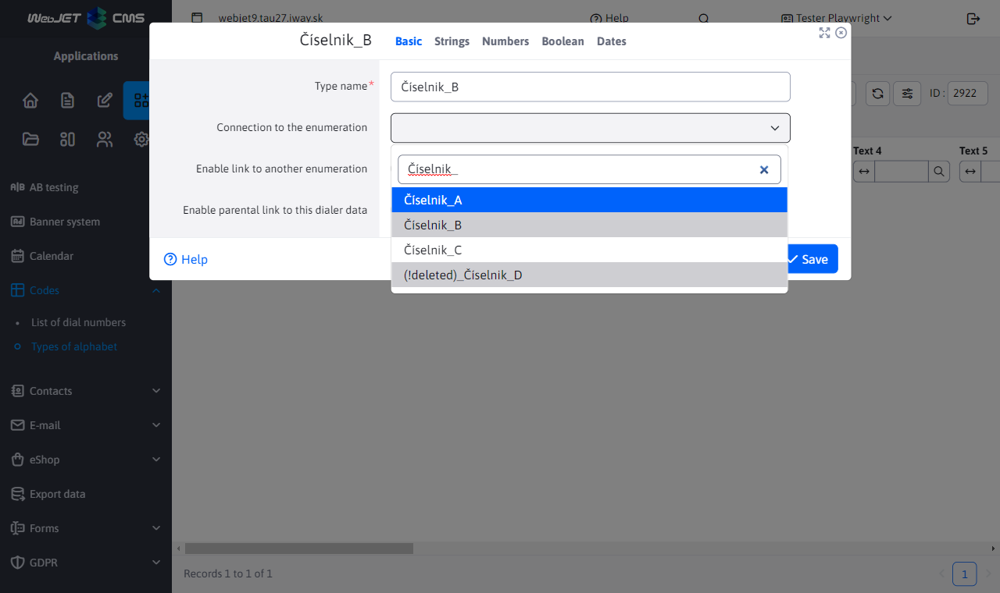
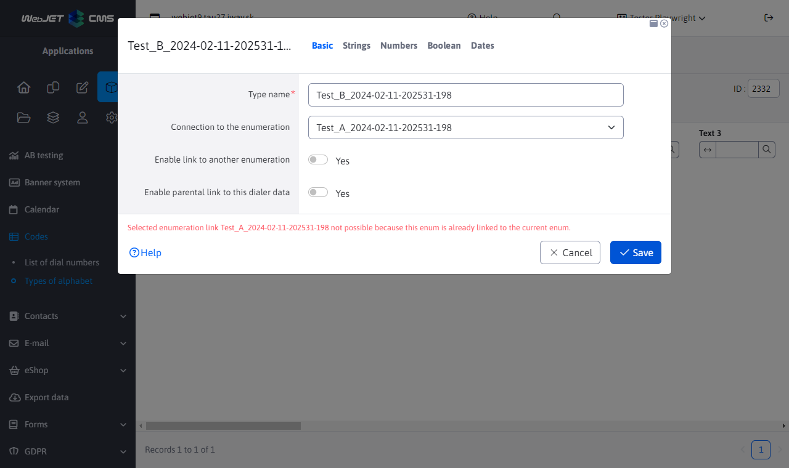
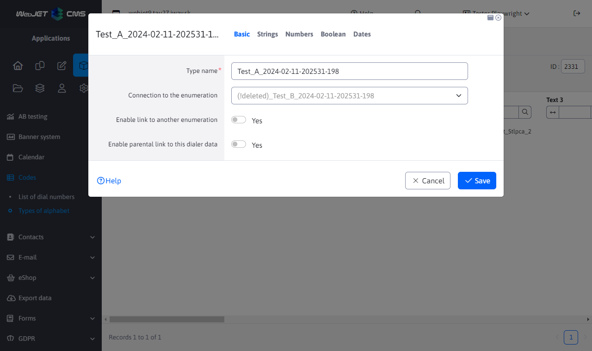
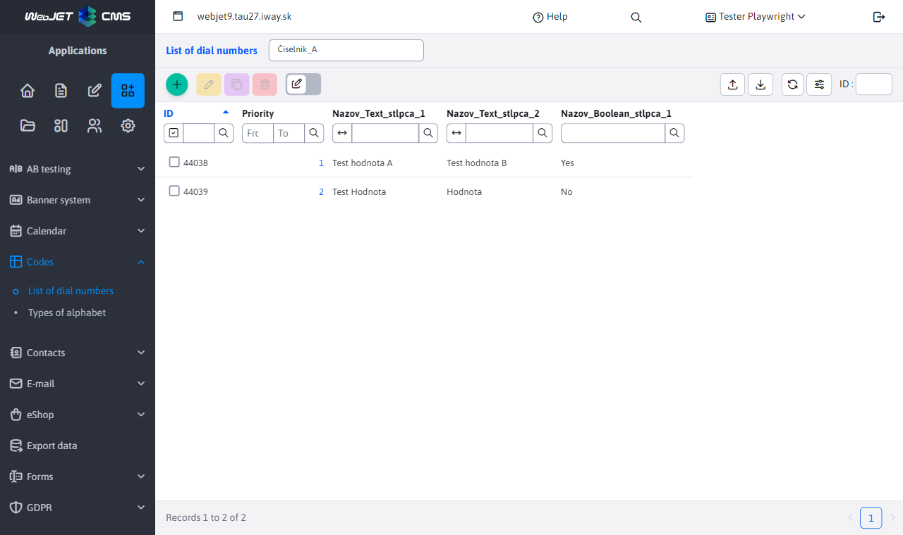
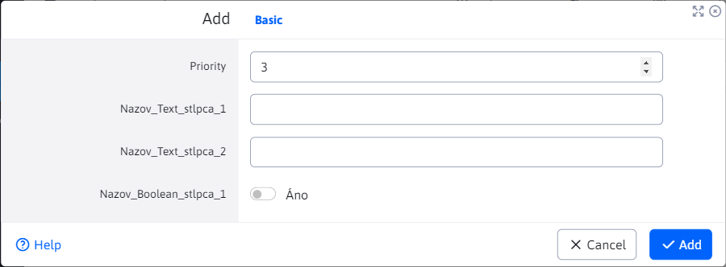

# Dialers

The Dials application allows you to create/edit/delete and duplicate named types of dials, which can then be used to store the data of these dials. Dial types and data can also be exported and imported using a file.

## Types of dials

When creating a new dial type, you must specify a name that is unique. The other fields are optional. Note the tabs **Chains** / **Numbers** / **Boolean** / **Dates** which contain several numbered fields. These fields are used to define the format of the dial data. If you specify a name for a field, the dial data will generate a field with a name that matches the specified text and the type of the card.

Example: if you fill in 2 fields in the tab **Chains**

and one field in the card **Boolean**,

then 2 columns/arrays of the string type and 1 column/array of the boolean type with the names that were entered will be displayed in the data of the given code list (see the figure in the section [List of dial data](#list-of-dial-data)).

This means that you can define the dial data format for each dial separately. As the tab names suggest, you can combine text, numeric, Boolean or date fields. Their number is limited for each type by the number of fields in each tab.

### Basic tab

In the "Basic" tab, the properties are set:
- Type name - a unique name for the dial type, must not be empty.
- Link to dial - select from all dials to link the dial.
- Enable link to dialpad - enable link to another dialpad (same as in the case of the dialpad type).
- Enable parent link to this dial's data - determines whether the data of this dial will be allowed to select the parent link.

You cannot have "dial link" and "parent link" enabled for data at the same time.

**Link to the dial** has some limitations and therefore some options either cannot be selected (marked in grey) or their selection returns an error message.

1. Linking the dial to itself is disabled. In the case of a dial **B** you select a link to another dial, it will be in the list itself but this option will not be selectable.

2. Circular linking of dials is disabled. If you dial **A** selects the link to the dialpad **B**, so the dial **B** cannot link back to the dial **A**. Option to select the dial **A** will be for the dial **B** although visible and able to select it, an error message will be returned when attempting to save.

3. Link to an already deleted dial. It may happen that the dial **C** is linked to the dial **D**, which was subsequently deleted. In this case you will see the deleted dial **D** in options with prefix **`(!deleted)_`**. This prefix will make it clear that the dial has already been deleted and this option will not be selectable. However, the dial **C** which was linked before the dial was deleted **D** retains this link. It will be possible to change this link, but once changed, it will not be able to link back to the deleted dial again.

**Enable link to dialpad** if enabled, individual dial data will be able to link to dials. Also in this case there are some limitations.

1. Linking to the dials from which the data is based is disabled. If the data you are creating under dial X has the link to dial enabled, the option to dial X will not even appear.

2. Link to an already deleted dial. This case has the same conditions as **Link to the dial** for the dial type.

**Enable the parent link to the data of this dialer** if enabled, individual dial data will be able to choose a parent from among other data under the same dial. Also in this case there are some limitations.

1. In this case, one condition must be met. To use the parent link, the dial type must have an option defined for **Chain 1**. The reason is that the value in the generated column **Chain 1** will be used as an identifier to select a link to the parent.

2. Linking a dial entry to itself is disabled. Dialpad data will not be visible between the options when selecting a parent link to itself.

!>**Warning:** if the 'dial link permission' or 'parent link permission' is revoked, all links that have been created to the data of this dial will be removed, even if this permission is granted again.

As an example, consider a situation where we create a dial type with the X label and this dial type allows "link to dial". Under this dial type, we create a record that has dial linking enabled and will link to dial Z. If we then remove the "link to dialer" permission for dialer type X, the record of this dialer that has linked to dialer Z will lose this link permanently. If we enable "link to dialer" again, the option would appear for the record but the previous option to dialer Z would be reset.

## List of dial data

Dial Data allows you to edit the data of created dial types. It is necessary to select the dial to be managed from the menu in the header of the page. After selecting a specific dial, its corresponding data will be displayed. If the dial type has some columns unnamed, these columns and their data will not be displayed.

!>**Warning:** only dials that have not been deleted are in the menu.

Example:

When creating a dial **A** we have filled in the fields **Chain 1**, **Chain 2** a **Boolean 1**. We can see that the table has exactly the columns we defined in the dial. If we create a new record (new data) for the dial, we will generate 2 fields of type string and 1 field of type boolean in the editor. The names of these fields will be the same as what we specified when we created the dial. Of course, if we enabled this when we created the dialer, we can have in the editor **parental connection** or **link to the dial**.

When you change the selected dial type, the entire table as well as the dial data editor can be changed.

## Data deletion

By default, when you delete a record of a codebook or data type, it is not physically deleted from the database, but marked as deleted. This is to protect against data retrieval errors in old data. For example, if the Car Color dial is used and we no longer want a color to be selected for new records, but at the same time the color needs to be displayed in the old records. Technically it is possible to restore a deleted record directly in the database by setting the attribute `hidden`, but the user interface does not currently allow it.
