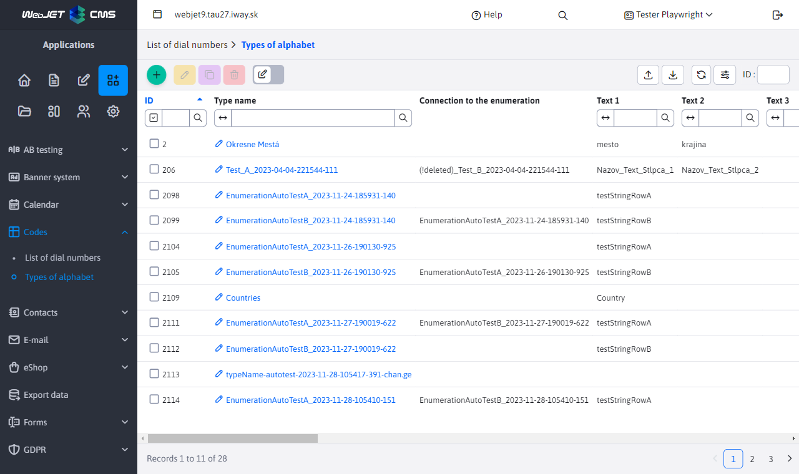
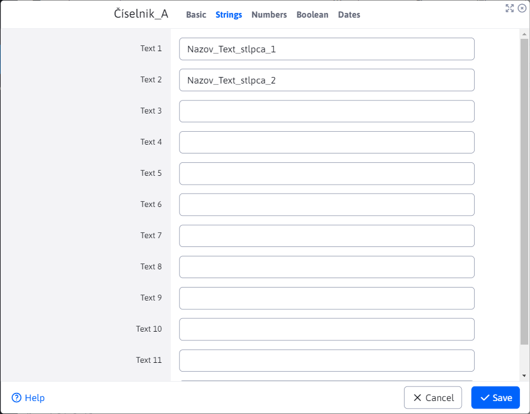
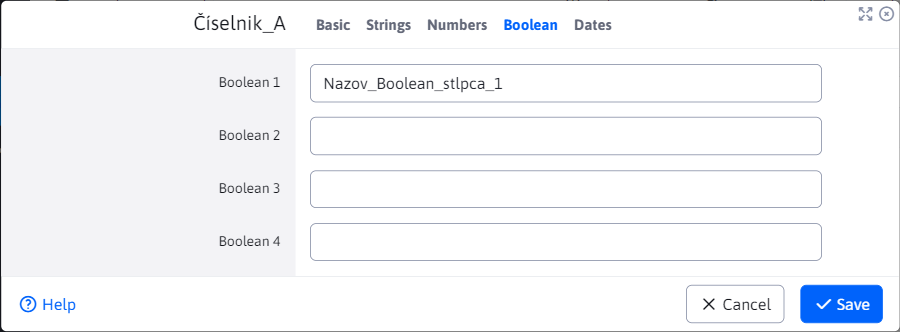
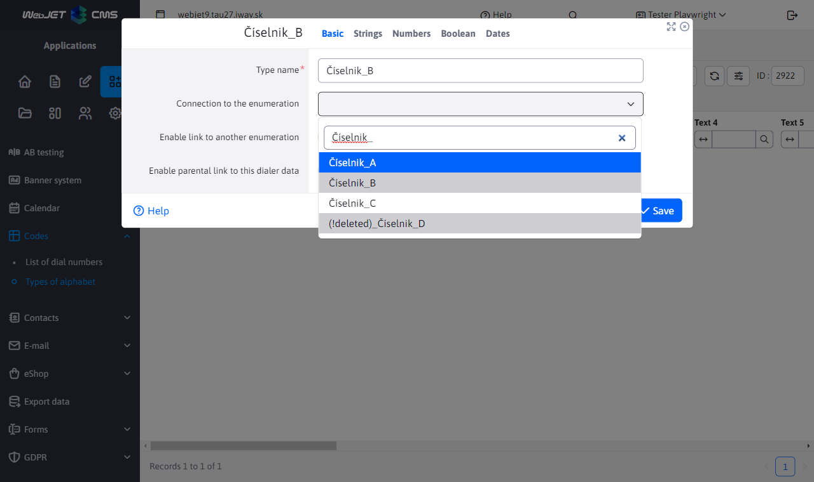
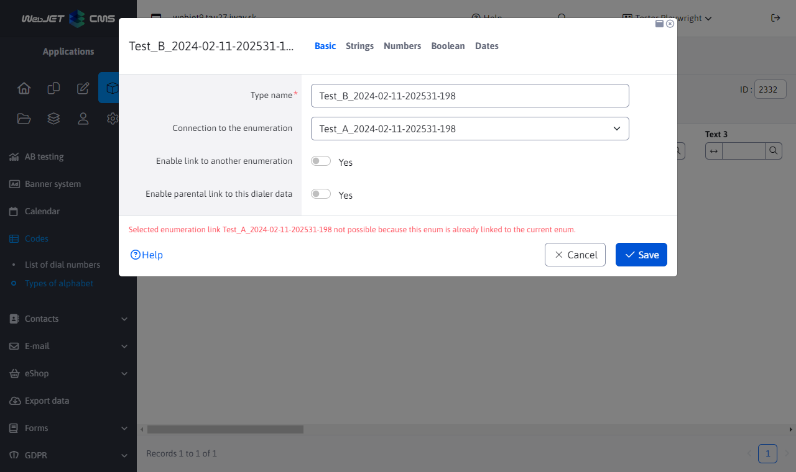
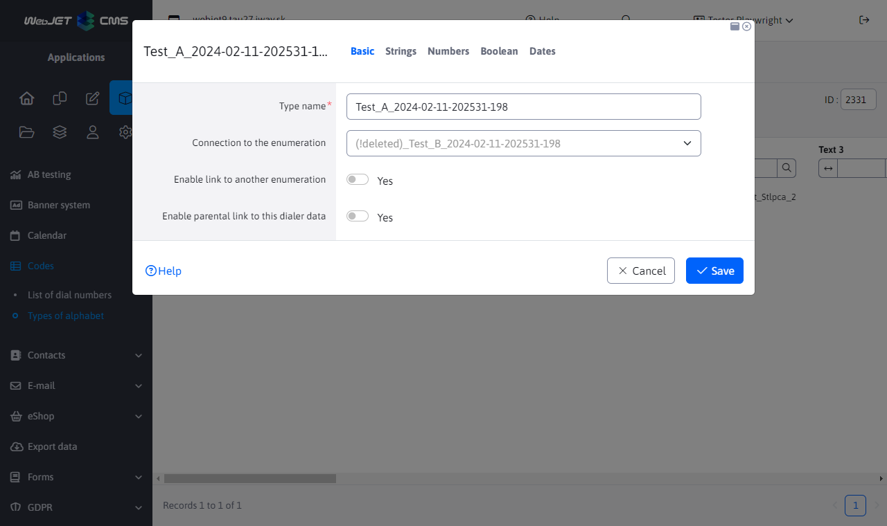
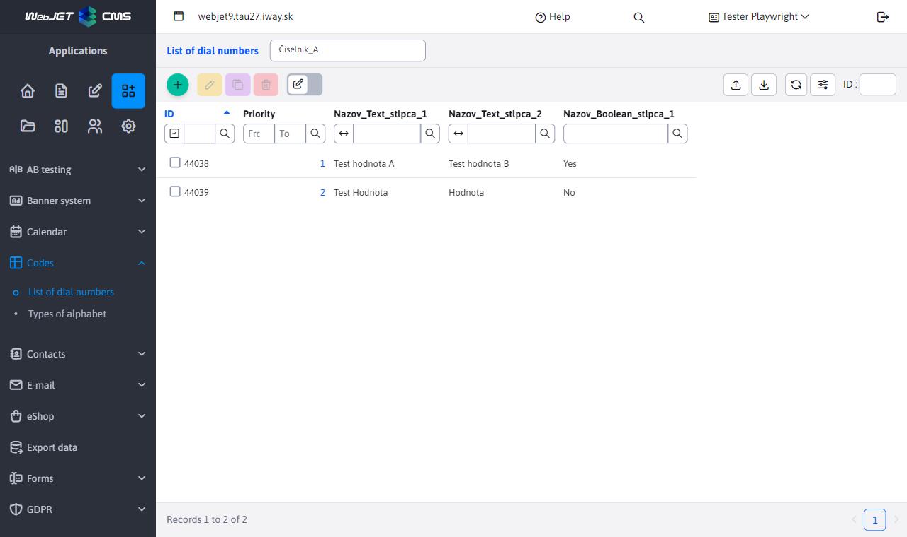
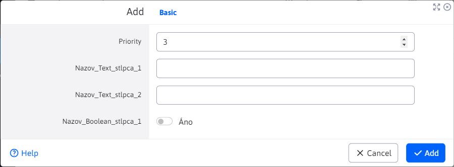

# Dials

The Dialpads application allows you to create/edit/delete and duplicate named dialpad types, into which you can then store the data of these dialpads. Dialpad types and data can also be exported and imported using a file.



## Dial types

When creating a new type of codebook, you must enter a name that will be unique. The other fields are optional. Notice the **Strings** / **Numbers** / **Booleans** / **Dates** tabs, which contain several numbered fields. These fields define the format of the data for the given codebook. If you enter a name for the field, a field with a name that matches the entered text and the type of the given card will be generated in the codebook data.


Example: if you fill in 2 fields in the **Strings** tab



and one field in the **Boolean** tab,



This will display 2 columns/fields of type string and 1 column/field of type boolean in the data of the given codebook with the names that were entered (see the image in the section [List of codebook data](#list-of-codebook-data)).

This means that you can define the data format of the dialpads for each dialpad separately. As the names of the cards suggest, you can combine text, numeric, Boolean or date fields. Their number is limited for each type by the number of fields in each card.

### Basic tab

The following properties are set in the "Basic" tab:

- Type name - a unique name for the dial type, cannot be empty.
- Link to dialer - select from all dialers to link the dialer.
- Allow link to dialpad - allow linking to another dialpad (same as in the case of dialpad type).
- Allow parent linking to data in this codebook - determines whether the data in the given codebook will have the option of selecting a parent link.

You cannot have "dial link" and "parent link" enabled for data at the same time.

**The dialer link** has certain limitations and therefore some options either cannot be selected (marked in gray) or selecting them will return an error message.

1. Linking a dial pad to itself is prohibited. If you select a link to another dial pad for dial pad **B**, it will also be in the list, but this option will not be available.



2. Circular linking of dials is prohibited. If dial **A** chooses to link to dial **B**, dial **B** cannot link back to dial **A**. The option to select dial **A** will be visible to dial **B** and will be able to select it, but an error message will be returned when trying to save.



3. Linking to an already deleted dialpad. It may happen that dialpad **C** has been linked to dialpad **D**, which was subsequently deleted. In this case, you will see the deleted dialpad **D** in the options with the prefix **`(!deleted)_`**. This prefix will clearly indicate that the dialpad has already been deleted and such an option will not be available. However, dialpad **C**, which was linked before dialpad **D** was deleted, will retain this link. This link can be changed, but after the change, it will no longer be able to link back to the deleted dialpad.



**Allow linking to dialpad** if enabled, individual dialpad data will be able to link to dialpads. There are also certain limitations in this case.

1. Linking to the codebooks from which the data comes is disabled. If the data you are creating under codebook X has a link to the codebook enabled, the option to codebook X will not even appear.
2. Link to an already deleted codebook. This case has the same conditions as **Link to codebook** for the codebook type.

**Allow parent linking to data in this codebook** if enabled, individual data in the codebook will be able to choose a parent from other data under the same codebook. Again, there are some limitations here.

1. In this case, one condition must be met. To use the parent link, the codebook type must have the option defined for **String 1**. The reason is that the value in the generated column **String 1** will be used as an identifier by which the link to the parent can be selected.
2. Linking a codebook entry to itself is prohibited. Codebook data will not be visible among the options when selecting a parent link.

!>**Warning:** if "codebook link permission" or "parent link permission" is removed, all links that were created for this codebook data will be removed, even if this permission is granted again.

As an example, let's take a situation where we create a dial type labeled X and this dial type allows "linking to dial". Under this dial type, we create a record that has the dial link enabled and will link to dial Z. If we then cancel the "link to dial" permission for dial type X, the record of this dial that was linked to dial Z will lose this link permanently. If we were to enable "link to dial" again, the option would be displayed for the record but the previous choice for dial Z would be reset.

## List of dial data

Codebook data allows you to edit the data of the created codebook types. It is necessary to select the codebook that will be managed from the menu in the page header. After selecting a specific codebook, its corresponding data will be displayed. If the codebook type has some columns that are not named, these columns and their data will not be displayed.

!>**Note:** Only dials that have not been deleted are listed.



Example:

When creating the codebook **A**, we filled in the fields **String 1**, **String 2** and **Boolean 1**. We can see that the table has exactly the columns that we defined in the codebook. If we create a new record (new data) for the codebook, 2 string fields and 1 boolean field will be generated in the editor. The names of these fields will be the same as those we entered when creating the codebook. Of course, if we enabled it when creating the codebook, we can have **parent link** or **link to codebook** in the editor.



When changing the selected codebook type, the entire table as well as the codebook data editor may change.

## Data deletion

By default, when a record of the code list or data type is deleted, it is not physically deleted from the database, but is marked as deleted. This is to protect against data retrieval errors in old data. For example, if the Car Color code list is used and we no longer want to have a color to choose from for new records, but at the same time the color needs to be displayed in old records. Technically, it is possible to restore a deleted record directly in the database by setting the ```hidden``` attribute, but the user interface currently does not allow this.