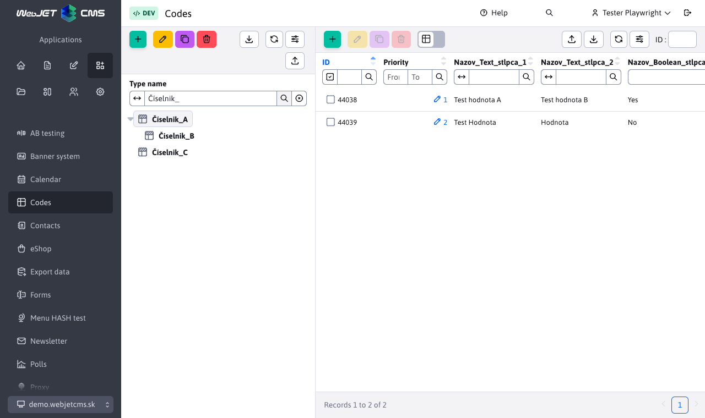
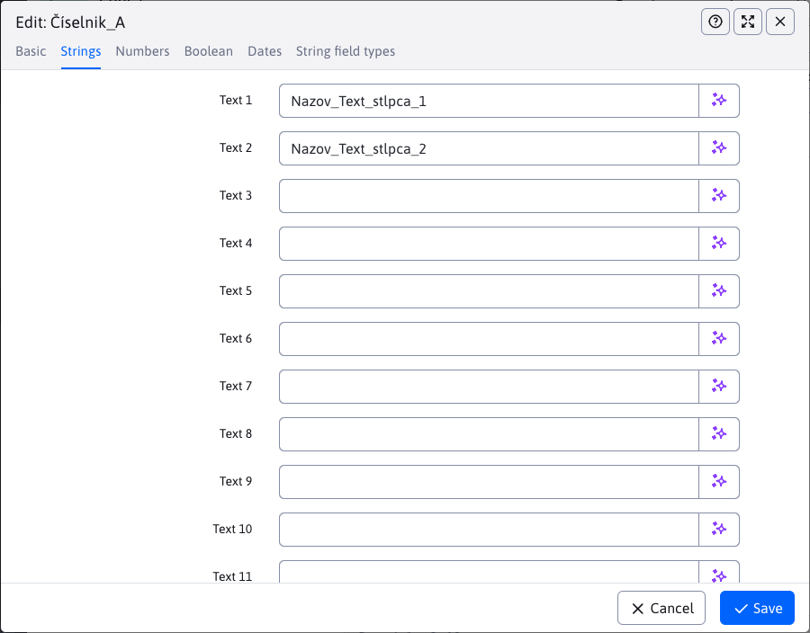
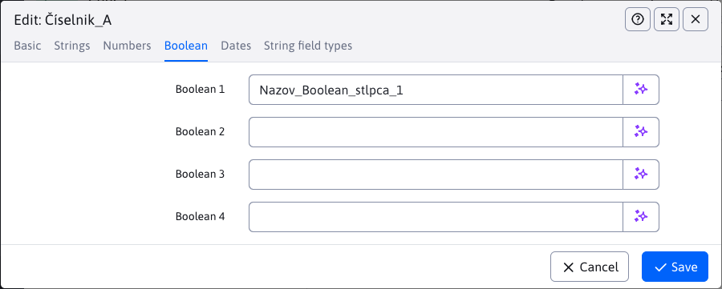
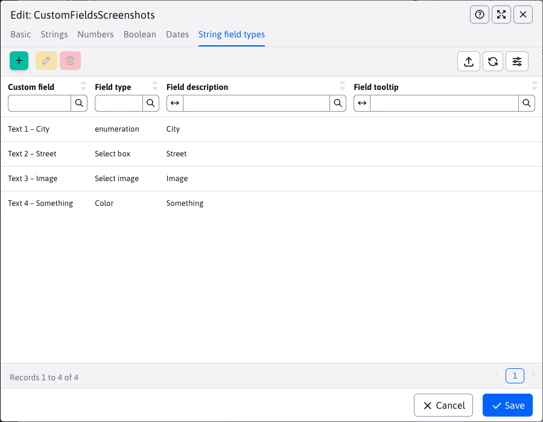
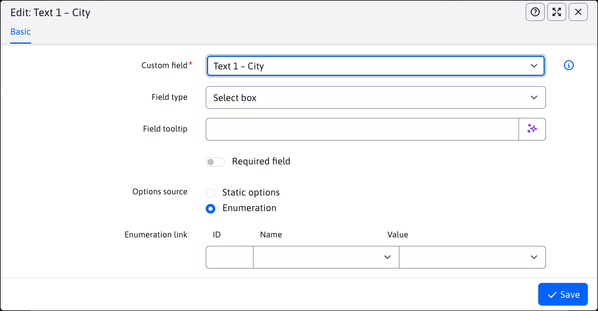
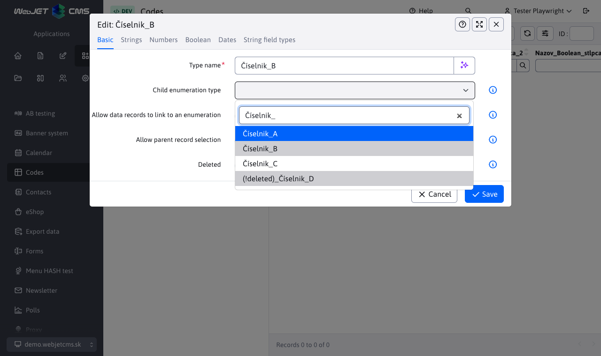
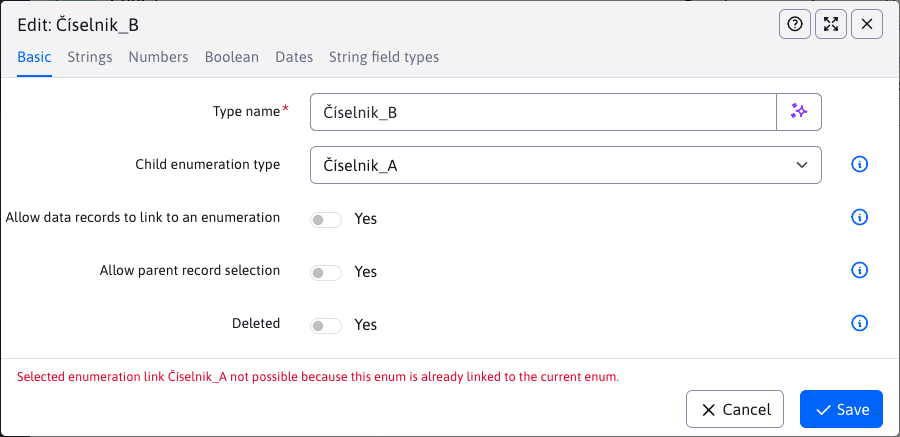
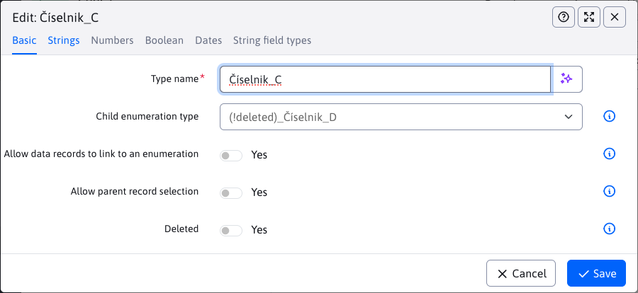
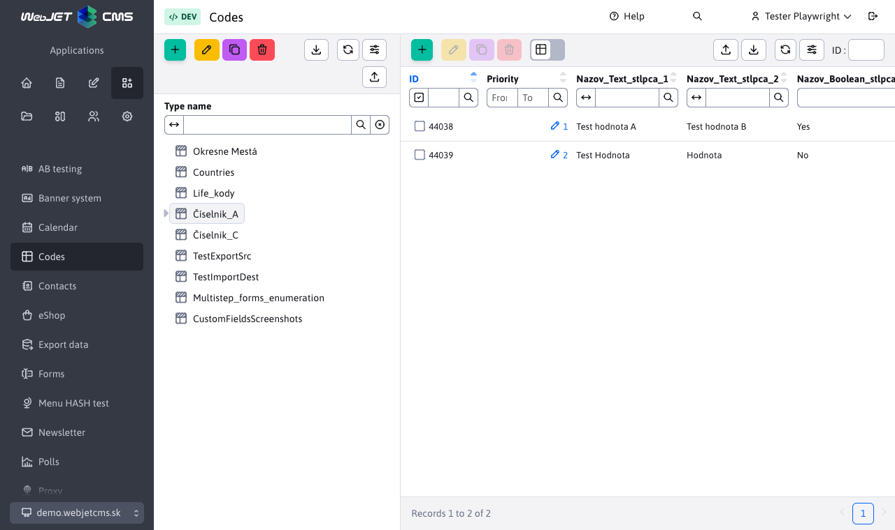
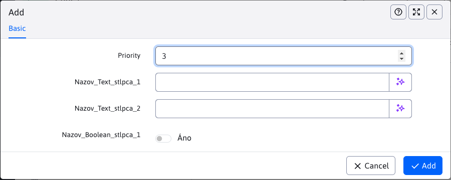

# Dials

The Dialpads application allows you to create, edit, delete, and duplicate named dialpad types and store data in them. Dialpad types and their data can also be exported and imported using a file.

The codebook types are selected in the tree list in the left panel. The right panel displays a data table with the data of the selected codebook type.

## Dial types

The types of codebooks are displayed in a tree structure on the left. You can use the buttons above the tree to create, edit, duplicate, delete, import, or export the type. When editing, the same editor opens with field and link settings. The search below the buttons filters the type names.

By button <button class="btn btn-sm btn-outline-secondary" type="button"><i class="ti ti-adjustments-horizontal"></i></button> above the tree you can change the ratio of the width of the tree to the table, set a fixed width of the tree in pixels or show **deleted types**. The setting is saved for the logged in user separately for this application.

!> **Deleted types** are not displayed in the tree by default. You can enable the **Show deleted types** option in the tree settings; they will appear in red with a trash can icon and you can select and edit them. When a deleted type is selected, delete and duplicate actions are blocked until you restore the type.

The tree takes into account the **Child Codebook Type** field in the type settings: if type **A** refers to type **B**, type **B** will appear under type **A**. A type linked to multiple parents will appear under each of them; all of its occurrences open the same data and settings. The search also leaves the path through the parent types visible, and this path will expand when the selection is renewed. Links between individual data records do not change the type hierarchy.

The type selection is saved in the page address, so you can save or share the link. If the selected type does not already exist, the first available type will be displayed. If no type is available, create one using the **+** button above the tree; adding data is disabled until then.

When creating a new type of codebook, you must specify a unique name. The other fields are optional. The **Strings**, **Numbers**, **Booleans**, and **Dates** tabs contain several numbered fields that you use to define the data structure of the given codebook. If you specify a name for the field, a field with the specified name and data type corresponding to the given tab is created in the codebook data.

Example: if you fill in two fields on the **Strings** tab

and one field on the **Boolean** tab,

In the data table of the given codebook, two columns of type string and one column of type boolean with the specified names will be displayed. The corresponding fields will be displayed in the editor (see the images in the section [Codebook data list](#codebook-data-list)).

You can define the data structure for each codebook separately. You can combine text, numeric, boolean, and date fields. The number of fields of each data type is limited by the number of fields on the corresponding card.

### String Field Types tab

After saving a codebook type for the first time, the **String Field Types** tab appears. It allows you to extend named fields from the **Strings** tab with settings known from [custom fields](../../../frontend/webpages/customfields/custom-fields-settings.md), such as a selection box, multiple selection, autocomplete, link to another codebook, or select an image, link, folder, or web page.

Only string fields for which a configuration is created are displayed in the table. When you add a field, only named string fields in the format **String N – name** are available in the **Optional field** field. The field menu, their names, and descriptions are based on the last saved version of the codebook type. Therefore, after naming or renaming a string field, save the codebook type first; the configuration will then be automatically updated. If you delete the field name, the field will be hidden and its mandatory setting will be canceled.

For each field you can set:

- field type and type-specific properties, such as select field options,
- obligation to fulfill,
- help text displayed as `tooltip`.

Without specific configuration, a named string field will appear as a regular text field with a maximum length of 1024 characters. Unnamed string fields will not appear in the codebook data or configuration options.

!> **Warning:** The code lists are not yet divided by the selected domain, therefore the settings of optional fields (string field types) are always saved in the main domain. In the [Optional Fields](../../../frontend/webpages/customfields/custom-fields-settings.md) section, these settings will only be displayed in the main domain. We recommend that you always set and edit them on the **String Field Types** tab.

!> **Backward compatibility note:** String field data attributes have changed from `string1` to `string12` to `fieldA` to `fieldL`. In custom or legacy Excel templates to import codebook data, you must manually edit the code names in the header, for example `Mesto|string1` to `Mesto|fieldA`. Use the same names `fieldA` to `fieldL` in REST API integrations that process codebook data. Database columns `string1` to `string12` remain unchanged.

### Basic tab

The following properties are set on the **Basic** tab:

- Type name - a unique name for the dial type, cannot be empty.
- Deleted - indicates a discarded type. Turning this option off and saving will restore the type and all its data records.
- Subordinate codebook type - the selected type will appear in the tree below the current type. This setting does not automatically link their data records.
- Enable linking of data records to a codebook - enables selection of a linked codebook in the individual record editor. Does not change the setting of the subordinate type.
- Allow selection of parent record - allows individual records to select a parent from among other records of the same codebook.

The **Allow linking of data records to the codebook** and **Allow selection of parent record** options cannot be enabled at the same time. The child type setting is independent of them. An explanatory description is available for each of these three fields.

There are some restrictions when selecting a **sub-dial type**. Some options are therefore not selectable (grayed out), while others will display an error message when you try to save.

1. Linking a dialpad to itself is prohibited. If you select a link to another dialpad for dialpad **B**, it will also be in the list, but this option will not be available.

2. Circular linking of dials is prohibited. If dial **A** refers to dial **B**, dial **B** cannot link back to dial **A**. You can select dial **A** in dial **B** settings, but an error message will appear when you try to save.

3. A new link to a deleted codebook cannot be created. If codebook **C** refers to codebook **D**, which was subsequently deleted, codebook **D** will appear in the options with the prefix **`(!deleted)_`** and will not be selectable. The existing link from codebook **C** to codebook **D** will remain. You can change it, but after changing it, you will no longer be able to select the deleted codebook **D**.

If the **Allow linking of data records to a codebook** option is enabled, you can link individual records to other codebooks. The following restrictions apply:

1. Linking to the codebook the record belongs to is prohibited. If you are creating a record in codebook **X**, codebook **X** will not appear in the link options.
2. The same conditions apply to linking to a deleted codebook as for the **Subordinate codebook type** field.

If the **Allow parent record selection** option is enabled, you can select a parent for an individual record from among other records in the same codebook. The following restrictions apply:

1. The codebook type must have a field named **String 1**. Its value is used to identify the record when selecting the parent.
2. Linking a record to itself is prohibited. Therefore, the current record will not appear in the parent selection options.

!> **Warning:** if you disable the **Allow linking of data records to a codebook** or **Allow selecting a parent record** option and save the change, all corresponding data record links for this codebook will be removed. Re-enabling the option will not restore them.

For example, a record of type **X** refers to a codebook of type **Z**. If you disable the **Allow linking of data records to codebook** option in type **X** and save the change, the record will lose the link to **Z**. After you re-enable the option, the link will be re-selectable, but the original value will not be restored.

## List of dial data

In the data table, you can edit the records of the created codebook types. In the tree in the left panel, select the codebook that you want to manage. After selecting it, the corresponding data will be displayed. You can create new records by clicking the **+** button above the data table. If the codebook type has some columns that are not named, these columns and their data will not be displayed.

!> **Warning:** deleted types are only available when the **Show deleted types** option is enabled. Restore the deleted type before adding or importing data.

Example:

When creating the codebook **A**, we named the fields **String 1**, **String 2**, and **Boolean 1**. The table contains these columns. When creating a new record, the editor will display two string fields and one boolean field with the names specified when creating the codebook. If we enabled it in the codebook settings, the **parent link** or **link to codebook** will also be available in the editor.

When changing the selected codebook type, the table columns and fields in the data editor can be changed according to the settings of the selected type.

## Data deletion

By default, when you delete a codebook type or its data records, they are not physically removed from the database; they are simply marked as deleted. This keeps the data available to existing records that reference them. For example, in the **Car Color** codebook, you can delete a color that you no longer want to offer when creating new records, but still need to display in older records.

You can restore a codebook type in the user interface: in the tree settings, enable **Show deleted types**, select the type with the trash icon, open its editor, and disable **Deleted**. Saving restores the type and all its data records, including records deleted separately before the type was deleted. Normal editing of an active type does not restore deleted data.

When a type is deleted, its data records are also marked as deleted. If the **Show deleted types** option is disabled, the type disappears from all branches of the tree, but existing links from other types remain; they are displayed in their editor with the prefix **`(!deleted)_`**. If you delete a parent type, its child type is not deleted: it remains under other active parents or is displayed at the top level of the tree if it no longer has an active parent.

When displaying deleted types, the tree also preserves their links to parents and children. When the type is restored, it is displayed again in the regular tree based on the preserved links.
