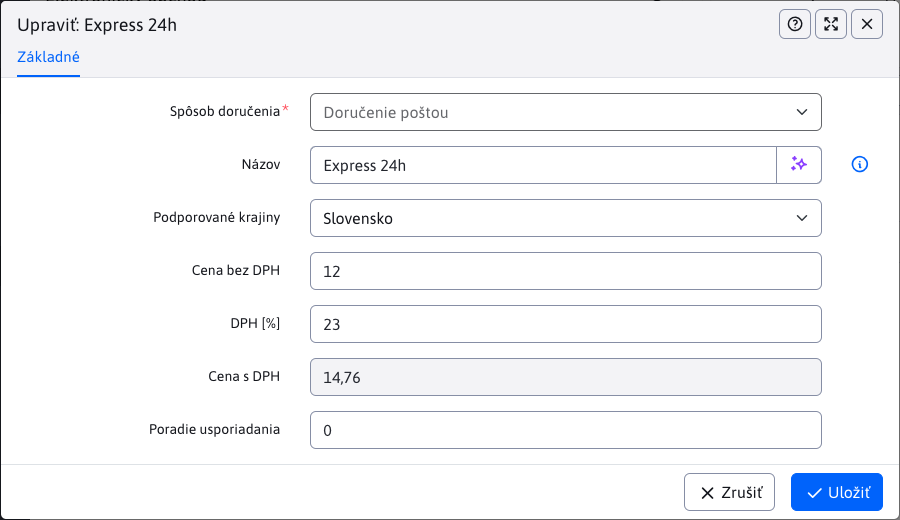

# Delivery methods

The Delivery Methods application allows you to set supported delivery methods for individual countries.


## Delivery method configuration

Each delivery method has at least the following fields:

- **Delivery Method**, an immutable value representing the type of delivery method. Supported delivery methods are defined programmatically.
- **Name**, the name displayed to the customer during the order. You can enter a translation key. If left blank, the delivery method will be used.
- **Supported countries**, select the country (or countries) for which this delivery method will be available. The list of supported countries can be set using the `basketInvoiceSupportedCountries` configuration variable.
- **Price excluding VAT**, the value representing the delivery price excluding VAT
- **VAT `[%]`**, a value representing the VAT rate in percentage
- **Price incl. VAT**, a value representing the delivery price including VAT (calculated automatically based on the price excluding VAT and the VAT rate)
- **Sort Order**, a numerical value for the order of the delivery method in the e-commerce.



The editor **may also contain additional fields**, depending on the implementation of the specific delivery method.

!> You choose the delivery method when creating a new record using the drop-down list in the upper left corner of the page.

## Delivery method validation

You must select at least one country for which this delivery method will be available.

Even when creating/editing a delivery method record, if you do not enter a value in the **Price excluding VAT** or **VAT `[%]`** field, the value 0 will be automatically filled in, meaning delivery will be free.

## New type of delivery method

Defining a new delivery method (type) is possible by programming the ```BackeEnd``` functionality. More information [for programmers](../../../../custom-apps/apps/eshop/delivery-methods/README.md).