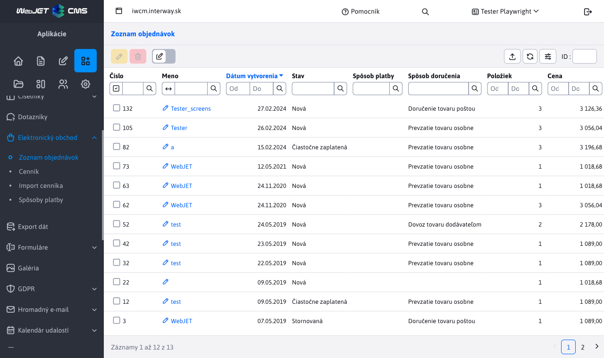
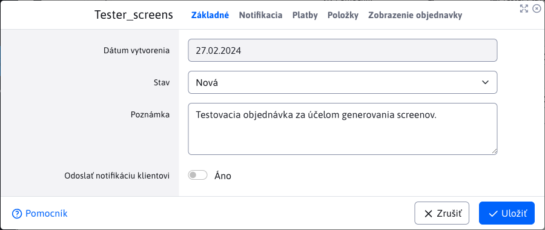
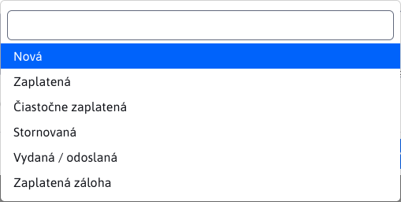
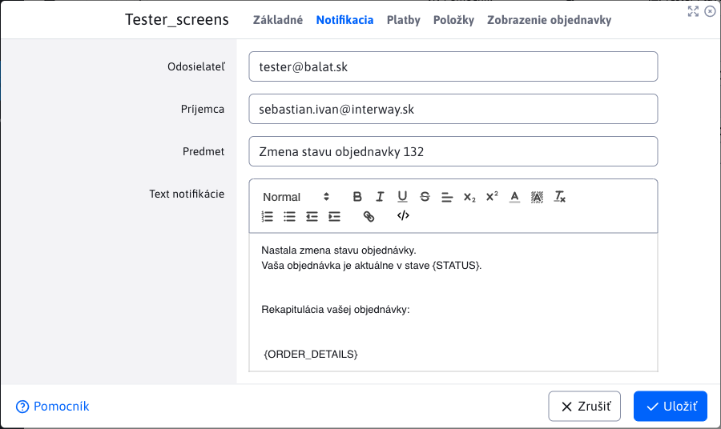
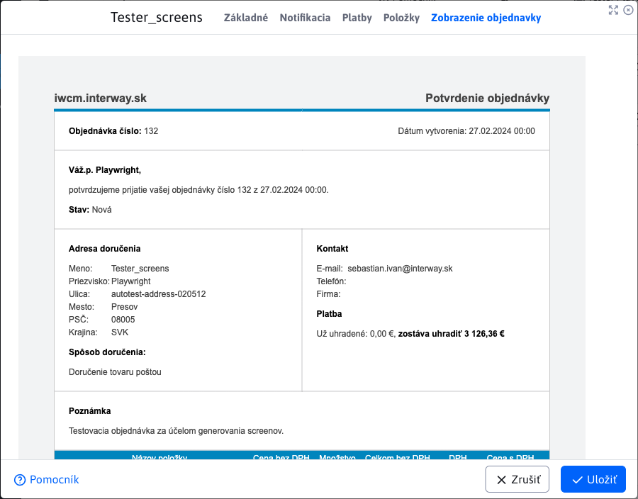
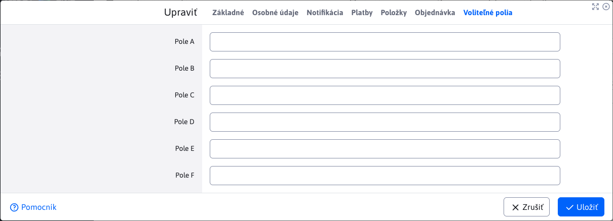

# List of orders

The Order List application provides an overview of all orders created using the e-commerce, with the possibility of managing them.

The application does not allow adding new orders by create/duplicate/import. Only edit/delete/export actions are allowed.

You may notice that the columns **Name** a **Last name** have some values combined. The first value **always** displays the name as a contact (billing name). The second name in brackets will only be displayed if a delivery address other than the billing address has been entered. Since the billing name and the delivery name may be different. When filtering, a match is searched for both of these values. The same is true for the last name column.

## Order modification

The order edit window consists of tabs:
- Basic
- Personal data
- Notification
- Payments
- Items
- Order
- Optional fields

### Basic tab

Provides basic order information.

The important parameter is **Status** which indicates the current status of the order it is currently in.

The displayed states are automatically available. If you wish to add new states, you can do so using the configuration variable `basketInvoiceBonusStatuses`. Add the new state as a value `status_id|translation_key`.

!>**Warning:** Value `status_id` must be equal to or greater than 10. Added states with a value less than 10 will be ignored.

If you choose the option **Send notification to client**, a notification will be sent when the edited order is saved. An overview of the notification is in the [Notification tab](#notification-tab).

### Personal Data tab

Provides an overview of personal data such as **Contact**, **billing address**, **company data** a **delivery address**. The values are obtained from the form when creating an order in the e-shop.

### Notification tab

Provides a preview of the email notification to the customer, with the option to change the text. Notification will be sent only if the option is selected **Send notification to client** v [Basic tab](#base-card).
- **Sender** - auto-populated value with the email of the currently logged in user. It serves as the email of the sender of the notification and it is possible to change this address.
- **Subject** - auto filled value with text **Change order status (order id)**. It serves as the subject of the sent email (notification) and can be changed.
- **Notification text** - body/text of the sent email.
  - Value `{STATUS}` will be replaced by the current order status when shipped.
  - Value `{ORDER_DETAILS}` on will be replaced by the total order summary, which can be found in the [View Orders tab](#order-display-tab).

### Card Payments

Provided by [overview of all payments](payments.md) to this order (in the form of a nested table) and the ability to manage payments.

### Card Items

Provides an overview [all items of the order](items.md) and the option to manage items.

### View Orders tab

Provides an overall overview of the order, including payments and items. This overview **cannot be edited**, is for information purposes only. It is also inserted in the sent [notifications](#notification-tab) to the user, as a replacement value `{ORDER_DETAILS}`.

When changing the values [payments](#card-payments) or values [items](#item-card) this order overview is refreshed and thus always provides up-to-date information.

### Optional Fields tab

The Optional Fields tab allows you to set field values according to the needs of your implementation.

## Change order status

If a payment has been added/changed/deleted in the order or an order item has been added/changed/deleted, the ratio is automatically recalculated in the background **the amount paid** a **amounts to be paid**.

According to the ratio of these amounts, the order status itself will change:
- if the paid amount is 0, the order status will be **New (unpaid)**
- if the amount paid **not covered** the total amount of the order, the order status will be **Partially paid**
- if the amount paid **Covers** the total amount of the order, the order status will be **Paid**

## Order deletion

To delete an order, you must first change the status to **Cancelled**. After deletion, the related payments and order items are automatically deleted.
