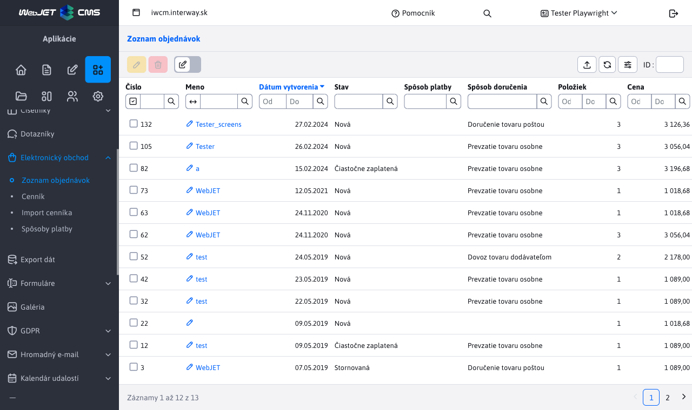
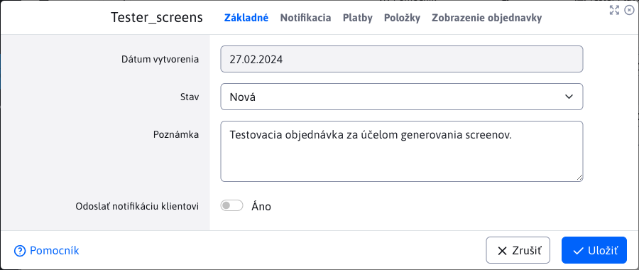
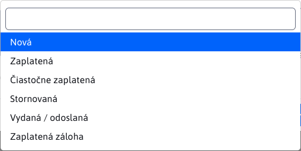
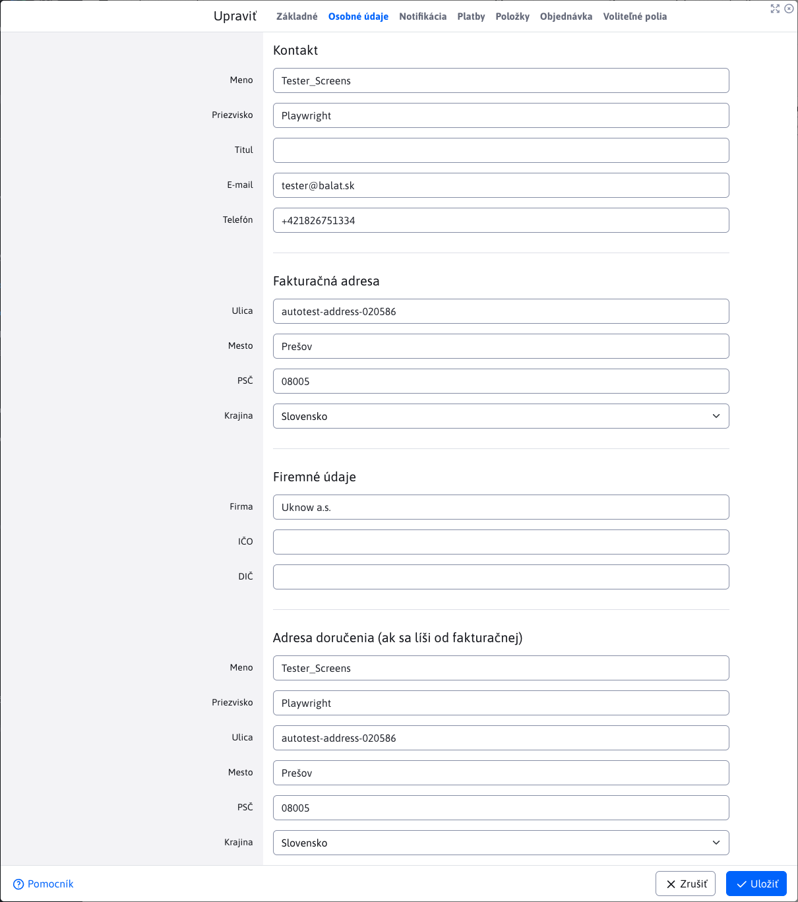
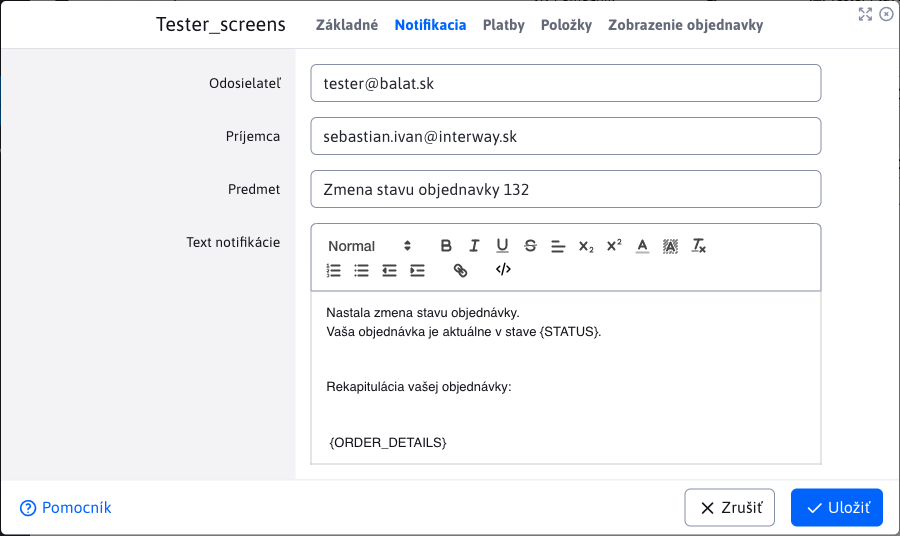
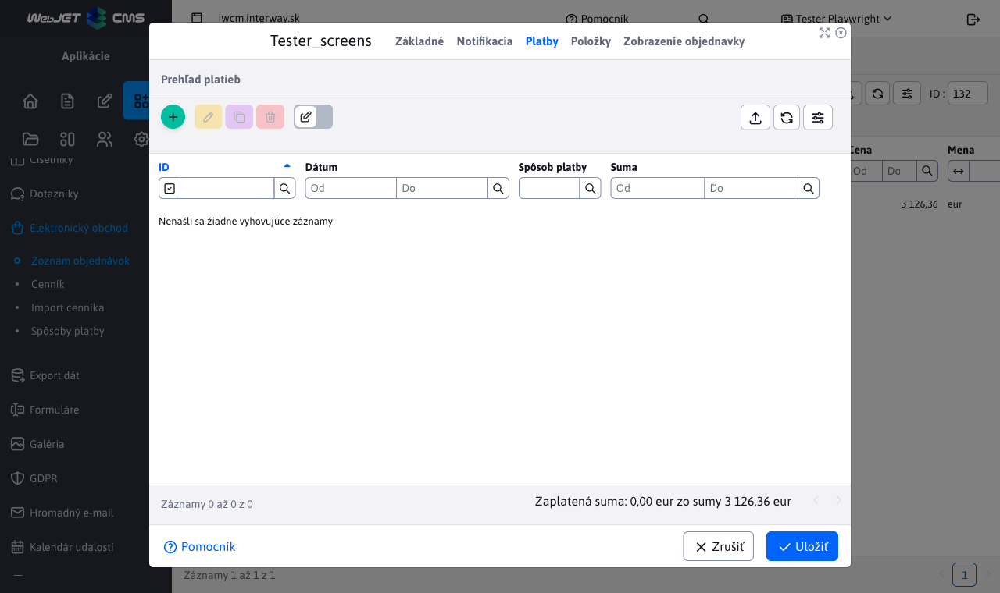
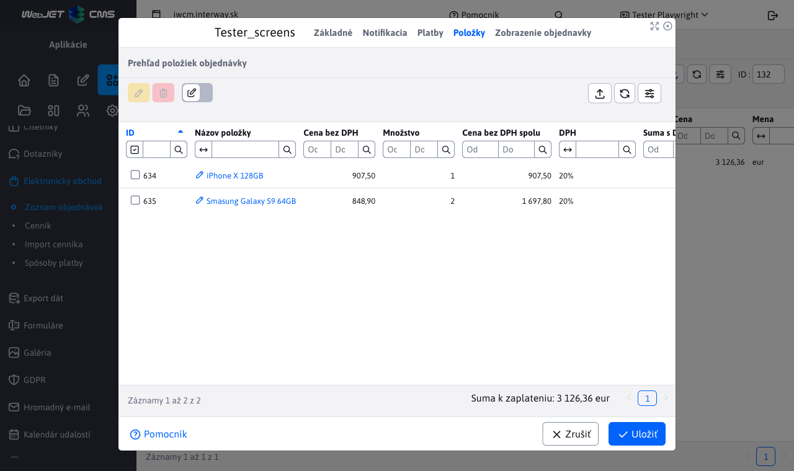
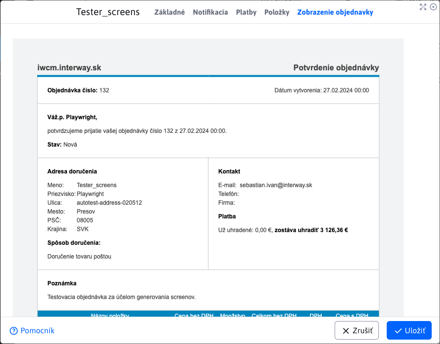
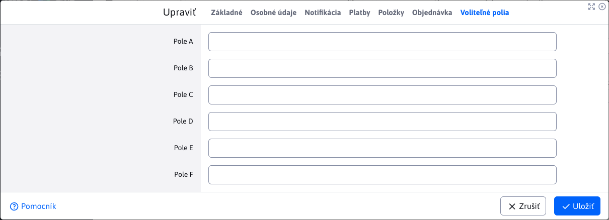

# Order list

The Order List application provides an overview of all orders created using the e-commerce, with the option to manage them.

The application does not allow adding new orders via create/duplicate/import. Only edit/delete/export actions are allowed.

You may notice that the **First Name** and **Last Name** columns have some values ​​combined. The first value **always** shows the name as the contact (billing name). The second name in parentheses is only shown if a shipping address has been entered that is different from the billing name. Since the billing name and shipping name can be different. When filtering, a match is searched for for both of these values. The same applies to the last name column.

## Order modification

The order editing window consists of the following tabs:
- Basic
- Personal data
- Notification
- Payments
- Items
- Order
- Optional fields

### Basic tab

Provides basic information about the order.

The **Status** parameter is important, as it indicates the current status of the order.

The displayed states are automatically available. If you wish to add new states, you can do so using the configuration variable `basketInvoiceBonusStatuses`. You add the new state as the value `status_id|translation_key`.

!>**Warning:** the value of `status_id` must be equal to or greater than the number 10. Added states with a value less than 10 will be ignored.

If you select the **Send notification to client** option, the notification will be sent when the edited order is saved. An overview of the notification is in the [Notification tab](#notification-tab).

### Personal information tab

Provides an overview of personal data such as **contact**, **billing address**, **company details** and **delivery address**. The values ​​are obtained from the form when creating an order in the e-shop.

### Notification tab

Provides a preview of the email notification to the customer, with the option to change the text. The notification will only be sent if the **Send notification to client** option is selected in the [Basic tab](#basic-tab).

- **Sender** - automatically filled in with the email of the currently logged in user. It serves as the email of the notification sender and it is possible to change this address.
- **Subject** - automatically filled in value with the text **Change of order status (order id)**. It serves as the subject of the sent email (notification) and can be changed.
- **Notification text** - body/text of the sent email.
  - The value `{STATUS}` will be replaced with the current order status upon submission.
  - The value `{ORDER_DETAILS}` will be replaced by the overall order overview, which can be found in the [Order View Tab](#order-view-tab).

### Payments tab

Provides an [overview of all payments](payments.md) for this order (in the form of a nested table) and the ability to manage payments.

### Items tab

Provides an overview of [all order items](items.md) and the ability to manage items.

### Order View Tab

Provides a complete overview of the order, including payments and items. This overview **cannot be edited**, it is for informational purposes only. This overview is also included in the [notification](#card-notification) sent to the user, as a replacement for the value `{ORDER_DETAILS}`.

When changing the values ​​of [payments](#card-payments) or the values ​​of [items](#card-items), this order overview is refreshed and always provides up-to-date information.

### Optional Fields tab

In the Optional Fields tab, you can set field values ​​according to the needs of your implementation.

## Change order status

If a payment has been added/changed/deleted in an order or an order item has been added/changed/deleted, the ratio of **paid amount** and **amount to be paid** is automatically recalculated in the background.

The order status itself will change depending on the ratio of these amounts:
- if the amount paid is 0, the order status will be **New (unpaid)**
- if the amount paid **does not cover** the total amount of the order, the order status will be **Partially Paid**
- if the paid amount **covers** the total order amount, the order status will be **Paid**

## Deleting an order

To delete an order, you must first change the status to **Cancelled**. Once deleted, the related payments and order items will also be automatically deleted.