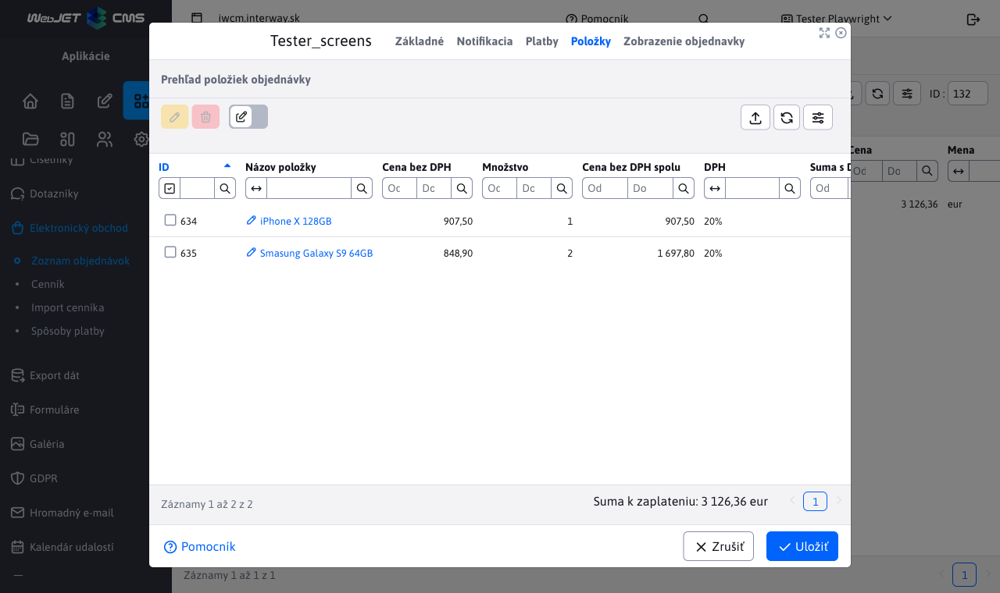
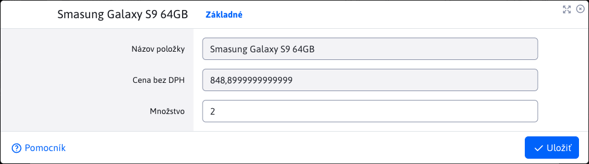

# Items

The nested Items table in the order detail provides an overview of the items in a specific order, the number of items as well as the individual or total price. The prices are without and including VAT.

Only operations for editing and deleting order items are allowed. Adding new items is only possible directly in the e-shop.

# Modifying an item

The item editor window offers the possibility to change only one parameter, namely **Quantity** pieces of a given item. The item type and the price excluding VAT are fixed and cannot be changed.

## Footer table

The footer of the table contains useful information about what the total amount of the order is to be paid, including VAT. If the number of items changes or an item is deleted, this value is automatically adjusted.

This change is automatically reflected in the footer of the table [payments](./payments.md#foot-of-the-table).
