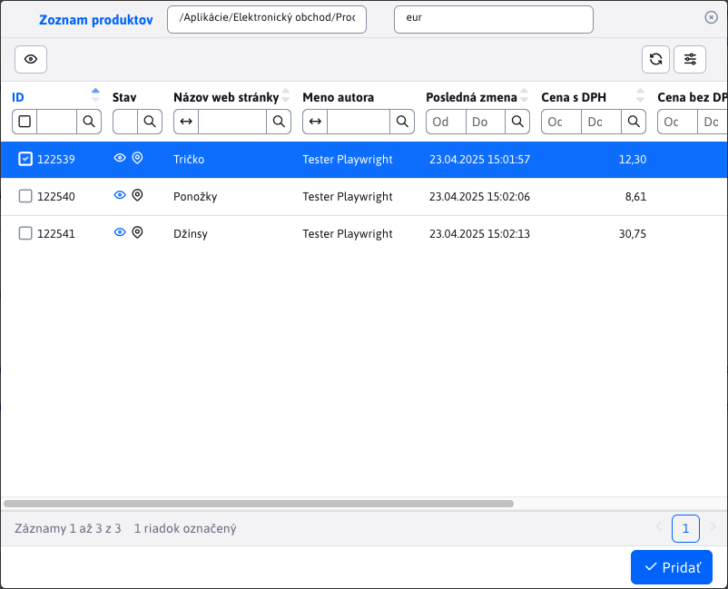

# Items

Nested table **Items** in the order detail provides an overview of the items of a specific order, the number of items as well as the individual or total price. The prices are without and including VAT.

## Status of items

Since the payment method and delivery method selected are also counted among the order items, the column **Status** distinguishes the different types of items by the following icons:
- <i class="ti ti-shopping-bag" ></i> - ordered item from the store
- <i class="ti ti-truck-delivery" ></i> - the chosen method of delivery
- <i class="ti ti-cash" ></i> - chosen payment method

## Adding items

When we add items, the whole section will be displayed in the window [List of products](../product-list/README.md). In this window you can perform classic filtering, but any modification is not allowed. Only the button is allowed <button class="btn btn-sm btn-outline-secondary" type="button"><i class="ti ti-eye" ></i></button> to view the product page.

To add products you have to select them and confirm your choice with the button <button class="btn btn-primary"><i class="ti ti-check" ></i>Add. If this product/item has not been ordered yet, it will be added. If this product/item is already in the order, the quantity will only be increased by the value </button>.`1`Modifying an item

## The item editor window offers the possibility to change the field&#x20;

Price without VA&#x54;**,&#x20;**&#x51;uantit&#x79;**,&#x20;**&#x4E;ote on the ite&#x6D;**. This way you can change the quantity of items in the order or if an item is damaged, give a discount on it, etc.**&#x46;ooter table

## The footer of the table contains useful information about what the total amount of the order is to be paid, including VAT. If an item is added, modified or deleted, the value is automatically adjusted.

This change is automatically reflected in the footer of the table&#x20;

payments[.](./payments.md#foot-of-the-table) !>

Warning:**&#x20;if you are making adjustments to the list of items you should for this order&#x20;**&#x53;end notification to clien&#x74;**&#x20;as changing the price to be paid may also change the status of the entire order.**
