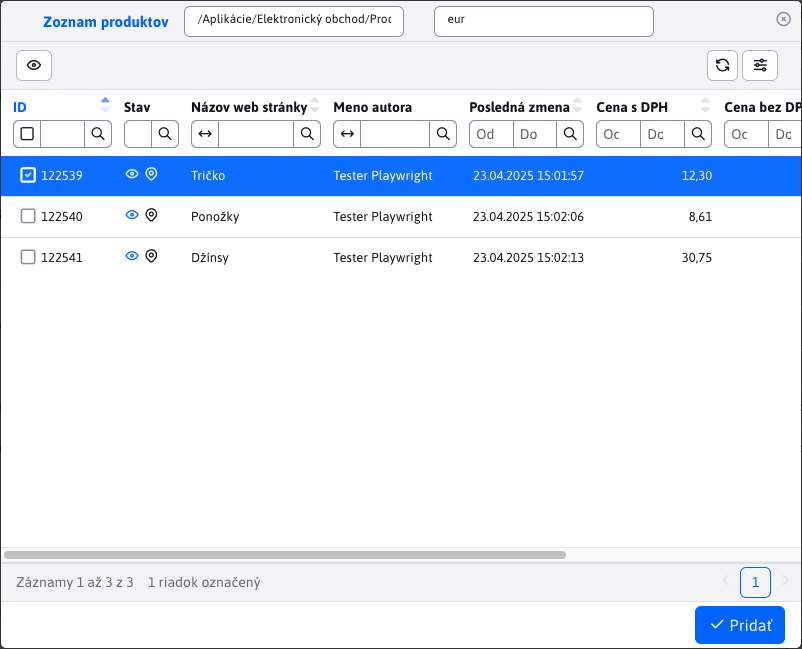
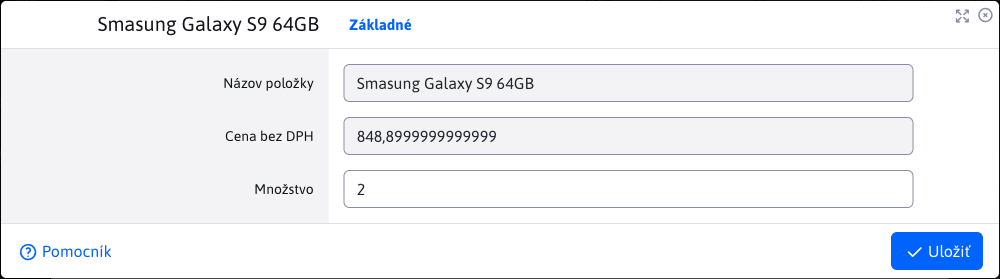

# Items

The nested table **Items** in the order details provides an overview of the items of a specific order, the number of pieces, as well as the individual or total price. Prices are listed excluding and including VAT.

## Item status

Since the selected payment method and selected delivery method are also included in the order items, the **Status** column distinguishes individual item types with the following icons:

-<i class="ti ti-shopping-bag"></i> - ordered item from the store
-<i class="ti ti-truck-delivery"></i> - selected delivery method
-<i class="ti ti-cash"></i> - chosen payment method

## Adding items

When adding items, the entire [Product List](../product-list/README.md) section will be displayed in the window. You can perform classic filtering in this window, but any editing is not allowed. Only the button is allowed. <button class="btn btn-sm btn-outline-secondary" type="button"><i class="ti ti-eye"></i></button> to view the product page.

To add products, you must select them and confirm your choice with the button. <button class="btn btn-primary"><i class="ti ti-check"></i>Add</button> . If this product/item was not already in the order, it will be added. If this product/item is already in the order, the quantity will only be increased by the value `1`.

## Edit an item

The item editor window offers the option to change the fields **Price excluding VAT**, **Quantity**, **Item Note**. This way you can change the quantity of items in the order or, if the item is damaged, give it a discount, etc.

## Table footer

The footer of the table contains useful information about the total amount of the order to be paid, including VAT. If the number of any item is added, edited or deleted, the value is automatically adjusted.

This change will automatically be reflected in the footer of the [payments] table (./payments.md#table-footer).

!>**Warning:** if you make changes to the item list, you should **Send a notification to the client** for this order, as changing the price to be paid may also change the status of the entire order.