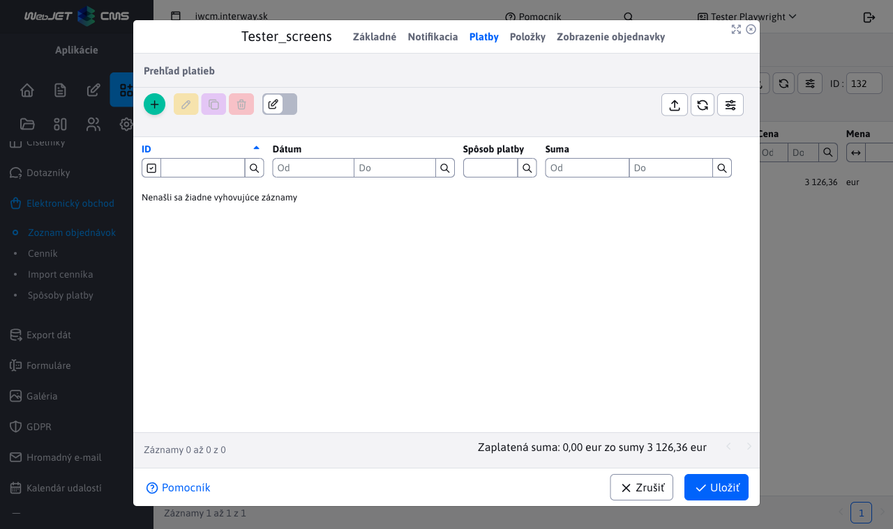
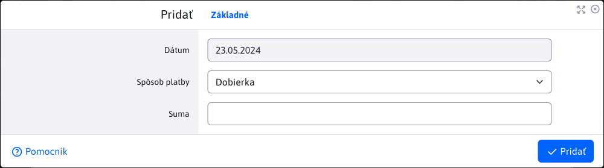
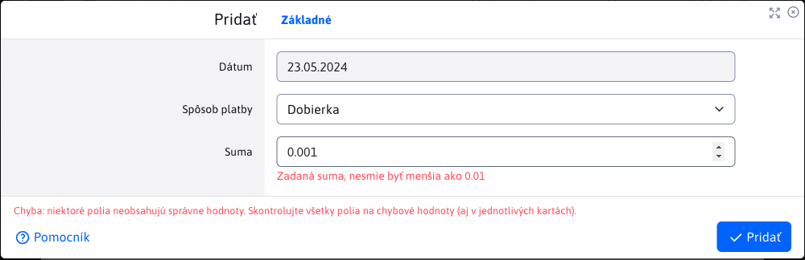
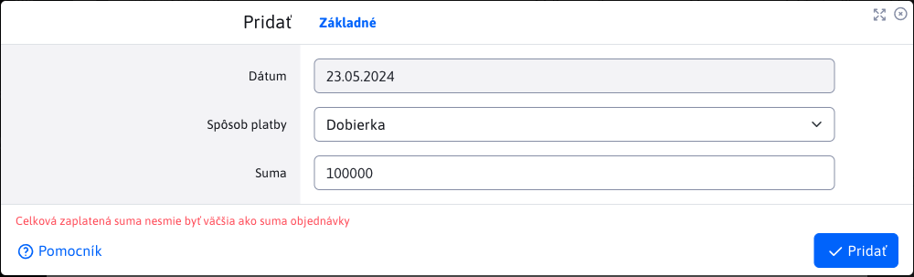
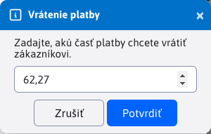
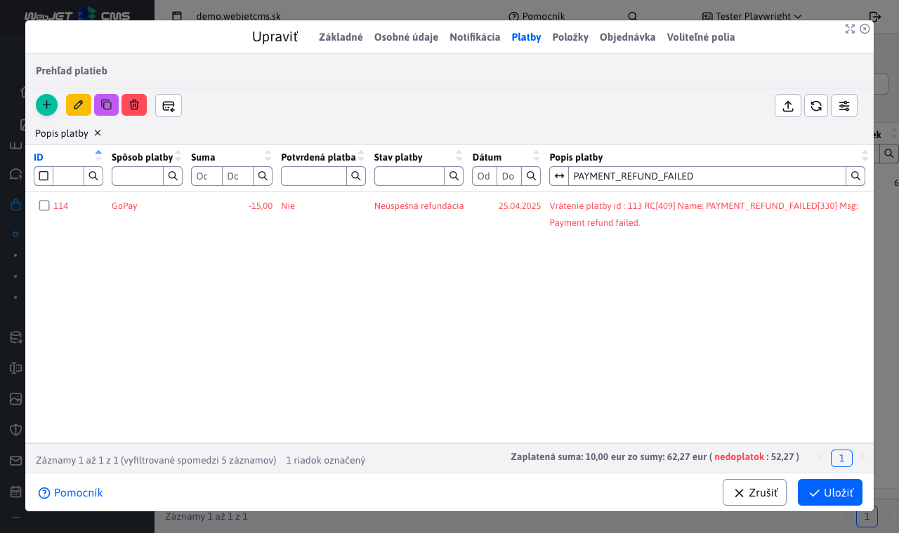
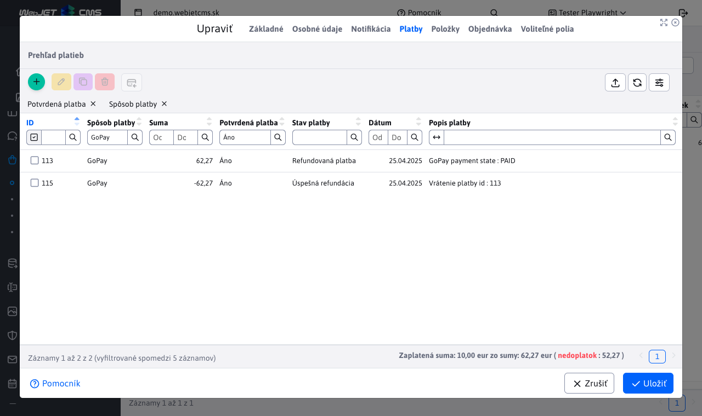
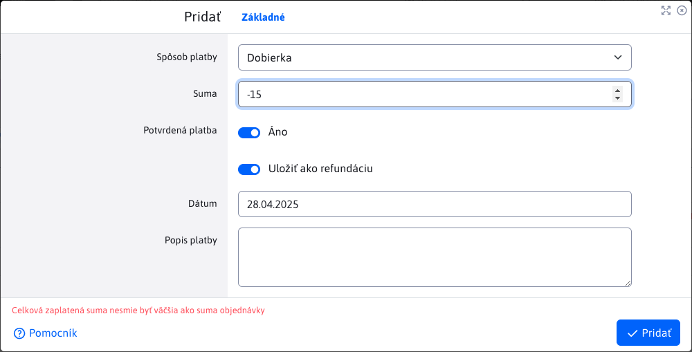
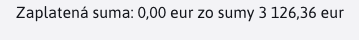

# Payments

Nested table **Payments** in the order detail provides an overview of payments for a specific order.

The requested order amount does not have to be paid in one lump sum, but can be paid in individual payments, some payments may be refunded or pending approval, which is why payments are kept in a separate table.

## Payment status

Payment statuses is an automatically set value that can acquire statuses:
- **Unsuccessful payment**, a payment that was created but failed, for example due to a problem with the payment gateway.
- **Successful payment**, successfully processed payment.
- **Successful refund**, successful refund of an existing payment or refund of an amount.
- **Unsuccessful refund**, unsuccessful refund of another existing payment.
- **Refunded payment**, a payment which has been successfully reimbursed in full.
- **Partially refunded payment**, a payment that has only been successfully partially refunded (not yet fully refunded).
- **Unknown condition**, payment is in an unknown status. For example, a manually created payment that has not yet been confirmed.

## Actions over payments

Add/edit/delete actions are only allowed if they are enabled by the programmer who added the payment method to the system. In some cases, the programmer may add this option to the configuration [method of payment](../payment-methods/README.md), for example, as with the payment method `GoPay` where this option is marked as **Allow administrator to edit payments**.

## Adding a payment from the app

After creating an order in the application **Ecommerce**, one of the following situations may occur, depending on which payment method has been selected:
- **payment is automatically created** if the selected payment method does not implement a payment gateway (such as payment methods **COD** or **Translation by**). A payment record is automatically created for the order in the given way. This payment record is in the full price of the order and is preset as **unconfirmed payment**. This means that this payment has **Unknown condition** and is not counted as a successful payment. It is then up to you to verify that the amount has been paid and then mark the payment in the administration as **confirmed payment**.

!>**Warning:** since such payments require manual status changes in the administration, make sure that the implementation of the payment method allows editing in the administration.

- **payment is not automatically created** if the chosen payment method implements a payment gateway. It will give you the option to pay this order immediately. It is up to you whether you choose to pay it immediately or later. All successful as well as unsuccessful attempts to pay the order (via the payment gateway) of the selected payment method will be saved automatically. So they are visible in the payment table.

!>**Warning:** since payment via the implemented payment gateway is an automated process set up by the programmer, we strongly recommend **disallow** editing the payment in the administration for a given payment method.

## Adding a payment from administration

Ideally, there will be no need to add a new payment through administration, only to modify or refund it. However, manually adding a new payment is available and has parameters:
- **Method of payment**, provides a choice of available payment methods, which are **Configured**.
- **Sum**, the amount of the order paid. The amount entered has its [limitations](./payments.md#limitation-of-the-amount).
- **Confirmed payment**, confirmation that the payment has been successfully made/accepted. Pre-set payment is confirmed.
- **Save as refund**, save the payment as [refund payment](./payments.md#refund-payment).
- **Date**, automatically set the current date when the payment is created (can be changed).
- **Description of payment**, an optional description to the payment that serves as a bonus information field. E.g. why the payment failed or what the payment is refunding.

!>**Warning:** the payment method must support [actions over payments](./payments.md#actions-over-payments).

### Limitation of the amount

The amount entered must not be less than the permitted minimum `0.01`.

The total amount paid must not be more than the total amount of the order. When adding a payment through the administration, the sum of the payment amounts is checked, including the payment that is currently being added.

Only payment amounts that are:
- confirmed payments
- payments with successful status:
  - **Successful payment**
  - **Successful refund**
  - **Partially refunded payment**
  - **Refunded payment**

If the payment when creating **not** marked as **Confirmed by**, validation of the entered amount is not performed. It is only done when the edit is marked as validated.

### Status of the payment being created

A payment being created via the administration can take on the status:
- **Successful payment** if the payment being created has a valid amount and is marked as **confirmed payment**
- **Unknown condition** if the payment being generated **not** marked as **confirmed payment**
- **Successful refund** if it is a successfully created [refund payment](./payments.md#refund-payment).

## Refund of payment

Refund of payment is used to return partial or full amount of an existing payment. The refund button is used to <button class="btn btn-sm btn-outline-secondary" type="button"><i class="ti ti-credit-card-refund" ></i></button>. Payment can only be refunded if:
- reimbursement of this type of payment is allowed in the annotation `@PaymentMethod` and is properly implemented (e.g. through a payment gateway). Read more in [payment methods](../../../../custom-apps/apps/eshop/payment-methods/README.md).
- payment is **Confirmed by**
- you refund an amount less than the balance of the payment that has not yet been refunded
- payment is in condition:
  - **Successful payment**
  - **Partially refunded payment**

### Refund process

Mark the payment (only one) you want to refund. Then press the button <button class="btn btn-sm btn-outline-secondary" type="button"><i class="ti ti-credit-card-refund" ></i></button> for reimbursement. A dialog will appear where you need to enter the amount you want to refund. The full amount of the payment is pre-set. You can refund the entire payment at once, or only part of the payment. Once you have entered the amount, continue by pressing the <button type="button" class="btn btn-primary">Confirm</button>

Consequently, one of the following situations may occur.

**Invalid refund**

You have attempted to refund a payment that is not in good standing, does not have a refund allowed, or you have refunded the wrong amount (etc.). In this case, only an error message will be returned to let you know why the payment could not be refunded.

**Refund failed**

You have refunded both the authorised payment and the correct amount, but the refund failed. For example, an error may have happened on the side of the payment gateway that handled the refund request. In this case, a record of the failed refund will be inserted into the table, i.e. the payment in the state of **Unsuccessful refund**. Automatically, this payment is marked as **Unconfirmed** and in the field **description of payment** there will also be an error message. The format of the message may vary depending on the payment method and how the programmer implemented the payment.

**Refund has been successful**

If all conditions have been met and no error has occurred in the refund process. A payment in the status will be automatically added to the payment table **Successful refund**. Note that **the amount of the refund is negative** as we were taking from the amount paid. Depending on the implementation of the refunded payment method, the field may **description of payment** also include bonus information such as `id` refunded payments.

The payment you have refunded will take on the status **Refunded payment** or **Partially refunded payment**, depending on whether you have refunded all or part of it. If you are refunding the payment multiple times, each refund will have its own representation in the form of a payment with a status of **Successful refund** (if successful).

!>**Warning:** the sum of the reimbursed payment amount must not be greater than the amount of the payment itself.

## Refund payment

Since not all payment methods can be refunded automatically, the payment table allows you to manually add a refund payment. The difference with a traditional refund is that this refund payment does not affect an existing payment. In practice, it is just a record that says that an amount has been refunded, but it does not say that a specific payment has been refunded.

### Adding a refund payment

The refund payment is added as a classic payment, but there are 2 main differences:
- option must be selected **Save as refund**
- field value **Sum** must be negative (the minimum refund amount is `-0.01`)

If you save the refund payment as **confirmed payment** the status of this payment will be **Successful refund** otherwise the status will be set as **Unknown condition**. We recommend adding bonus information about this promotion to the box **Description of payment**.

!>**Warning:** As with traditional payments, there is a limit on the amount you can enter. You cannot refund more than the total amount paid.

## Footer table

The footer of the table contains useful information about how much of the total order amount has actually been paid and also what the total price of the order is. This gives the user an overview of how much they still have to pay or if everything is already paid. Only payments and refunds that are **Confirmed**.

The information in the footer automatically changes over time whenever the payment is modified, or [items](./items.md#foot-of-the-table).

!>**Warning:** if you are making adjustments in **Payment overview**, you should for this order **Send notification to client** as changing the price to be paid may also change the status of the entire order.
