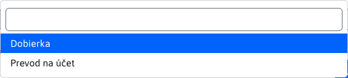

# Payments

The nested Payments table in the order details provides an overview of payments for a specific order. All data operations are possible above this table.

The required order amount does not have to be paid in one lump sum, but can be paid in individual payments, which is why the payments are kept in a separate table.

## Adding/modifying payments

The payment editor window contains only a few parameters.

**Date**, automatically set the current date when the payment is created. This value cannot be changed and remains unchanged when edited.

**Method of payment**, provides the following options to choose from.

**Sum**, the amount of payment to the order. The amount entered has its limitations.

The amount entered cannot be less than 0.01.

The sum of all payments, or one single payment, must not be greater than the total amount of the order to be paid.

## Footer table

The footer of the table contains useful information about how much of the total order amount has actually been paid and also what the total price of the order is. This gives the user an overview of how much they still have to pay or if everything is already paid.

The information in the footer automatically changes over time whenever the payment is modified, or [items](./items.md#foot-of-the-table).
