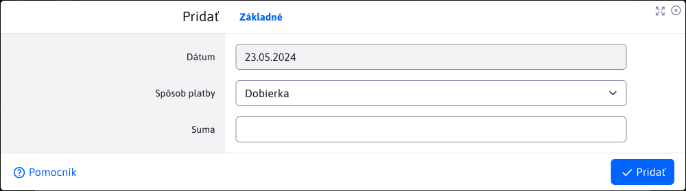
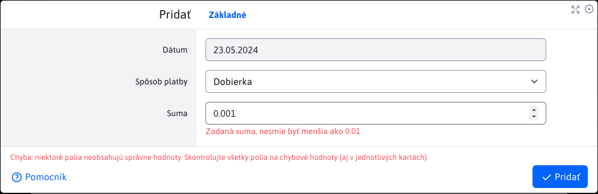
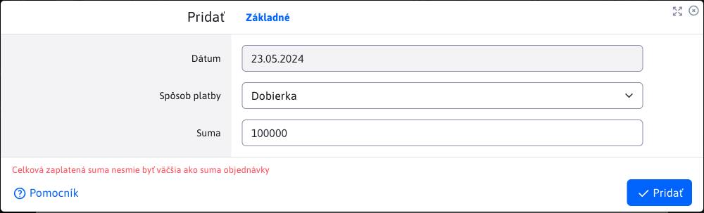
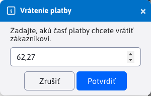
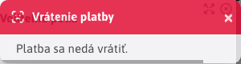
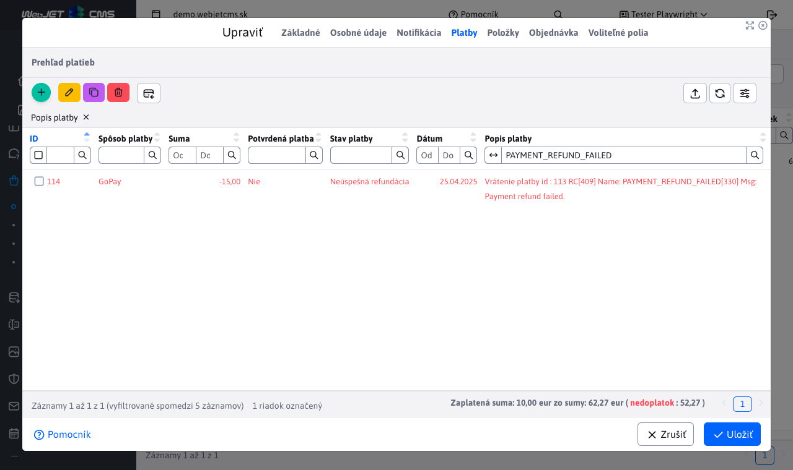
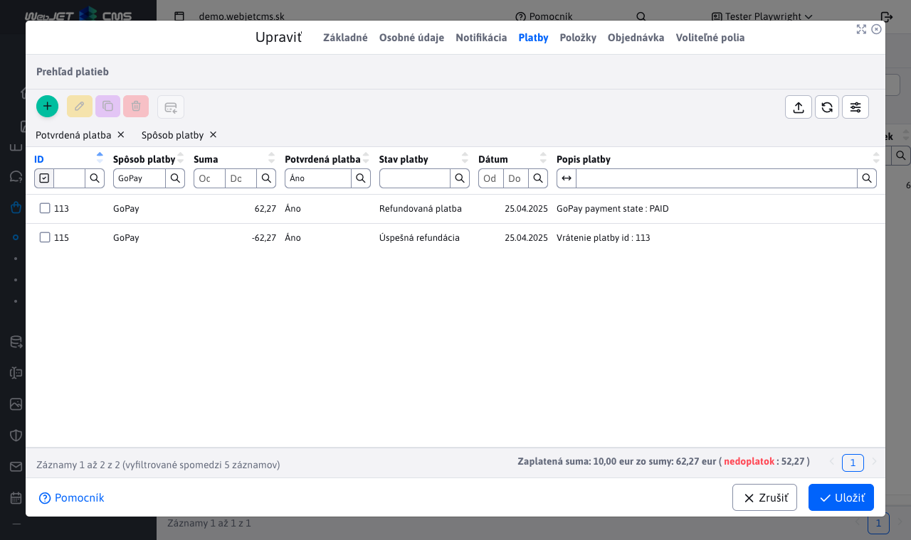
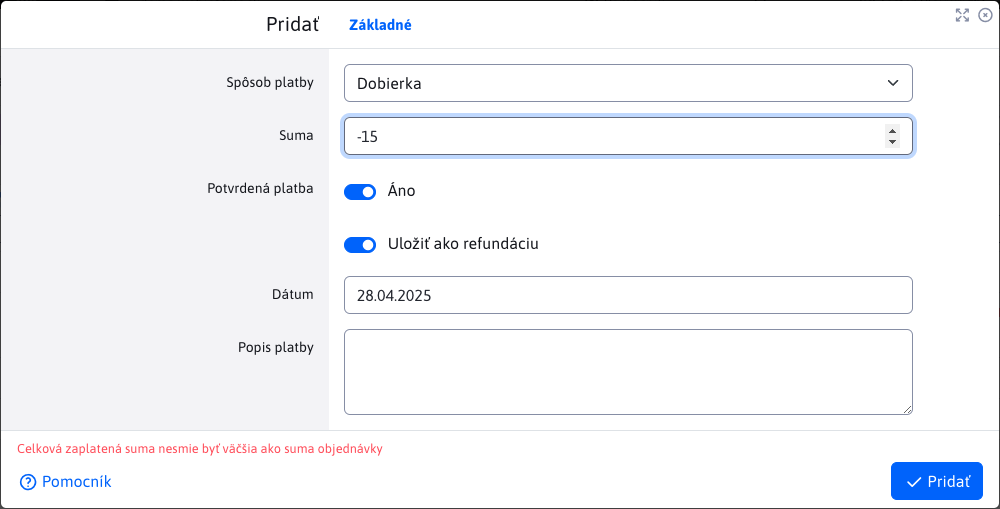
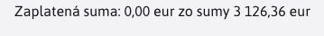

# Payments

The nested table **Payments** in the order details provides an overview of payments for a specific order.

The required order amount does not have to be paid at once, but can be paid in individual payments, some payments may be refunded or pending approval, which is why payments are kept in a separate table.


## Payment status

Payment status is an automatically set value that can take on the following statuses:

- **Failed payment**, a payment that was created but failed, for example due to a problem with the payment gateway.
- **Successful payment**, payment successfully processed.
- **Successful refund**, successful refund of an existing payment or refund of the amount.
- **Unsuccessful refund**, failed refund of another existing payment.
- **Refunded payment**, a payment that has been successfully refunded in full.
- **Partially refunded payment**, a payment that has only been successfully refunded in part (not yet fully refunded).
- **Unknown status**, the payment is in an unknown status. For example, a manually created payment that has not yet been confirmed.

## Actions over payments

Add/edit/delete actions are only allowed if enabled by the programmer who added the payment method to the system. In some cases, the programmer may add this option to the [payment method](../payment-methods/README.md) configuration, for example, as with payment method ```GoPay```, where this option is marked as **Allow administrator to edit payments**.

## Adding a payment from the app

After creating an order in the **Electronic Store** application, one of the following situations may occur, depending on the payment method selected:

- **payment is automatically created** if the selected payment method does not implement a payment gateway (such as **cash on delivery** or **transfer** payment methods). A payment record is automatically created for the given order using the given method. This payment record is for the full price of the order and is preset as **unconfirmed payment**. This means that this payment has an **Unknown status** and is not counted among successful payments. It is then up to you to verify whether the amount has been paid and then mark the payment in the administration as **confirmed payment**.

!>**Warning:** Since such payments require a manual status change in the administration, make sure that the payment method implementation allows editing in the administration.

- **payment will not be automatically created**, if the selected payment method implements a payment gateway. It will provide you with the option to pay for this order immediately. It is up to you whether you decide to pay immediately or later. All successful and unsuccessful attempts to pay for the order (via the payment gateway) of the selected payment method are automatically saved. So they are visible in the payment table.

!>**Warning:** since payment through the implemented payment gateway is an automated process set by the programmer, we strongly recommend **not allowing** payment editing in the administration for the given payment method.

## Adding a payment from the administration

Ideally, you will not need to add a new payment through the administration, but only edit or refund it. However, manually adding a new payment is available and has the following parameters:

- **Payment Method**, provides a choice of available payment methods that are **configured**.
- **Amount**, the amount paid for the order. The amount entered has its [limitations](./payments.md#limitations-amounts).
- **Confirmed payment**, confirmation that the payment was successfully made/received. By default, the payment is confirmed.
- **Save as refund**, save the payment as [refund payment](./payments.md#refund-payment).
- **Date**, automatically set to the current date when the payment is created (can be changed).
- **Payment description**, an optional description of the payment that serves as a bonus information field. For example, why the payment failed or what payment it refunds.



!>**Warning:** The payment method must support [payment actions](./payments.md#payment-actions).

### Amount limitation

The entered amount must not be less than the allowed minimum `0.01`.



The total amount paid must not be greater than the total amount of the order. When adding a payment through the administration, the sum of the amounts from the payments, including the payment being added, is checked.



Only payment amounts that are:

- confirmed payments
- payments with successful status:
  - **Successful payment**
  - **Successful refund**
  - **Partially refunded payment**
  - **Refunded payment**

If the payment is **not** marked as **confirmed** when created, the entered amount is not validated. It is only performed when edited, when it is marked as confirmed.

### Status of payment being created

A payment created through administration can have the following status:

- **Successful payment**, if the payment being created has a valid amount and is marked as **confirmed payment**
- **Unknown status** if the payment being created **is not** marked as **confirmed payment**
- **Successful refund**, if it is a successfully created [refund payment](./payments.md#refund-payment).

## Payment refund

A payment refund is used to return a partial or full amount of an existing payment. The refund button is used for refunds. <button class="btn btn-sm btn-outline-secondary" type="button"><span><i class="ti ti-credit-card-refund"></i></span></button> Payment can only be refunded if:

- refund of this type of payment is allowed in the `@PaymentMethod` annotation and is properly implemented (e.g. via a payment gateway). You can read more in the [payment methods] section (../../../../custom-apps/apps/eshop/payment-methods/README.md).
- payment is **confirmed**
- you refund an amount less than or equal to the remaining payment amount that has not yet been refunded
- payment status:
  - **Successful payment**
  - **Partially refunded payment**

### Refund process

You mark the payment (only one) that you want to refund. Then you press the button <button class="btn btn-sm btn-outline-secondary" type="button"><span><i class="ti ti-credit-card-refund"></i></span></button> for refund. A dialog will appear where you must enter the amount you want to refund. The default is the full payment amount. You can refund the entire payment at once, or only part of the payment. After entering the amount, press <button type="button" class="btn btn-primary">the Confirm</button> button to continue.



Subsequently, one of the following situations may occur.

**Invalid refund**

You attempted to refund a payment that is not in good standing, does not allow refunds, or you refunded the wrong amount (etc.). In this case, only an error message will be returned, notifying you why the payment cannot be refunded.



**Refund failed**

You refunded an authorized payment and the correct amount, but the refund failed. For example, an error could have occurred on the payment gateway side that handled the payment refund request. In such a case, a record of an unsuccessful refund is inserted into the table, i.e. the payment is in the **Unsuccessful refund** status. This payment is automatically marked as **unconfirmed** and there will also be an error message in the **payment description** field. The message format may vary depending on the payment method and how the programmer implemented this payment.



**Refund successful**

If all conditions have been met and there were no errors during the refund process. The payment will be automatically added to the payments table with the status **Successful refund**. Note that **refund amount has a negative value**, as we subtracted from the amount paid. Depending on the implementation of the refunded payment method, the **payment description** field may also contain bonus information, such as `id` of the refunded payment.

The payment you refunded will have a status of **Refundable payment** or **Partially refunded payment**, depending on whether you refunded it in full or only partially. If you refund a payment multiple times, each refund will be represented as a payment with a status of **Successful refund** (if successful).



!>**Warning:** the total refunded payment amount must not be greater than the amount of the payment itself.

## Refund payment

Since not all payment methods can be refunded automatically, the payment table allows you to manually add a refund payment. The difference compared to a classic refund is that this refund payment will not affect an existing payment. In practice, it is just a record that says that some amount was refunded, but it does not say that a specific payment was refunded.

### Adding a refund payment

A refund payment is added like a classic payment, but there are 2 main differences:

- **Save as refund** option must be selected
- the value of the **Amount** field must be negative (the minimum refund amount is `-0.01`)



If you save the refund payment as **confirmed payment**, the status of this payment will be **Successful refund**, otherwise the status will be set to **Unknown status**. We recommend adding bonus information about this promotion in the **Payment description** field.

!>**Note:** As with traditional payments, there is a limit on the amount you can enter. You cannot refund more than the total amount paid.

## Table footer

The footer of the table contains useful information about how much of the total order amount has already been paid and also what the total price of the order is. This gives the user an overview of how much they still have to pay or whether everything has been paid. Only payments and refunds that are **confirmed** are counted.



The information in the footer automatically changes over time with each payment or [item](./items.md#footer-tables).

!>**Warning:** if you make changes in **Payment Overview**, you should **Send Notification to Client** for this order, as changing the price to be paid may also change the status of the entire order.