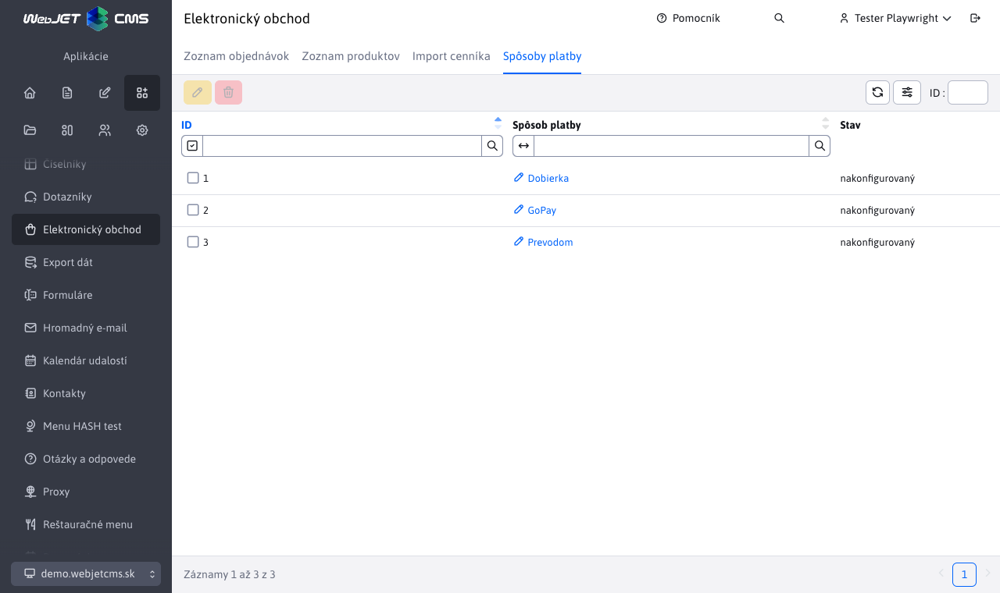
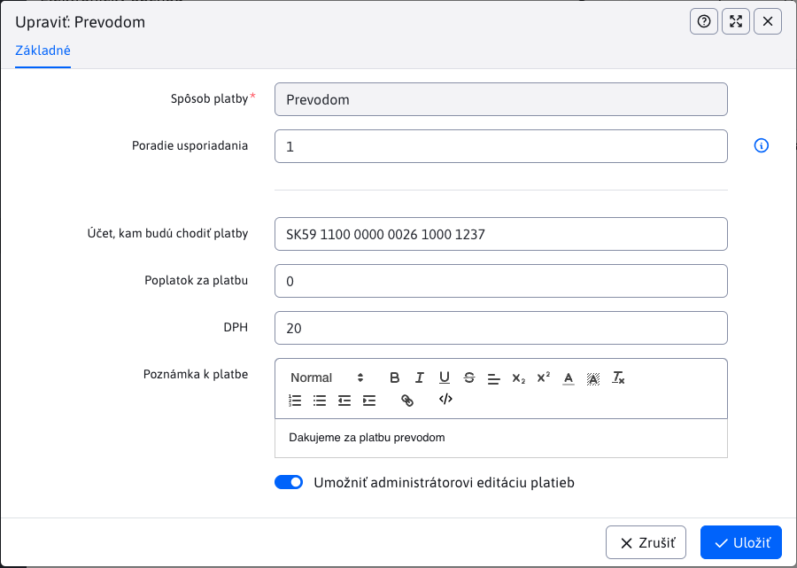
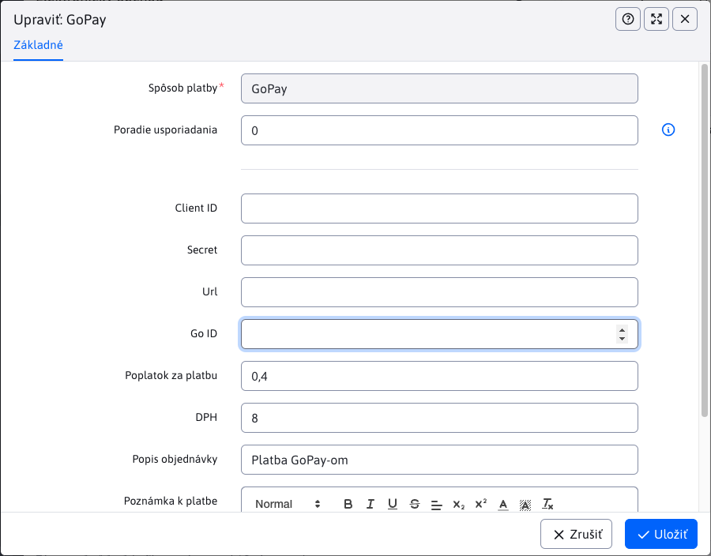

# Payment methods

The Payment Methods application allows you to configure the available payment methods. The basic columns of the table are only the name of the payment and the status of whether the payment is configured.

## Creating/duplicating a payment method

Creating new payment methods (or duplicating them) is not possible via the user interface, it is only possible by programming `BackeEnd` Functionality. More information [for the programmer](../../../../custom-apps/apps/eshop/payment-methods/README.md).

## Edit/configure payment method

This application is special in that the editor of each payment can look completely different, as each payment method may require different input values (their number, type, format ...).

There are still only fields:
- **Method of payment**, an immutable value representing the name of the payment method
- **Order of arrangement**, a numeric value to arrange the payment method. The smaller the value, the higher the payment will be in the list of payment list, e.g. in e-commerce or administration.

Example of payment method editor **Via**:

editor for payment method [GoPay](https://www.gopay.com), looks like this:

## Deleting a payment method

Deletion is not possible, in the true sense of the word. The payment method itself will be in the table **always display**, even after it has been deleted. The delete action only removes the set configuration (values from the editor). You can notice this on the value of the status column. If the payment method was **Configured**, when deleted, its status changes to **not configured**.
