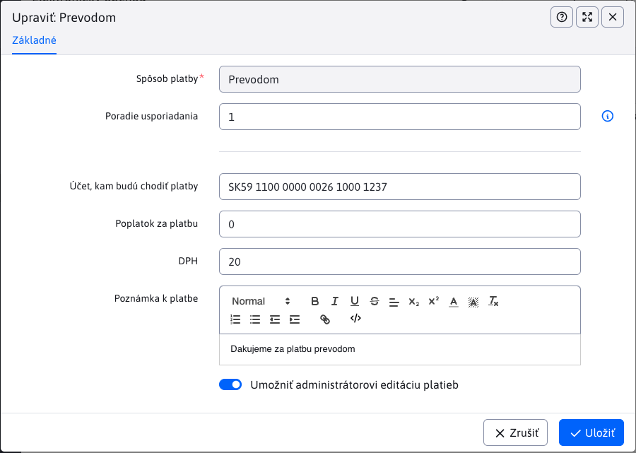
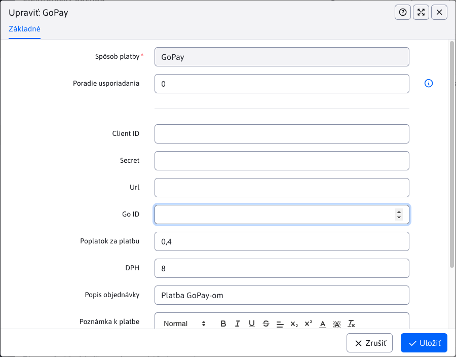

# Payment methods

The Payment Methods application allows you to configure available payment methods. The basic columns of the table are only the payment name and the status of whether the payment is configured.


## Creating/Duplicate a Payment Method

Creating new payment methods (or duplicating them) is not possible through the user interface, it is only possible by programming the ```BackeEnd``` functionality. More information [for programmers](../../../../custom-apps/apps/eshop/payment-methods/README.md).

## Edit/Configure Payment Method

This application is special in that the editor for each payment can look completely different, as each payment method may require different input values ​​(their number, type, format...).

There are still only fields:

- **Payment Method**, an immutable value representing the name of the payment method
- **Arrangement order**, a numerical value to arrange the payment method. The smaller the value, the higher the payment will be in the payment list, e.g. in e-commerce or in administration.

Example of the **Transfer** payment method editor:



The editor for the payment method [GoPay](https://www.gopay.com), looks like this:



## Deleting a payment method

Deleting is not possible, in the true sense of the word. The payment method itself will **always be displayed** in the table, even after deleting it. The deletion action only removes the configured configuration (the values ​​from the editor). You can see this in the value of the status column. If the payment method was **configured**, after deleting it, its status will change to **not configured**.