# Product list

The Product List application provides an overview and management of available products for e-commerce.

The displayed products are filtered according to the selected **product category**. Such a product category is represented by a folder. In the upper left corner of the application there is a category filter 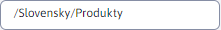 which actually filters out the data for the given folder but also all sub-folders.

The available folders representing categories are arranged in a so-called tree, where subfolders are always located after the respective parent folders.

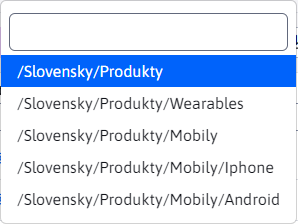

The values ​​in the section selection field in the header are generated:

- automatically - if the config variable `basketAdminGroupIds` is set to an empty value, a list of news folder IDs is obtained by searching for the expression `%!INCLUDE(/components/eshop/%", "%!INCLUDE(/components/basket/%", "%product-list.jsp%", "%products.jsp%"` in the page bodies.
- according to the conf. variable `basketAdminGroupIds`, where it is possible to enter a comma-separated list of folder IDs, e.g. `17,23*,72`, and if the folder ID ends with the character `*`, products (web pages) from subfolders will also be loaded when selected.

## Adding a new product category

Adding a new category will create a sub-folder that will be placed under the currently selected folder (category).

Example.
If we have the currently selected folder 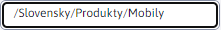 and we create a new one called **Android**, we will have a new folder at 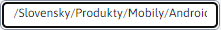

Add a new folder using the button <button class="btn btn-sm btn-outline-secondary" type="button"><i class="ti ti-folder-plus"></i></button> After pressing it, a window for adding a folder will appear.

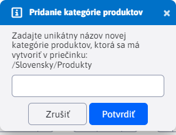

The window also contains information about the folder under which the new one will be created. After (not) filling in the field in the window and confirming with the <button class="btn btn-primary" type="button">Confirm</button> button, four situations can occur:

- if the name of the new category is not entered, creation will fail and a message will be displayed

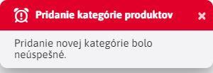

- if the name of the new category is not unique (unique for the given folder), creation will fail and a message will be displayed

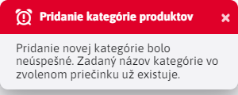

- if another error occurs, a message will be displayed

- if everything goes well

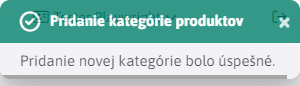

## Product management

Products are represented by pages that you can add under specific categories. The parent folder is automatically preset in the page according to the currently selected category (but it can be changed). All operations can be performed on products (pages) such as create/edit/clone/import ...

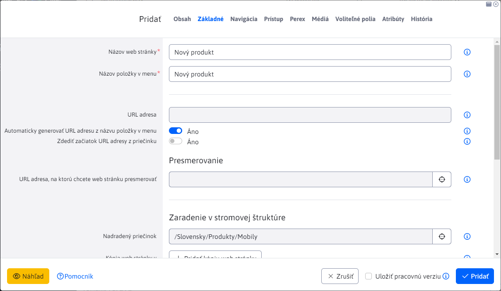

## Important settings

### **Perex** card

In the **Perex** tab, there is an important setting:

- **Image** values. This image will be displayed in the e-shop as a product preview.

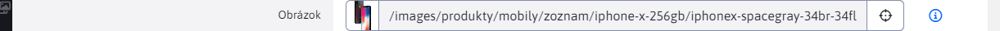

- **Tags** values. These tags make it easy to filter products in an e-commerce store.

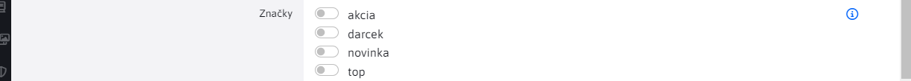

### Attributes tab

In the attributes tab, we will use the phone group selection in the product specifications. As can be seen in the image below, for the `Monitor` group, it is possible to set the manufacturer, diagonal, etc. These selection fields are displayed in the e-shop, in the product details.

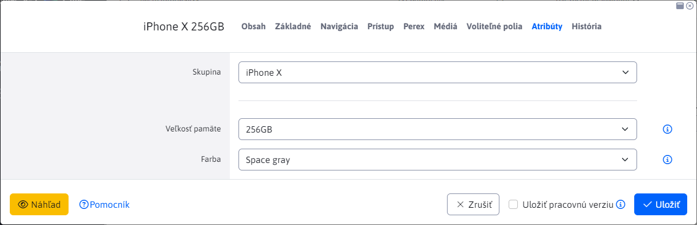

You can read more about attributes in the [Page Attributes](../../../webpages/doc-attributes/README.md) section.
