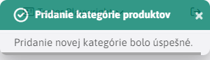

# List of products

The Product List application provides an overview and management of available products for e-commerce.

The displayed products are filtered by the selected **product categories**. Such a product category is represented by a folder. In the upper left corner of the application there is a category filter  which actually un-filters the data for that folder but also all sub-folders.

The available folders representing the categories are arranged in a so-called tree, where the sub-folders are always after the corresponding parent folder.

The values in the section selection field in the header are generated:
- automatically - if the conf. variable is `basketAdminGroupIds` set to empty, a list of news folder IDs is obtained by searching for the term `%!INCLUDE(/components/eshop/%", "%!INCLUDE(/components/basket/%", "%product-list.jsp%", "%products.jsp%"` in the bodies of the pages.
- by conf. variable `basketAdminGroupIds`, where you can specify a comma-separated list of folder IDs, e.g. `17,23*,72`, where if the folder ID ends in a character `*` products (web pages) from subfolders are loaded during selection.

## Adding a new product category

Adding a new category will create a sub-folder that will be placed under the currently selected folder (category).

Example. If we have just selected a folder  and create a new one called **Android**, a new folder will be created at 

Add a new folder by clicking <button class="btn btn-sm btn-outline-secondary" type="button"><i class="ti ti-folder-plus" ></i></button>. When you press it, the window for adding a folder appears.

The window also contains information about under which folder this new one will be created. After (un)filling in the fields in the window and confirming with the button <button class="btn btn-primary" type="button">Confirm</button> four situations can occur:
- if a new category name is not entered, the creation will fail and a message will be displayed

- if the name of the new category is not unique (unique for the folder), the creation will fail and a message will be displayed

- if any other error occurs, the message will be displayed

- if everything goes well

## Product management

Products are represented by pages that you can add under specific categories. The parent folder is automatically pre-set in the page according to the currently selected category (but can be changed). You can do all operations over the products (pages) like create/edit/clone/import ...

## Important settings

### Card **Perex**

In the charts **Perex** is an important setting:
- values **Image**. This image will be displayed in the e-shop as a product preview.

- values **Tags**. These tags make it easy to filter products in the e-shop.

### Attributes tab

In the attributes tab, we use the phone group selection on the item specifications. As can be seen in the figure below, for the group `Monitor` manufacturer, diagonal, etc. settings are possible. These selection fields are displayed in the e-shop, next to the product details.

Read more about attributes in [Page attributes](../../../webpages/doc-attributes/README.md).
