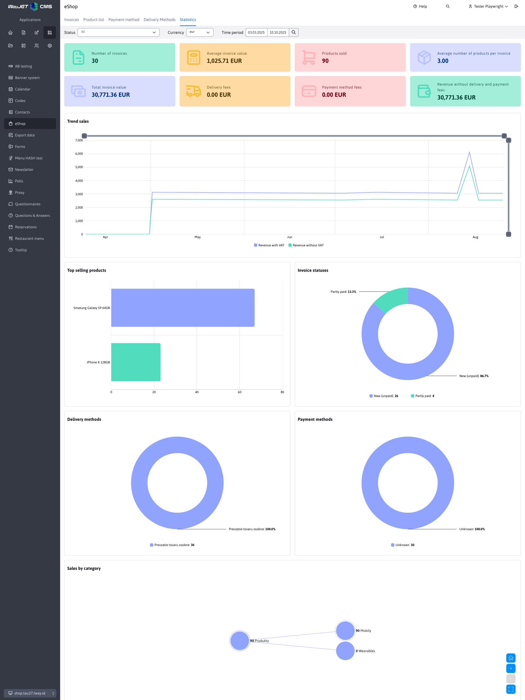

# E-shop statistics

The **E-shop Statistics** application provides an overview of orders, sales, and product sales in the e-shop. Statistics are calculated separately for the currently selected domain.

## Filtering

You can use the following filters in the page header:

- **Status** - select one or more order statuses. If no status is selected, all orders will be processed.
- **Currency** - the currency in which financial values ​​will be displayed. Orders held in other currencies will be converted to the selected currency.
- **Period** - date range for creating orders. You can enter only the date from or only the date to. The last used range is saved in the browser and shared with traffic statistics. If the period is not specified, the last 30 days will be used.

After changing the filter, all summary indicators and graphs are automatically recalculated.

## Summary indicators

The first line shows basic sales data:

- **Number of invoices** - number of orders matching the selected filters.
- **Average invoice value** - average value of non-cancelled orders with VAT.
- **Products Sold** - total number of products sold.
- **Average number of products per invoice** - the average number of units sold in one non-cancelled order.

The second line contains the financial overview:

- **Total invoice value** - sum of non-cancelled orders with VAT.
- **Delivery fees** - total value of fees for selected delivery methods.
- **Payment method fees** - total value of fees for payment methods used.
- **Sales excluding delivery and payment fees** - the value of orders after deducting both types of fees.

!>Financial values, products sold and average values ​​do not include cancelled orders. Cancelled orders remain included in the invoice count and order distribution charts.

## Charts

Charts are available under the summary indicators:

- **Sales development** - sales development over time with and without VAT.
- **Best Selling Products** - ten products with the highest number of units sold.
- **Invoice statuses** - division of orders according to their current status.
- **Delivery methods** - representation of the delivery methods used.
- **Payment methods** - representation of the payment methods used.
- **Sales by category** - tree view of sales by product categories.

## Sales by category

The category tree starts with the root node **Products** and only displays categories that contain e-commerce products. System folders and shipping method items are not displayed in the tree.

The node value represents the number of units sold in the category, including its subcategories. The value and category name are displayed next to the circular node to remain readable. Categories with no sales in the selected period remain displayed in the tree with the value `0`. If the products are located directly in the parent category, they are displayed in a separate **Directly in category** node.

Click a node to expand or collapse its subcategories. The chart controls allow you to return to the basic view, zoom in, out, and maximize the chart to full screen. A two-finger swipe on the touchpad scrolls the page; the chart is zoomed in only with the buttons or pinch-to-zoom gesture.

For a large number of categories, a compact tree with one expanded level and smaller horizontal spacing is displayed. Zooming in increases the spacing between nodes while keeping the text readable; scroll the graph or click on a specific category to view other parts of the tree.

