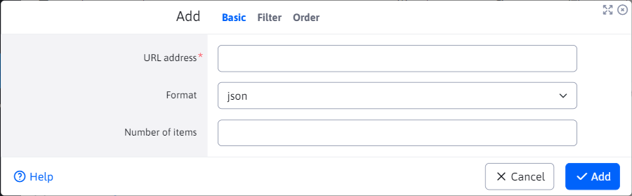

# Export of data

The Data Export application allows you to export news/web pages from WebJET CMS in various JSON or XML/RSS formats. The export can be used in external web/mobile applications.


When creating/duplicating a new export, you must fill in the mandatory "URL address" field, which defines the address where the export will be available.

The other fields are similar to the ones used when inserting a list of news items into a web page. They set the filtering and arrangement of the exported data list.



Data can be exported in the following formats:
- JSON
- XML (format for RSS reader)
- `ud-ofngovcz` - export format for `Úradní desku` v [OpenData Czech Republic](https://ofn.gov.cz/úřední-desky/2021-07-20/) JSON format. When using it is necessary to define translation keys in CZ language `components.ud-ofngovcz.url` with the URL of the page and `components.ud-ofngovcz.ico` with the city ID number. The value for the Agenda field is taken from the tag (perex group), attachments from the media page.

Sample export in json format:

```json
[
    {
        "numberItems": 10,
        "total": 6,
        "urlAddress": "/export-dat/json/"
    },
    {
        "authorEmail": "web.spam@interway.sk",
        "authorId": 1,
        "authorName": "WebJET Administrátor",
        "available": true,
        "cacheable": false,
        "data": "HTML KOD",
        "dateCreated": 1612432841000,
        "disableAfterEnd": false,
        "docId": 21,
        "docLink": "/sk/novinky/web-stranka.html",
        "eventDate": 0,
        "eventDateString": "",
        "eventTimeString": "",
        "externalLink": "",
        "fieldA": "",
        "fieldB": "",
        "fieldC": "",
        "fieldD": "",
        "fieldE": "",
        "fieldF": "",
        "fieldG": "",
        "fieldH": "",
        "fieldI": "",
        "fieldJ": "",
        "fieldK": "",
        "fieldL": "",
        "fieldM": "",
        "fieldN": "",
        "fieldO": "",
        "fieldP": "",
        "fieldQ": "",
        "fieldR": "",
        "fieldS": "",
        "fieldT": "",
        "fileName": "/SK/Novinky",
        "footerDocId": -1,
        "forumCount": 0,
        "groupId": 24,
        "headerDocId": -1,
        "historyActual": false,
        "historyApprovedBy": 0,
        "historyId": 0,
        "htmlData": "",
        "htmlHead": "",
        "logonPageDocId": 0,
        "menuDocId": -1,
        "navbar": "Web stránka",
        "passwordProtected": "",
        "perexGroup": [
            "3",
            "1"
        ],
        "perexImage": "",
        "perexPlace": "",
        "publicable": false,
        "publishEnd": 0,
        "publishEndString": "",
        "publishEndTimeString": "",
        "publishStart": 1588512660000,
        "publishStartString": "03.05.2020",
        "publishStartStringExtra": "",
        "publishStartTimeString": "15:31",
        "requireSsl": false,
        "rightMenuDocId": -1,
        "searchable": true,
        "showInMenu": true,
        "sortPriority": 80,
        "syncDefaultForGroupId": "",
        "syncId": 0,
        "syncRemotePath": "",
        "syncStatus": 1,
        "tempId": 4,
        "tempName": "",
        "title": "Web stránka",
        "viewsTotal": 0,
        "virtualPath": "/sk/novinky/web-stranka.html"
    },
    {
        "authorEmail": "web.spam@interway.sk",
        "authorId": 1,
        "authorName": "WebJET Administrátor",
        "available": true,
        "cacheable": false,
        ...
    }
]
```

Sample export in XML format (format for RSS reader):

```xml
<?xml version="1.0" encoding="UTF-8"?>
<rss xmlns:atom="http://www.w3.org/2005/Atom" version="2.0">
   <channel>
      <title>RSS Feed</title>
      <link>http://domena.sk/</link>
      <description />
      <language>sk</language>
      <pubDate>Tue, 16 Nov 2021 16:08:37 GMT</pubDate>
      <generator>WebJET Content Management</generator>
      <ttl>60</ttl>
      <urlAddress>/export-dat/xml/</urlAddress>
      <numberItems>10</numberItems>
      <image>
         <title>RSS Feed</title>
         <url>http://domena.sk/images/logo.gif</url>
         <link>http://domena.sk/</link>
      </image>
      <atom:link href="http://domena.sk/export-dat/xml/" rel="self" type="application/rss+xml" />
      <item>
         <guid>/sk/novinky/web-stranka.html</guid>
         <title><![CDATA[Web stránka]]></title>
         <link>http://domena.sk/sk/novinky/web-stranka.html</link>
         <description />
         <author>web.spam@interway.sk(WebJET Administrátor)</author>
         <pubDate>Sun, 03 May 2020 13:31:00 GMT</pubDate>
      </item>
      <item>
         ...
      </item>
   </channel>
</rss>
```

## Custom export format

If you need to export the data in another format, just create a file `/components/INSTALL_NAME/export/meno.jsp` Where `INSTALL_NAME` is the name of your installation (conf. variable `installName`). We recommend starting from existing JSP files and just modifying the necessary key values.

The created file is automatically offered as an export type option.

For JSP files that contain in the name `rss` or `xml` (or if the export URL ends in) the HTTP header is set `Content-Type` at `text/xml`, for other cases it is set `application/json`. But if necessary, you can set a specific value in the JSP file right at the beginning by calling:

```java
sk.iway.iwcm.Encoding.setResponseEnc(request, response, "application/ld+json");
```
