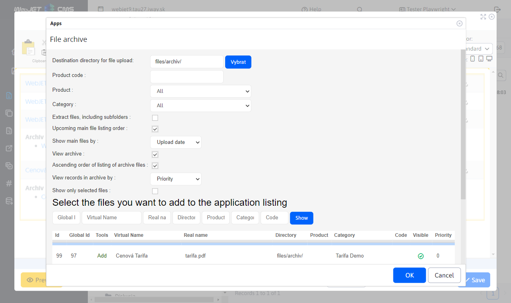

# File archive

One-stop file management and versioning application. It also allows you to set up future file publishing and categorize files and assign them to products.

## Application settings

In this section you can set attributes:
- Destination directory for file upload
- Product code
- Product
- Category
- Listing of files including subfiles
- Ascending order of the master file listing
- Show main files by
- Date uploaded
- View archive
- Ascending order of listing
- View records in the archive by
- Archive item pre-opened
- Show only selected files
It is also possible to select files to be added to the application listing, files can be filtered by global id, virtual name, real name, directory, product, category, code

## View application

