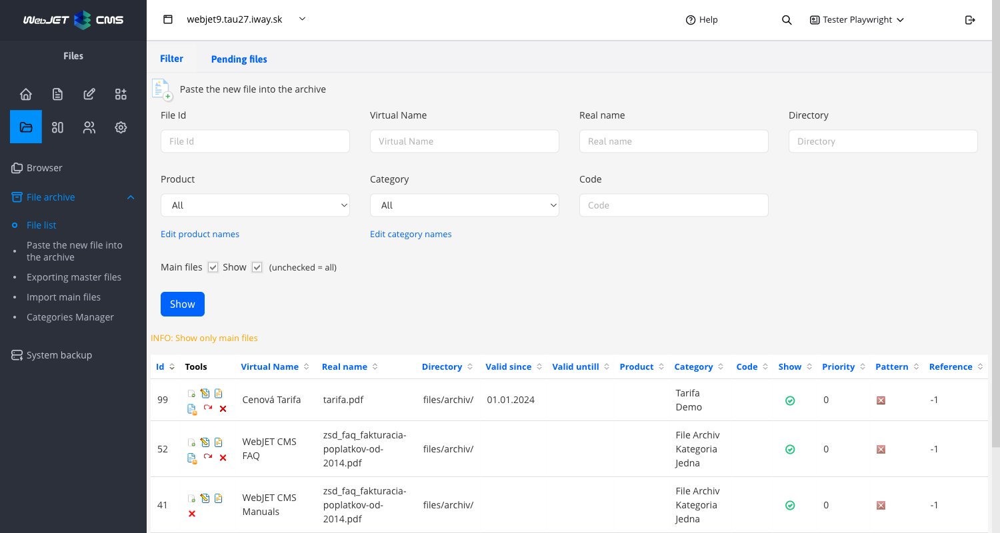
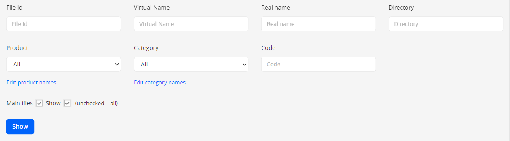
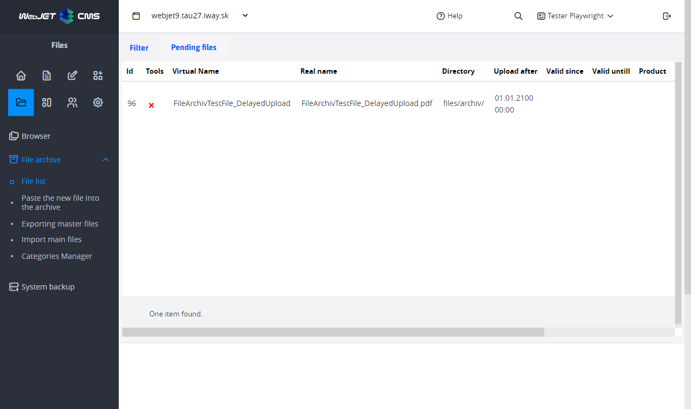
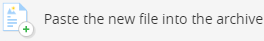
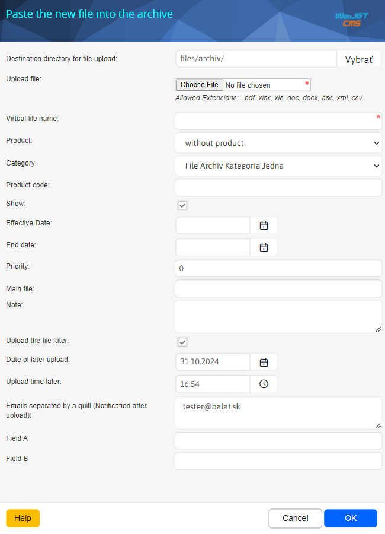
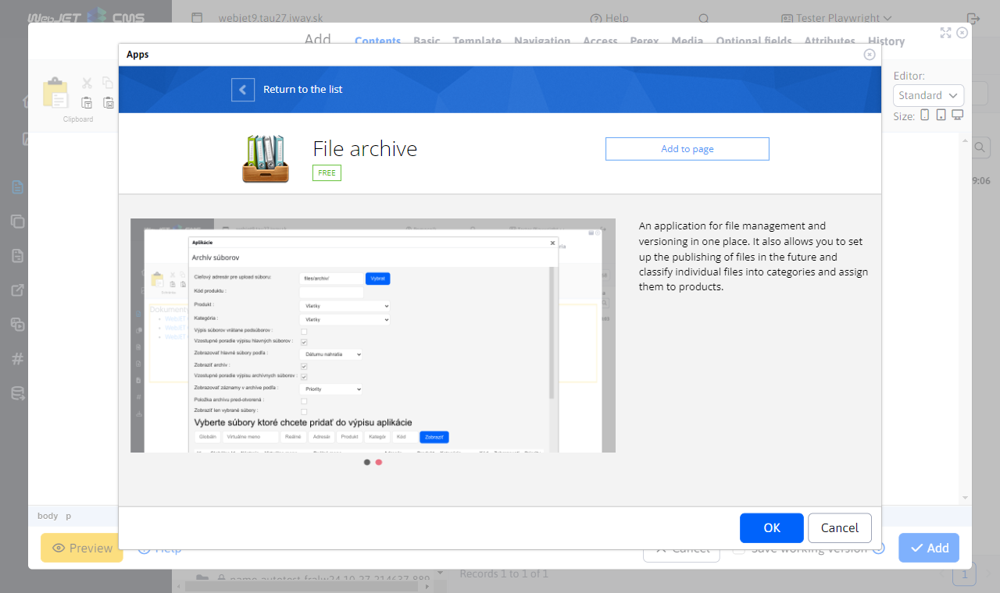

# Archive files

A one-stop application for managing files and their versions. It also allows you to set up future file publishing and categorize and assign files to products.

## List of files in the archive

In the displayed list, we can see all files that have been uploaded to the file archive in the currently selected domain.

### Filtering files

Through the filter you can un-filter the displayed files based on:
- **file id** - Unique file id
- **Virtual name** - The name that appears when listing files on the page
- **Real name** - Real filename with extension ( e.g. Zmuva.pdf )
- **Directory** - The directory in which the file is located
- **Product, Category, Code** - The information you set when you uploaded the file
- **Main files** - only the main files are shown without their older versions
- **View** - displayed files that have display enabled

You can filter using multiple conditions at once. E.g. product "fruit" category "apple" code "2015". You will see a list of files that will meet all three of these filter conditions (or no matching file will be found).

### Actions over files

Through the file list we can perform various functions over the inserted files such as editing, renaming, deleting, or inserting a more recent version of the file, or undoing the last change. The functions can be found in the tools column when listing a file in the file archive:
- , **Upload new version** if you want to upload a new (current) version of an already uploaded file, this tool allows you to do so. When clicked, you will be taken to a standard window with the settings of the file properties, but these will already be pre-populated according to the old file you want to update. We do not recommend changing these pre-populated fields, as they should be identical to the properties of the old file. (for the sake of filtered listing on the page, as the file listing also allows you to display older versions of the file on the page, not just the current one)
- , **Edit file** if you want to change some settings of the file or find out what properties the file has, this tool will help you to do that.
- , **Rename file** : The tool allows you to rename the file name
- , **View list of versions**, this tool will be displayed only when at least one version is inserted, Show all archive versions of the file
- , **Undo last change**, this tool will be displayed only when at least one version is inserted
- , **Delete file**, permanently removes the file from the archive

### Pending Files tab

In the charts **Pending files** shows files that were set to be uploaded later when uploaded.

## Inserting a new file into the archive

If you want to add a new file to the archive, you can do so by clicking on the icon located above the list of files

In the dialog box, select the file you want to upload by clicking **Select file**. The following fields must be completed as a minimum **Virtual filename**, the remaining fields are optional:

- **Destination directory for file upload** - select the directory you want to upload the file to (this will be useful later when filtering the display of files on the page)
- **File for upload** - select the file you want to upload to the archive
- **Virtual filename** - enter the name of the file that will be displayed on the page (as a link to the file)
- **Product** - enter any product name (this will be useful later when filtering the display of files on the page)
- **Category** - enter any category name (this will be useful later when filtering the display of files on the page)
- **Product code** - enter any product code name (this will be useful later when filtering the display of files on the page)
- **View** - setting to display the file on the page (if you do not want to display the file on the page, uncheck this setting)
- **Date of commencement of validity** - setting the file validity start date
- **Expiry date** - setting the file expiration date
- **Priority** - using priority you can set the order of displaying files on the page
- **Main file** - if you don't want to use the uploaded file as the main file, only as a pattern (pattern of another main file), enter the input **Main file** to which the file you are currently uploading will be a sample (this file will then be displayed on the page in the file listing together with the main file whose link you have filled in). To get the link of the main file, find the file in the list and click in the tools on **Edit by** (  ), which will open a window with the set file properties. From there, copy the **Link for reference** and insert it into the input **Link to the main file**.
- **Note** - the note appears on the page when you link to the file
- **Upload file later** - if you need to upload a file to the archive at a specific time and date, you can set the file to be uploaded automatically in the future. By selecting the option you will see the hidden fields
  - **Date of later upload** - select the day on which you want to upload the file
  - **Time of later upload** - select the time at which you want to upload the file
  - **Emails separated by a comma** - enter the comma-separated emails to which you want to send a notification of successful/unsuccessful file upload to the archive

After a successful send, the following conditions may occur:
- The file is uploaded successfully and you will see it in the uploaded files list
- The file is uploaded successfully and you will see it in your statement **pending files** - this state occurs if you check and set in the properties **Upload file later**
- You will be notified that a file with the same content as the one you are uploading is already in the archive. (The module compares the actual content of the file, not the name). In this case you have two options:
  - **Delete file** - the application shows you a link to a file that is already in the archive and has the same content as the file you wanted to upload. This way, you can use that link on the page and you don't have to upload the file duplicated. In that case, you can delete the file.
  - **Keep the file** - if you still want to upload the file to the archive and have it duplicated, click on **Keep the file**

## Inserting a file from the archive into the web page and application settings

To the page [insert application](../../webpages/working-in-editor/README.md#application-insertion) File Archive.

When you click on the "Insert into page" button, the application is inserted into the page and the settings are opened. These settings serve as a filter when listing files on the page.

The settings dialog consists of three sections:

1. section for filtering the listing of files on the page, these are the following attributes:
    - **Destination directory for file upload** - select the folder from which you want to view the files
    - **Product code** - enter the code (as a filter) you want to view
    - **Product** - enter the product (as a filter) you want to view
    - **Category** - enter the category (as a filter) you want to view
    - **Listing files including sub files** - If you check this option, the page will also display files that are in nested sub-folders of the target directory you have set.
    - **Ascending order of the master file listing** - the main files will be sorted on the page in ascending order
    - **Show main files by** - sorting the main files in the archive by:
      - Priority - the priority you set yourself when uploading a new file
      - Upload date - time reference of adding the file to the archive
      - Virtual file name - alphabetical order of file names
    - **View archive** - if checked, the archives of the main file will be displayed on the page
    - **Ascending order of listing archive files** - archive files will be sorted on the page in ascending order
    - **View records in the archive by** - sort files in the archive by:
      - References - sorts by record ID
      - Priority - the priority you set yourself when uploading a new file
      - Orders - the order in which the file is uploaded
      - Upload date - time reference of adding the file to the archive
      - Virtual file name - alphabetical order of file names
    - **Archive item pre-opened** - The sequence number to specify which of the file threads should be opened first.
    - **Show only selected files** - you can also manually add files that do not meet the filter, but you still want to display them with the listing

2. Select the files you want to add to the application listing. Files can be filtered by global id, virtual name, real name, directory, product, category, code.

3. Result/table from auxiliary search. This section contains the expected files, click on Add to add the file to the list of selected files (if only selected files are to be displayed).

## View application

The final appearance of the application after adding it to the page. The individual file names are links to download the files.

