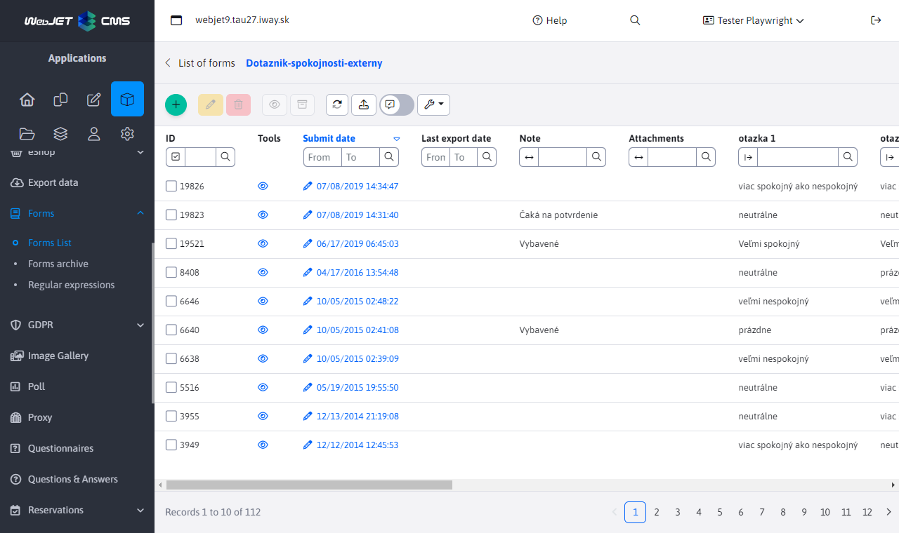
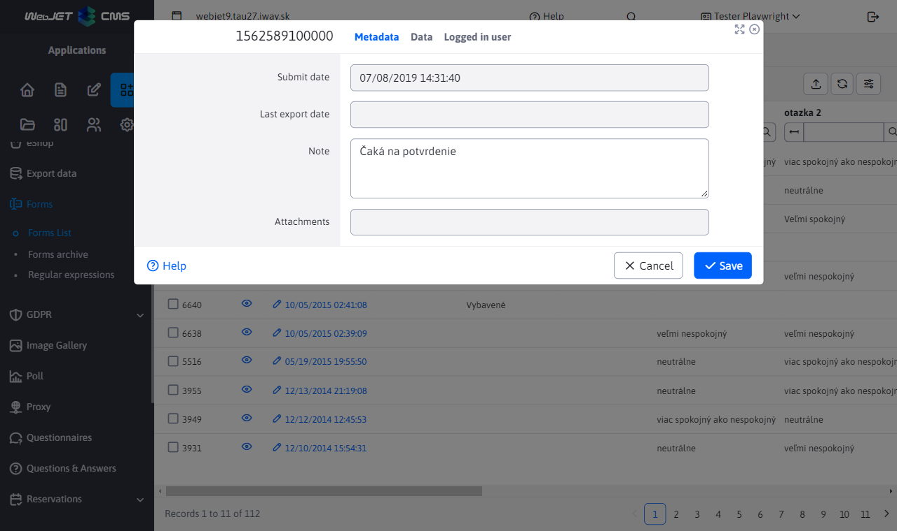

# Forms

The forms application is used for advanced management of completed forms. Each web page can contain a form that the visitor fills out. These can be job applications, requests for more detailed information, and so on.

Forms can be sent to an email address, and the form looks the same in the email message as it does on the website, can be printed and further processed.

Additionally, all forms are stored in a database, and you can return to them at any time in the administration area of Web JET. Items in the forms can be sorted by any column and exported to MS Excel.



Click on the eye icon to view the form as it appears on the web page and print it.

In form editing, you can change the note field (where you can record the processing/status of the form). The individual fields filled in are read-only, they cannot be changed after submission. The data tab contains the individual fields of the completed form, the logged in user tab contains the details of the user who submitted the form (if they were logged in when submitting it).



## Export of data

Form records can be exported to the format `xlsx` a `csv`. The following export options can be set in the Advanced tab:
- Currently filtered data - if you have data filtered by a certain column in the table, only this data is exported.
- All data - all data is exported regardless of the filter set in the displayed table.
- Not yet exported data - only data that have not been exported yet (have a blank value in the Last exported date column) are exported. So you can simply export only newly added data one by one.
- Only selected rows - only selected rows in the table are exported.
After the export, the Last Export Date column is automatically set to the current date and time.


## Advanced setting options

It is possible to set some hidden values to the form that will affect its processing. By default, it is not necessary to set any of these values specifically.

- `recipients` - list of email recipients. It can contain multiple recipients separated by a comma.
	- ATTENTION: in order to prevent sending emails via the system to foreign addresses (mail relay server), the system checks if the specified target email address is in the body of the original page. Therefore, if you change the email address dynamically, it must be in the body of the page.
- `ccEmails` - a comma separated list of email addresses to which a copy of the email should be sent.
- `bccEmails` - a comma-separated list of email addresses to which a hidden copy of the email should be sent.
- `subject` - email subject. If it is not filled in automatically it will be used according to the web page.
- `email / e-mail` - a field specifying the email address of the sender of the email. If it is a contact form, it is ideal if the field where the visitor enters the email is called this.
- `name / firstname / lastname / meno / priezvisko / jmeno / prijmeni` - a field specifying the name of the sender of the email. If it is a contact form, it is ideal if the field where the visitor enters his/her name is called this way.
- `savedb` - the name under which the form is saved in the database.
- `forward` - url address to redirect to after saving the form. If not specified it will redirect to the original page.
- `forwardFail` - url address to redirect to if the form fails to submit. If not specified, the same value is used as has `forward`.
- `forwardType` - type of redirection after the form is processed.
	- If the value is not specified, the form is processed and then redirection to the specified page with the set send status parameter (e.g. formSend=true) is performed.
	- Value `forward` means that an internal redirect is performed to the destination page. The target page can then access the identical parameters as the form and perform an additional action. Since this is an internal redirect, the value will remain in the browser's address bar `/formmail.do`.
	- Value `addParams` performs a redirect to the destination page with the addition of individual parameters to the URL. In this case, the browser performs the redirection and the address of the destination page remains in the address bar. However, since the parameters are added to the URL, the number of parameters is limited by the length of the URL, which is 2048 characters by default.
- `useFormDocId` - doc ID of the page where the form is located. By default, the system tries to determine this page based on `refereru`, or the last page viewed in the session. You can specify this value to determine the exact value. If it is not specified, WebJET will automatically add it when the form is displayed.
- `useFormMailDocId` - doc ID of the page with version for email. The system needs the page to be able to generate the email version. If the value none is specified, the web page determination for email is not used. If the value is not specified at all, the value specified by the parameter `useFormDocId`. The value is useful if you have one contact form embedded in all pages, e.g. in the footer. When generating an email, the code of the page itself is used as the code, but the form is not located in it. This way you can tell it to use a different page for the email.
- `forceTextPlain` - if the parameter exists the email is sent as `text/plain` version, otherwise it is sent as `multipart`.
- `formMailEncoding` - the character encoding type of the email. By default, the same encoding as the web page is used. If ASCII is set as the value, the diacritics are removed from the text.
- `fieldsEmailHeader` - if the generated email is to contain a special header, it is possible to enter a comma separated list of field names into this field, whose values are set into the header.
- `formmail_overwriteOldForms` - if the user is logged in and this field is set to `true`, if the user has already submitted the form, its value will be overwritten by the new version. In this way, the form will only appear once in the database from a single user.
- `formmail_allowOnlyOneSubmit` - if the user is logged in and this field is set to `true`if the user has already submitted the form, the system will not allow the user to submit it again. In this way, the form will only appear once in the database from one user.
- `formmail_sendUserInfoDocId` - if it is set to docId value of some web page, then after successful saving of the form, an email with the text of the web page is sent to the visitor's email (from the email / email field). This can be, for example, a thank you for filling out the form, or further instructions on how to proceed.
- `isPdfVersion` - if set to true, the system will also generate a PDF version of the form after saving it to the directory `/WEB-INF/formfiles/ID_FORMULARU_pdf.pdf`, where the value `ID_FORMULARU` Is `id` form in the database.

## Confirm email address settings

The form can be set **confirmation of email address**. You can confirm that the form has been sent by clicking on the link in the email and therefore `double opt-in`. **Verify** that the visitor who has filled in the form has entered **a valid email address**.

It needs to be set up:

1. In the properties of the form, you need to select the option **Require confirmation of consent by e-mail**.
2. Create a page for confirmation of consent, the application ```!INCLUDE(sk.iway.iwcm.components.form.DoubleOptInComponent)!``` must be inserted in it, which will confirm the consent based on the parameters in the database. The page can be used for several different forms, it can have a URL e.g. `/double-optin-confirmation/`.
3. Create a page with e-mail text, e.g. "To confirm the validity of the email address, click on the following link" and insert a link to the page where there will be a confirmation of consent. The link must contain parameters `!FORM_ID!,!OPTIN_HASH!`, i.e. e.g. `/double-optin-confirmation/?formId=!FORM_ID!&hash=!OPTIN_HASH!`. Set the ID of this page in the Doc ID field of the notification for the user.

After clicking on the link in the email, the Date of confirmation of consent field will be set in the form, so you can identify the forms that have the consent confirmed.

## Possible configuration variables

- `formmailAllowedRecipients`. Blank by default, which means that the form can be sent to any address`@interway.sk,podpora@demo.webjet.sk` - character set for sending emails from forms. Defaults to blank, which means that the same character encoding is used as is set for web pages.
- `formMailEncoding` - if set to&#x20;
- `spamProtection`, spam protection will be enabled in forms. By default set to `true`.`true` - if set to&#x20;
- `spamProtectionJavascript` (all forms will be protected) or `all` (only forms sent to email will be protected), the forms will be protected `formmail`, to deactivate the function you need to enter `javascriptom`. Default set to `none`.`all` - the time in seconds during which the form cannot be resent to the email. By default set to 30.
- `spamProtectionSendInterval` - a comma-separated list of IP address beginnings (or a character&#x20;
- `spamProtectionDisabledIPs` for all) for which spam protection is disabled.`*` - if set to&#x20;
- `formMailSendPlainText` the email from the form is sent as plain text (not HTML format).`true` - if set to&#x20;
- `formMailRenderRadioCheckboxText` will display selection and checkboxes as text `true` or `[X]`.`[ ]` - if set to&#x20;
- `formMailCropForm` only the part wrapped in `true` Form.`tagov` - A comma-separated list of domains for which forms will always be sent over a secure httpS connection.
- `formmailHttpsDomains` - Setting the validation of the form when initializing it, when set to&#x20;
- `checkFormValidateOnInit` the entire form is not validated when displayed, when set to `false` is validated.`true` - If it is set to the email address, it is used as a fixed value of the sender's email address. Unlike&#x20;
- `formMailFixedSenderEmail` does not set the original email in the field `emailProtectionSenderEmail`so that the sender is not notified of any misdelivery (which may sometimes be necessary for security reasons).`reply-to` - If it is set to&#x20;
- `formmailShowClassicErrorMessage` will display the classic form validation message at the top of the form instead of the message next to each field.`true` - If it is set to&#x20;
- `formmailScrollTopAfterSend` scrolls the page to the top of the form after submission (to show the submission message).`true` - If it is set to&#x20;
- `formmailResetFormAfterSend` after successful submission, the form is cleared.`true` - It will be sent as the sender's name in the email when the page is sent according to the specified&#x20;
- `formmailSendUserInfoSenderName`. If empty, the name of the author of the page whose content is being sent to the email is sent.`formmail_sendUserInfoDocId` - It will be sent as the sender's email in the email when the page is sent according to the specified.
- `formmailSendUserInfoSenderEmail`. If it is empty, an email is sent to the author of the page whose content is being sent to the email.
