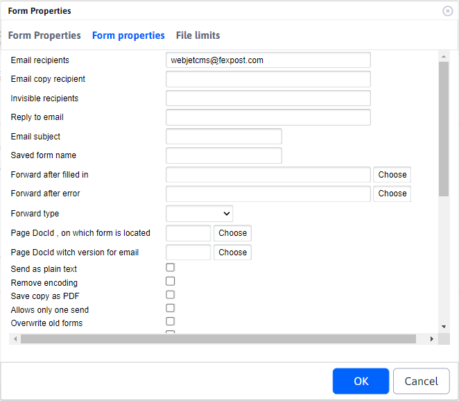
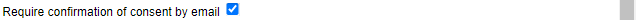
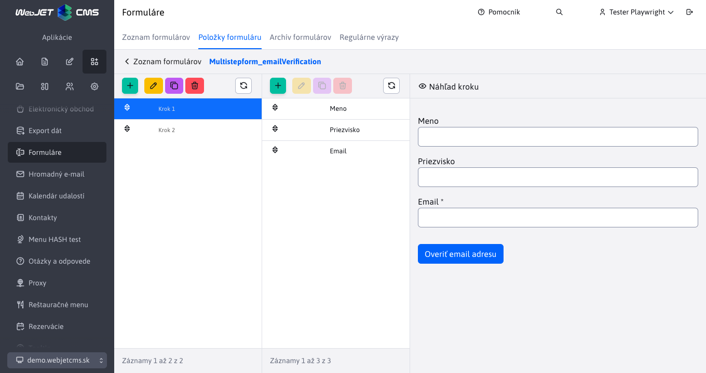

# List of forms

The forms application is used for advanced forms management. Each web page can contain a form that the visitor fills out. These can be job applications, requests for more detailed information, and so on.

Forms can be sent to an email address, and the form looks the same in the email message as it does on the website, can be printed and further processed.

Additionally, all forms are stored in a database, and you can return to them at any time in the administration area of Web JET. Items in the forms can be sorted by any column and exported to MS Excel.


Click on the eye icon to view the form as it appears on the web page and print it.

In form editing, you can change the note field (where you can record the processing/status of the form). The individual fields filled in are read-only, they cannot be changed after submission. The Form Items tab contains the individual items of the completed form, the Personal Details, Contact Details and Optional fields contain the details of the user who submitted the form (if they were logged in when submitting it).


## Creating a form

The easiest way to create a form is to click the Add icon and set its basic parameters in the Basic tab. This will create a new form of type [Multi-step form](../multistep-form/README.md). You can then add individual form items (text fields, checkboxes, selection fields, etc.) to the form by clicking on the name of the created form in the table and navigating to the [Items on the form](../multistep-form/README.md).

<div class="video-container">
    <iframe width="560" height="315" src="https://www.youtube.com/embed/XRnwipQ-mH4" title="YouTube video player" frameborder="0" allow="accelerometer; autoplay; clipboard-write; encrypted-media; gyroscope; picture-in-picture" allowfullscreen></iframe>
</div>

### Basic tab


- **Name of the form** - unique form name.
- **Email address of the recipient** - list of email recipients. It can contain multiple recipients separated by a comma.
  - **Warning:** to prevent emails being sent via the system to foreign addresses (`mail relay server`), the system checks whether the specified target email address is in the body of the original page or in the form settings. So if you change the email address dynamically, it must be in the body of the page in which the form is embedded.
- **Type of form** - specifies the detected form type, according to which the available setting options will be displayed. For new forms, the Multi-step form type is always set.

Additional optional parameters can be set for the form that will affect its processing.

### Tab - Settings


- **Redirection after completion** - url address to redirect to after saving the form. If not specified it will redirect to the original page.
- **Redirecting after an error** - url address to redirect to if the form fails to submit. If not specified, the same value is used as has `forward`.
- **Save copy as PDF** - if set to true, the system will also generate a PDF version of the form after saving it to the directory `/WEB-INF/formfiles/ID_FORMULARU_pdf.pdf`, where the value `ID_FORMULARU` Is `id` form in the database.
- **Allow only one send** - if the user is logged in and this field is set to `true` if the user has already submitted the form, the system will not allow the user to submit it again. In this way, the form will only appear once in the database from one user.
- **Overwrite older dispatch** - if the user is logged in and this field is set to `true`, if the user has already submitted the form, its value will be overwritten by the new version. In this way, the form will only appear once in the database from a single user.
- **Require confirmation of consent by email** - activates the mode [confirmation of email address](#setting-the-email-address-confirmation).
- **Send the form as an attachment to an email** - by turning it on, the form will be attached to the email as an HTML attachment.
  - **Name of the attachment to the form** - the name of the attachment in HTML format.
- **Encryption key** - if you want to encrypt the form values, you can enter [encryption key](../../admin/README.md#Header).
- **Doc id of the page where the form is located** - doc ID of the page where the form is located. By default, the system tries to determine this page based on `refereru`, or the last viewed page in `session`. For precise determination, this value can be entered. If it is not entered WebJET will automatically add it when the form is displayed.
- **Doc id notifications for user** - if it is set to the value of a web page, then after the form is successfully saved, an email with the text of the web page is sent to the visitor's email (from the email / email field). This can be, for example, a thank you for filling out the form, or further instructions on how to proceed.
- **Doc id of page with email version** - doc ID of the page with version for email. The system needs the page to be able to generate the email version. If the value none is specified, the web page determination for email is not used. If the value is not specified at all, the value specified by the parameter `useFormDocId`. The value is useful if you have one contact form embedded in all pages, e.g. in the footer. When generating an email, the code of the page itself is used as the code, but the form is not located in it. This way you can tell it to use a different page for the email.

### Card - Email


- **Recipient of a copy of the email** - a comma separated list of email addresses to which a copy of the email should be sent.
- **Invisible recipients** - a comma-separated list of email addresses to which a hidden copy of the email should be sent.
- **Reply to emails** - the email address to which the reply email should be sent (sets the email header `Reply-To`).
- **Subject of the email** - the subject of the email sent to the admin form. If it is not filled in automatically it will be used by the name of the web page on which the form is located.
- **Send email as text without formatting** - if checked the email is sent as unformatted text version (in field name: value format), otherwise it is sent as formatted HTML text as it is displayed on the web page.
- **Remove diacritics** - by default, the same character encoding as the web page is used. Turning it on will remove the diacritics and the email text will be without diacritics.
- **Add technical information** - if checked, technical information (page name, page address, date and time of sending, browser information) will be added to the email.
- **Text at the beginning of the email** - text to be added to the email before the form fields.
- **Text at the end of the email** - text to be added to the email after the form fields.
- **Email header** - if the generated email is to contain a special header, it is possible to enter a comma separated list of field names into this field, whose values are set into the header.

!>**Warning:** the form expects the following named fields to be set correctly for the sender's email and name:
- `email / e-mail` - a field specifying the email address of the sender of the email. If it is a contact form, it is ideal if the field where the visitor enters the email is called this.
- `name / firstname / lastname / meno / priezvisko / jmeno / prijmeni` - a field specifying the name of the sender of the email. If it is a contact form, it is ideal if the field where the visitor enters his/her name is called this way.

### Card - Advanced


- **Line view** - allows you to insert fields into the form in line view. To create a new row, insert the New Row field.
- **Add CSS classes** - A list of CSS classes that will be added to the form wrapper element when it is displayed.
- **Add CSS styles** - A comma-separated list of CSS stylesheet files that will be added to the displayed form.
- **Redirection method** - type of redirection after the form is processed.
  - If the value is not entered, the form is processed and then redirection to the specified page with the set parameter of the sending status is performed (e.g.`formSend=true`).
  - Value `forward` means that an internal redirect is performed to the destination page. The target page can then access the identical parameters as the form and perform an additional action. Since this is an internal redirect, the value will remain in the browser's address bar `/formmail.do`.
  - Value `addParams` performs a redirect to the destination page with the addition of individual parameters to the URL. In this case, the browser performs the redirection and the address of the destination page remains in the address bar. However, since the parameters are added to the URL, the number of parameters is limited by the length of the URL, which is 2048 characters by default.
- **Interceptor before sending an email** - value is the name of the class that **must implement the interface `AfterSendInterceptor`**. After the email is sent, the code from this class is executed. It is used for older versions of forms sent to a URL `/formMailAction.do`.
- **Forms processor** - value is the name of the class that must implement the interface [FormProcessorInterface](../../../../../src/main/java/sk/iway/iwcm/components/multistep_form/support/FormProcessorInterface.java). The class ensures that the form steps are processed according to its own logic. An example is the class [FormEmailVerificationProcessor](../../../../../src/main/java/sk/iway/iwcm/components/multistep_form/support/FormEmailVerificationProcessor.java), which ensures that the verification code is sent to the email and verified in the second step of the form. It is used for multi-step forms.
- **Maximum file size** - the maximum size of the uploaded file in bytes.
- **Allowed suffixes** - comma-separated list of allowed file extensions for uploaded files, e.g. `jpg,png,pdf,docx`.
- **Maximum height (for images)** - the maximum height of the uploaded image in pixels.
- **Maximum width (for images)** - the maximum width of the uploaded image in pixels.

## Confirm email address settings

The form can be set **confirmation of email address** ( `double opt-in` ). You can confirm that the form has been sent by clicking on the link in the email and therefore **Verify** that the visitor who has filled in the form has entered **a valid email address**.

To enable email address confirmation, you need to set:

1. In the form properties, specifically in the advanced settings  you need to select the option **Require confirmation of consent by email**. 

2. Create a page to confirm consent, the application must be embedded in it `!INCLUDE(sk.iway.iwcm.components.form.DoubleOptInComponent)!`, which confirms the consent based on the parameters in the database. The page can be used for several different forms, it can have a URL address for example `/potvrdenie-double-optin/`.

3. Create a page with email text e.g. "To validate your email address, click on the following link" and insert a link to the page where the consent will be confirmed. The link must contain the parameters `!FORM_ID!,!OPTIN_HASH!`, e.g. `/potvrdenie-double-optin/?formId=!FORM_ID!&hash=!OPTIN_HASH!`. Set the ID of this page in the field `Doc ID` notifications for the user.

When you click on the link in the email, the Consent Confirmation Date field is set in the form, so you can identify the forms that have consent confirmed. At the same time, forms that do not have confirmed consent are shown in red.


## Confirmation settings with a sent code

To protect the forms, you can also set up a confirmation by sending a code. After completing the first step of the form, a code is sent to the specified email address, which must be entered in the second step of the form for successful submission.

In the Form Settings in the Advanced tab, you need to enter a value in the Form Processor field `sk.iway.iwcm.components.multistep_form.support.FormEmailVerificationProcessor`. This ensures that the code is sent to the email and verified in a second step.


In the form fields in the first step, enter the fields you need to complete the form, including the field for the email address.



Then, in the second step, you add an item of type Verification code, which ensures that the input field for entering the code is displayed and verified when the form is submitted.


If you need to implement similar functionality, but with different logic, the Customer Application Programming section has more technical information on how to implement [the form's own processor](../../../custom-apps/apps/multistep-forms/README.md) that will provide the required functionality.

## Form submission event

After submitting the form via AJAX, an event is published `WJ.formSubmit` to which it is possible to listen, e.g. as:

```javascript
    window.addEventListener("WJ.formSubmit", function(e) { console.log("DataLayer, submitEvent: ", e); dataLayer.push({"formSubmit": e.detail.formDiv, "formSuccess": e.detail.success}); });
```

## Export of data

Form records can be exported to the format `xlsx` a `csv`. The following export options can be set in the Advanced tab:
- Currently filtered data - if you have data filtered by a certain column in the table, only this data is exported.
- All data - all data is exported regardless of the filter set in the displayed table.
- Not yet exported data - only data that have not been exported yet (have a blank value in the Last exported date column) are exported. So you can simply export only newly added data one by one.
- Only selected rows - only selected rows in the table are exported.

After the export, the Last Export Date column is automatically set to the current date and time.


## Possible configuration variables

- `formmailAllowedRecipients` - List of email addresses to which forms can be sent, for example: `@interway.sk,podpora@demo.webjet.sk`. Blank by default, which means that the form can be sent to any address
- `formMailEncoding` - character set for sending emails from forms. Defaults to blank, which means that the same character encoding is used as is set for web pages.
- `spamProtection` - if set to `true`, spam protection will be enabled in forms. By default set to `true`.
- `spamProtectionJavascript` - if set to `all` (all forms will be protected) or `formmail` (only forms sent to email will be protected), the forms will be protected `javascriptom`, to deactivate the function you need to enter `none`. Default set to `all`.
- `spamProtectionSendInterval` - the time in seconds during which the form cannot be resent to the email. By default set to 30.
- `spamProtectionDisabledIPs` - a comma-separated list of IP address beginnings (or a character `*` for all) for which spam protection is disabled.
- `formMailSendPlainText` - if set to `true` the email from the form is sent as plain text (not HTML format).
- `formMailRenderRadioCheckboxText` - if set to `true` will display selection and checkboxes as text `[X]` or `[ ]`.
- `formMailCropForm` - if set to `true` only the part wrapped in `tagov` Form.
- `formmailHttpsDomains` - A comma-separated list of domains for which forms will always be sent over a secure httpS connection.
- `checkFormValidateOnInit` - Setting the validation of the form when initializing it, when set to `false` the entire form is not validated when displayed, when set to `true` is validated.
- `formMailFixedSenderEmail` - If it is set to the email address, it is used as a fixed value of the sender's email address. Unlike `emailProtectionSenderEmail` does not set the original email in the field `reply-to` so that the sender is not notified of any misdelivery (which may sometimes be necessary for security reasons).
- `formmailShowClassicErrorMessage` - If it is set to `true` will display the classic form validation message at the top of the form instead of the message next to each field.
- `formmailScrollTopAfterSend` - If it is set to `true` scrolls the page to the top of the form after submission (to show the submission message).
- `formmailResetFormAfterSend` - If it is set to `true` after successful submission, the form is cleared.
- `formmailSendUserInfoSenderName` - It will be sent as the sender's name in the email when the page is sent according to the specified `formMailSendUserInfoDocId`. If empty, the name of the author of the page whose content is being sent to the email is sent.
- `formmailSendUserInfoSenderEmail` - It will be sent as the sender's email in the email when the page is sent according to the specified `formMailSendUserInfoDocId`. If it is empty, an email is sent to the author of the page whose content is being sent to the email.
