# List of forms

The Forms application is used for advanced form management. Every website can contain a form that a visitor fills out. These can be job applications, requests for more detailed information, and the like.

Forms can be sent to an email address, and the form looks the same in the email message as on the website, and can be printed and processed further.

In addition, all forms are saved in the database and can be accessed at any time in the Web JET administration area. Form items can be sorted by any column and exported to MS Excel.

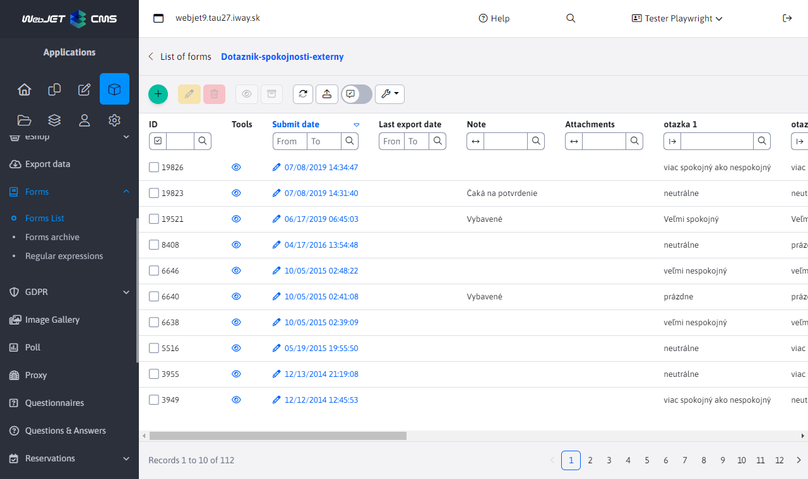

The form list also shows a Completion Duration column for [multistep forms](../multistep-form/README.md), which shows how long it took a user to complete the form (the time from when it was viewed to when it was submitted).

By clicking the eye icon, you can view the form as it appears on the website and print it.

In the form editor, you can change the note field (in which you can record the processing/status of the form). Individual completed fields are read-only, they cannot be changed after submission. The Form Items tab contains the individual items of the completed form, while the Personal Data, Contact Data and Optional Fields tabs contain the data of the user who submitted the form (if they were logged in when submitting it).

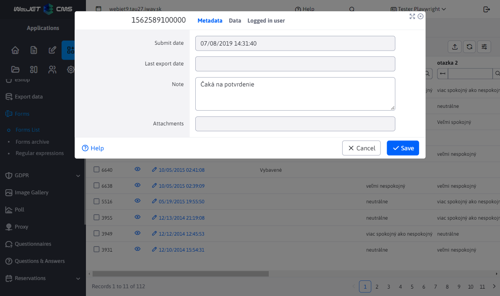

## Create a form

The easiest way to create a form is to click the Add icon and set its basic parameters in the Basic tab. This will create a new form of type [Multistep form](../multistep-form/README.md). You can then add individual form items (text fields, checkboxes, selection fields, etc.) to the form by clicking on the name of the created form in the table and going to the [Form items](../multistep-form/README.md) tab.

<div class="video-container">
    <iframe width="560" height="315" src="https://www.youtube.com/embed/XRnwipQ-mH4" title="YouTube video player" frameborder="0" allow="accelerometer; autoplay; clipboard-write; encrypted-media; gyroscope; picture-in-picture" allowfullscreen></iframe>
</div>

### Basic tab

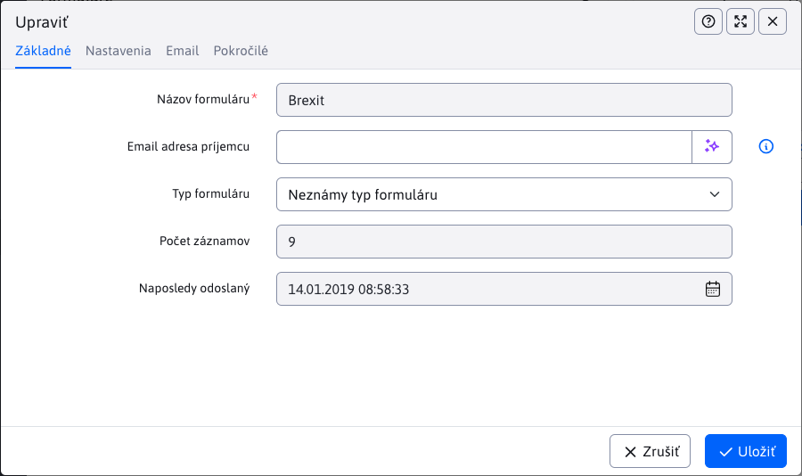

- **Form name** - unique name of the form.
- **Recipient email address** - list of email recipients. Can contain multiple recipients separated by commas.
  - **Warning:** To prevent emails from being sent through the system to foreign addresses (`mail relay server`), the system checks whether the entered target email address is in the body of the original page or in the form settings. Therefore, if you are changing the email address dynamically, it must be in the body of the page where the form is inserted.
- **Form Type** - specifies the detected form type, according to which the available setting options will be displayed. For new forms, the type is always set to Multi-step form.

It is possible to set additional optional parameters for the form that will affect its processing.

### Tab - Settings

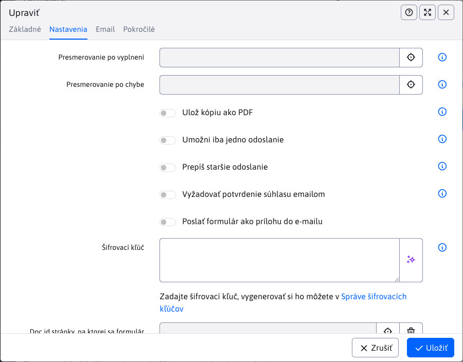

- **Redirect after filling** - url address to which the redirect should be performed after saving the form. If not specified, it will redirect to the original page.
- **Redirect after error** - url address to redirect to if the form fails to submit. If not specified, the same value as ```forward``` will be used.
- **Save copy as PDF** - if set to `true`, then after saving the form, the system will also generate its PDF version in the ```/WEB-INF/formfiles/ID_FORMULARU_pdf.pdf``` directory, where the value of ```ID_FORMULARU``` is the ```id``` form in the database.
- **Allow only one submission** - if a user is logged in and this field is set to the value ```true```, then if the user has already submitted the form, the system will not allow them to submit it again. This way, the form will only be found in the database from one user once.
- **Overwrite older submission** - if a user is logged in and this field is set to ```true```, then if the user has already submitted the form, its value will be overwritten by the new version. This way, the form will only be present in the database once for one user.
- **Require email confirmation** - activates [email address confirmation] mode(#email-address-confirmation-settings).
- **Send form as an attachment to an email** - when enabled, the form will be attached to the email as an HTML attachment.
  - **Form attachment name** - the name of the attachment in HTML format.
- **Encryption key** - if you want to encrypt the form values, you can enter [encryption key](../../admin/README.md#header).
- **Doc id of the page where the form is located** - doc ID of the page where the form is located. By default, the system tries to determine this page based on ```refereru```, or the last viewed page in `session`. For precise determination, this value can be entered. If it is not entered, WebJET will automatically fill it in when the form is displayed.
- **Doc id notification for user** - if set to the value of a web page, then after successfully saving the form, an email with the text of the given web page is sent to the visitor's email (from the email / e-mail field). This can be, for example, a thank you for filling out the form, or further instructions on the procedure.
- **Doc id of the page with the email version** - doc ID of the page with the email version. The system needs the page to be able to generate the email form. If the value `none` is entered, the web page designation for the email will not be used. If the value is not entered at all, the value entered by the ```useFormDocId``` parameter will be used. The value is useful if you have one contact form on all pages, inserted e.g. in the footer. When generating the email, the code of the page itself is used as the code, but the form is not located there. This way, it is possible to tell it to use a different page for the email.

### Card - Email

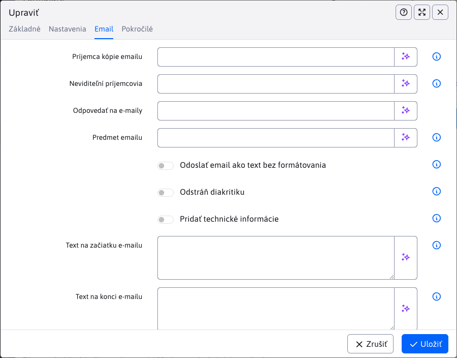

- **Email copy recipient** - a list of email addresses separated by commas to which a copy of the email should be sent.
- **Blank recipients** - a comma-separated list of email addresses to which a blind copy of the email should be sent.
- **Reply to emails** - email address to which the reply to the email should be sent (sets the email header `Reply-To`).
- **Email Subject** - the subject of the email sent to the administrator. If it is not filled in automatically, it will be used according to the name of the website where the form is located.
- **Send email as plain text** - if checked, the email is sent as an unformatted text version (in the field name:value format), otherwise it is sent as formatted HTML text as displayed on the web page.
- **Remove diacritics** - by default, the same character encoding as the website will be used. By enabling this, diacritics will be removed and the email text will be without diacritics.
- **Add technical information** - if you check this box, technical information (page name, page address, date and time of sending, browser information) will be added to the email.
- **Text at the beginning of the email** - text that will be added to the email before the form fields.
- **Text at the end of the email** - text that will be added to the email after the form fields.
- **Email header** - if the generated email is to contain a special header, it is possible to enter a comma-separated list of field names in this field, the values ​​of which will be set in the header.

!>**Warning:** the form expects the following renamed fields to correctly set the sender's email and name:

- ```email / e-mail``` - ​​field specifying the email address of the email sender. If it is a contact form, it is ideal if the field where the site visitor enters the email is called this.
- ```name / firstname / lastname / meno / priezvisko / jmeno / prijmeni``` - ​​field specifying the name of the email sender. If it is a contact form, it is ideal if the field where the site visitor enters their name is called this.

### Tab - Advanced

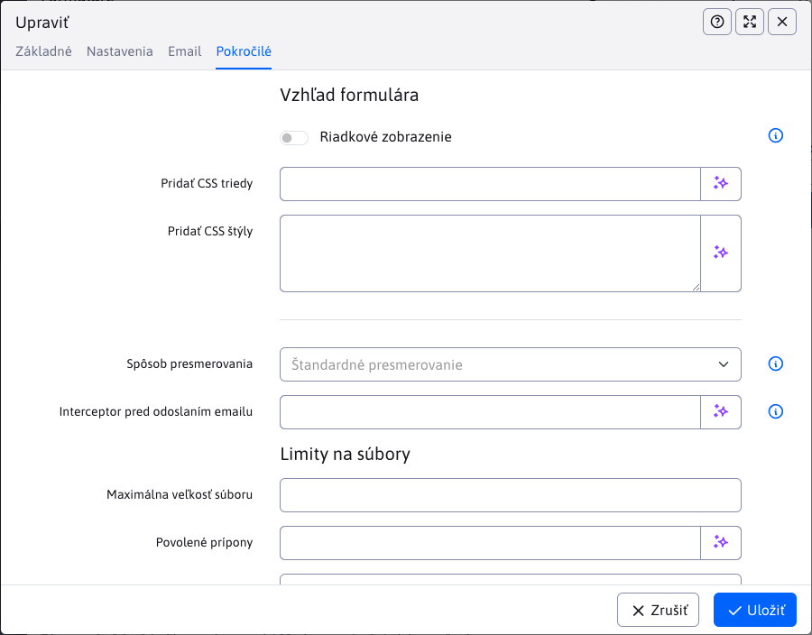

- **Line view** - allows you to insert fields into the form in line view. You create a new row by inserting the New Row field.
- **Add CSS classes** - a list of CSS classes that will be added to the form's wrapper element when it is displayed.
- **Add CSS styles** - a comma-separated list of CSS style files that will be added to the displayed form.
- **Redirect method** - type of redirection after form processing.
  - If no value is specified, the form will be processed and then redirected to the specified page with the set submission status parameter (e.g. `formSend=true`).
  - The value ```forward``` means that an internal redirect will be performed to the target page. The target page thus has access to identical parameters as the form and can perform an additional action. Since this is an internal redirect, the value ```/formmail.do``` will remain in the browser address bar.
  - The value ```addParams``` will redirect to the target page with the addition of individual parameters to the URL. In this case, the browser will perform the redirect and the address of the target page will remain in the address bar. However, since the parameters are added to the URL, their number is limited by the length of the URL, which is 2048 characters by default.
- **Interceptor before sending email** - the value is the name of the class that **must implement the interface `AfterSendInterceptor`**. After sending the email, the code from this class will be executed. It is used for older versions of forms sent to the URL address `/formMailAction.do`.
- **Form Processor** - the value is the name of the class that must implement the interface [FormProcessorInterface](../../../../../src/main/java/sk/iway/iwcm/components/multistep_form/support/FormProcessorInterface.java). The class will ensure the processing of the form steps according to its own logic. An example is the class [FormEmailVerificationProcessor](../../../../../src/main/java/sk/iway/iwcm/components/multistep_form/support/FormEmailVerificationProcessor.java), which ensures sending the verification code to the email and its verification in the second step of the form. It is used for multi-step forms.
- **Maximum file size** - maximum size of the uploaded file in bytes.
- **Allowed extensions** - comma-separated list of allowed extensions for uploaded files, e.g. `jpg,png,pdf,docx`.
- **Maximum height (for images)** - maximum height of the uploaded image in pixels.
- **Maximum width (for images)** - maximum width of the uploaded image in pixels.

## Setting up email address confirmation

The form can be set to **email address confirmation** ( ```double opt-in``` ). This will confirm the form submission by clicking on the link in the email and thus **verify** that the visitor who filled out the form entered a **actually valid email address**.

To enable email address confirmation, you need to set:

1. In the form properties, specifically in the advanced settings 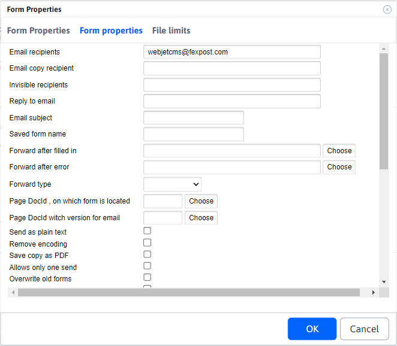, you need to select the option **Require confirmation of consent by e-mail**. 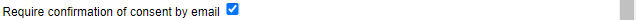
2. Create a page for confirming consent, it must contain the application `!INCLUDE(sk.iway.iwcm.components.form.DoubleOptInComponent)!`, which confirms consent based on parameters in the database. The page can be used for several different forms, it can have a URL address of, for example, `/potvrdenie-double-optin/`.
3. Create a page with the text of the email, e.g. "To confirm the validity of the email address, click on the following link" and insert a link to the page where the confirmation of consent will be. The link must contain the parameters `!FORM_ID!,!OPTIN_HASH!`, e.g. `/potvrdenie-double-optin/?formId=!FORM_ID!&hash=!OPTIN_HASH!`. Set the ID of this page in the field ```Doc ID``` of the notification for the user.

After clicking the link in the email, the Consent Confirmation Date field will be set in the form, so you can identify forms that have consent confirmed. At the same time, forms that do not have consent confirmed are displayed in red.

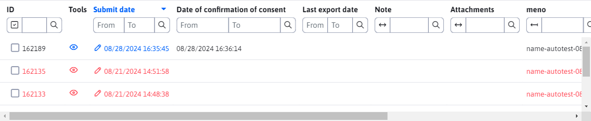

## Setting up confirmation with a sent code

To protect forms, you can also set up confirmation with a sent code. After completing the first step of the form, a code is sent to the specified email address, which must be entered in the second step of the form to successfully submit it.

In the form settings, in the Advanced tab, you need to enter the value `sk.iway.iwcm.components.multistep_form.support.FormEmailVerificationProcessor` in the Form Processor field. This will ensure that the code is sent to the email and verified in the second step.

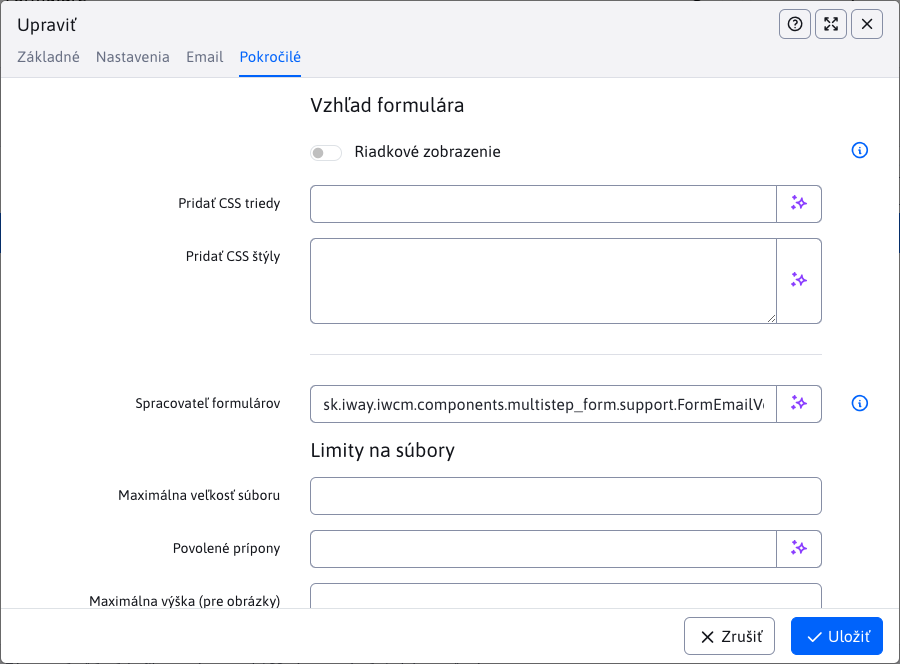

In the form items in the first step, enter the fields you need to fill out the form, including the email address field.

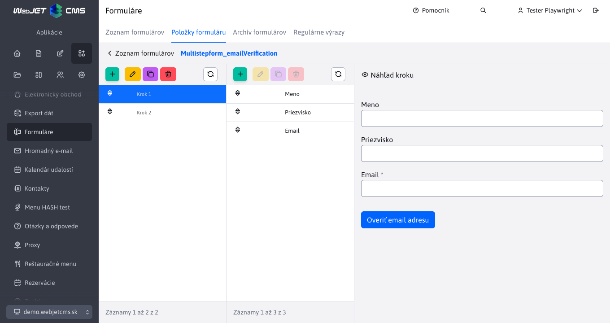

Then, in the second step, you add an item of the Verification Code type, which will ensure the display of an input field for entering the code and its verification when submitting the form.


If you need to implement similar functionality, but with different logic, the Programming Custom Applications section provides more technical information about the possibility of implementing a [custom form handler](../../../custom-apps/apps/multistep-forms/README.md) that will provide the required functionality.

## Form submission event

After submitting the form via AJAX, an event `WJ.formSubmit` is published, which can be listened to, e.g. as:

```javascript
    window.addEventListener("WJ.formSubmit", function(e) { console.log("DataLayer, submitEvent: ", e); dataLayer.push({"formSubmit": e.detail.formDiv, "formSuccess": e.detail.success}); });
```

## Data export

Form records can be exported to ```xlsx``` and ```csv``` formats. The following export options can be set in the Advanced tab:

- Currently filtered data - if you have data in the table filtered by a certain column, only this data is exported.
- All data - all data is exported regardless of the filter set in the displayed table.
- Data not yet exported - only data that has not yet been exported (has an empty value in the Last Export Date column) is exported. This way, you can easily export only newly added data one by one.
- Only selected rows - only selected rows in the table are exported.

After exporting, the Last Export Date column is automatically set to the current date and time.


## Possible configuration variables

- ```formmailAllowedRecipients``` - ​​List of email address tails to which forms can be sent, for example: ```@interway.sk,podpora@demo.webjet.sk```. Empty by default, which means that the form can be sent to any address
- ```formMailEncoding``` - ​​character set for sending emails from forms. By default set to empty, which means that the same character encoding as set for the web page will be used.
- ```spamProtection``` - ​​if set to ```true```, spam protection in forms will be enabled. Default is set to ```true```.
- ```spamProtectionJavascript``` - ​​if set to ```all``` (all forms will be protected) or ```formmail``` (only forms sent to email will be protected), forms will be protected ```javascriptom```, to deactivate the function it is necessary to enter ```none```. Default set to ```all```.
- ```spamProtectionSendInterval``` - ​​time in seconds during which it is not possible to resend the form to email. Default is set to 30.
- ```spamProtectionDisabledIPs``` - ​​list of IP address beginnings separated by a comma (or `*` character for all) for which spam protection is disabled.
- ```formMailSendPlainText``` - ​​if set to ```true```, the email from the form is sent as plain text (not HTML format).
- ```formMailRenderRadioCheckboxText``` - ​​if set to ```true``` it will display select and check boxes as ```[X]``` or ```[ ]``` text.
- ```formMailCropForm``` - ​​if set to ```true``` only the part wrapped in ```tagov``` form will be sent.
- ```formmailHttpsDomains``` - ​​A comma-separated list of domains for which forms will always be submitted over a secure httpS connection.
- ```checkFormValidateOnInit``` - ​​Setting the form validation when it is initialized, when set to ```false``` the entire form is not validated when displayed, when set to ```true``` it is validated.
- ```formMailFixedSenderEmail``` - ​​If set to an email address, it will be used as a fixed value for the sender's email. Unlike ```emailProtectionSenderEmail```, it will not set the original email in the ```reply-to``` field, so the sender is not notified in case of an error in delivery (which may sometimes be necessary for security reasons).
- ```formmailShowClassicErrorMessage``` - ​​If set to ```true``` it will display the classic form validation message at the top of the form instead of the message for individual fields.
- ```formmailScrollTopAfterSend``` - ​​If set to ```true```, the page will scroll to the top of the form after submission (so that the submission notification can be seen).
- ```formmailResetFormAfterSend``` - ​​If set to ```true```, the form will be cleared after successful submission.
- ```formmailSendUserInfoSenderName``` - ​​Sent as the sender name in the email when sending a page according to the specified ```formMailSendUserInfoDocId```. If empty, the name of the author of the page whose content is being sent to the email is sent.
- ```formmailSendUserInfoSenderEmail``` - ​​Sent as the sender's email in the email when sending a page according to the specified ```formMailSendUserInfoDocId```. If empty, the email of the author of the page whose content is being sent to the email is sent.