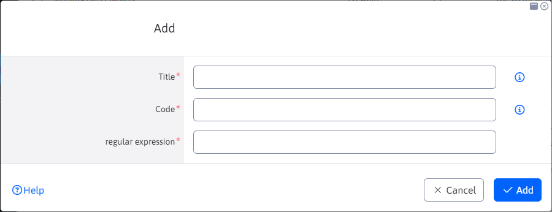

# Regular expressions

The Forms application contains a Regular Expressions node, through which you can define rules for checking the filling of fields. Rules are defined using a regular expression.

The editor contains the following fields.

- Name - Name, or better translation key, rules. The name should be concise and clear to the user (e.g. at least 8 characters).
- Code - Code designation, can only contain letters without spaces. In HTML code it is used as a CSS class on the input field.
- Regular expression - [Regular expression](https://www.w3schools.com/jsref/jsref_obj_regexp.asp) Rules.

