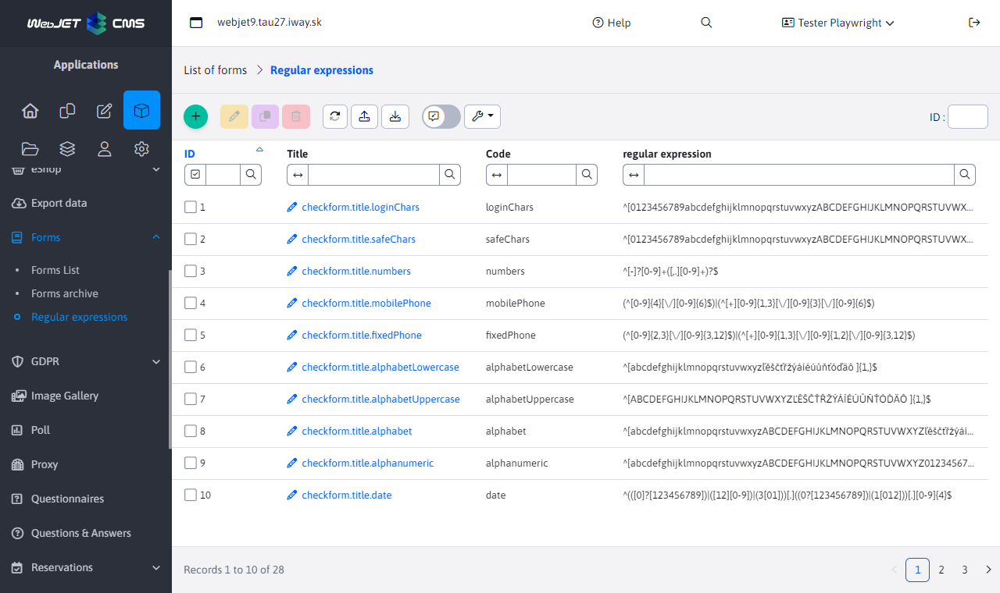
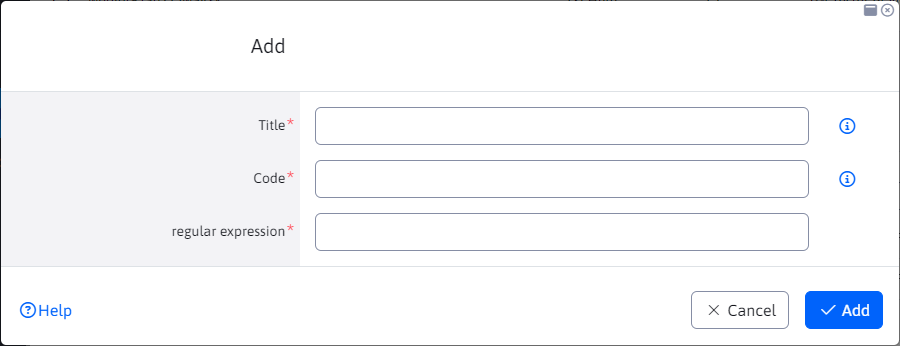

# Regular expressions

The Forms application contains a Regular Expressions node, through which you can define rules for checking field completion. Rules are defined using a regular expression.

The editor contains the following fields.

- Title - The title, or better yet, the translation key, of the rules. The title should be concise and clear to the user (e.g., at least 8 characters).
- Code - Code designation, can only contain letters without spaces. In HTML code, it will be used as a CSS class on the input field.
- Regular Expression - [Regular Expression](https://www.w3schools.com/jsref/jsref_obj_regexp.asp) rules.

