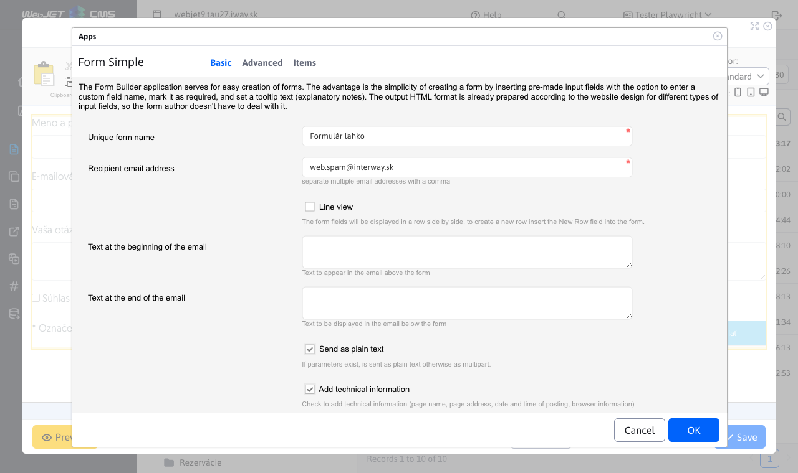
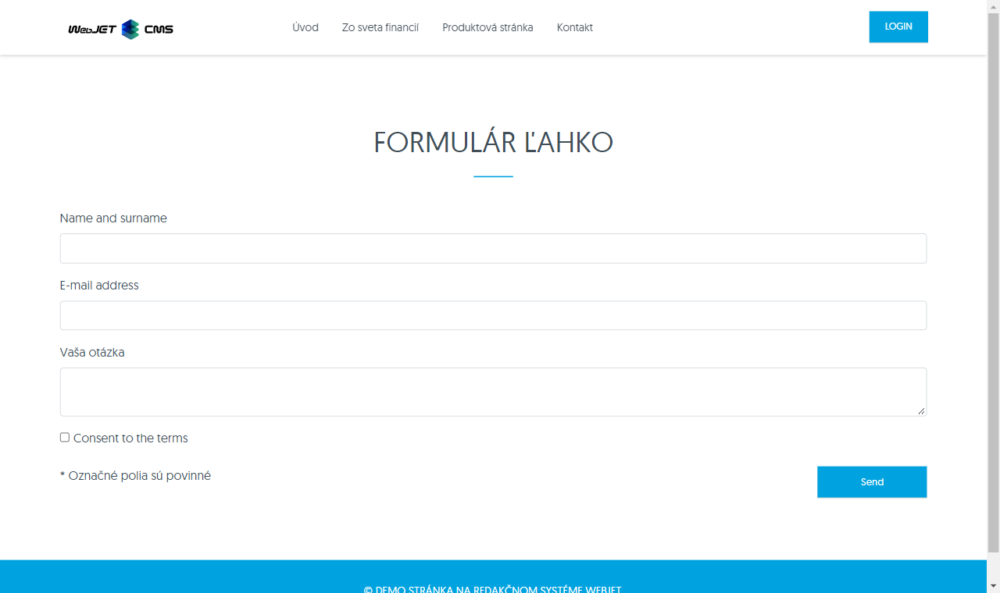
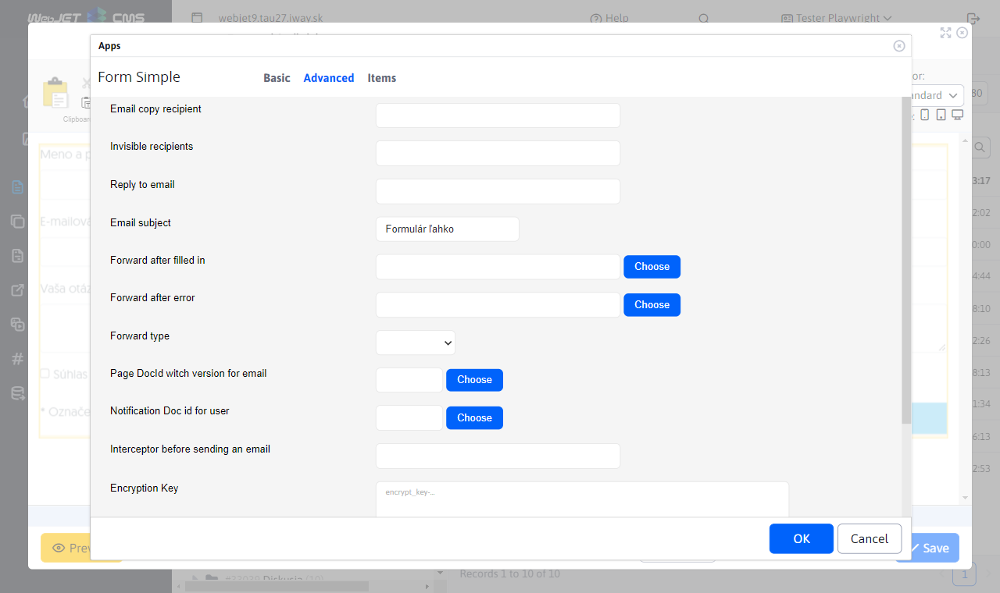
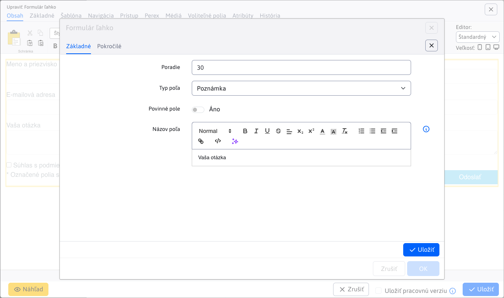
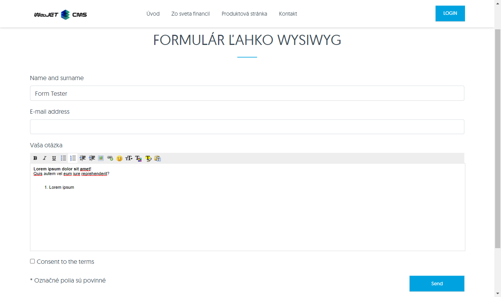

# Form easily

The form application is easy to use for creating forms. The advantage is the simplicity of creating a form by simply inserting prepared input fields with the option of entering a different field name, marking the obligation to fill in and setting the explanatory text (```tooltip```). The form author does not have to deal with the output HTML format, it is prepared according to the website design for individual types of input fields.

## Basic

The following values ​​need to be set for the form.

- **Unique form name** - the entered form name should be unique for the entire website, the form will be saved in the Forms application under this name.
- **Recipient email address** - a list of email addresses separated by commas to which the completed form should be sent.
- **Line view** - form fields will be displayed in a row next to each other (otherwise each field is on a new line). To create a new line, insert the New Line field into the form.
- **Text at the beginning of the email** - text that will be added to the email before the form fields.
- **Text at the end of the email** - text that will be added to the email after the form fields.
- **Send email as plain text** - if checked, the email is sent as an unformatted text version (in the field name:value format), otherwise it is sent as formatted HTML text as displayed on the web page.
- **Add technical information** - if you check this box, technical information (page name, page address, date and time of sending, browser information) will be added to the email.



By default, form fields are displayed one below the other:



When you select the Row view option, fields can be displayed in a row next to each other. To create a new row, insert the **New Row** field into the form:


## Advanced

The Advanced tab contains advanced settings that are not mandatory.

- **Encryption key** - if you want to encrypt the form values, you can enter [encryption key](../../admin/README.md#header).
- **Email copy recipient** - a list of email addresses separated by commas to which a copy of the email should be sent.
- **Blank recipients** - a comma-separated list of email addresses to which a blind copy of the email should be sent.
- **Email subject** - email subject. If not filled in automatically, it will be used according to the website.
- **Redirect after filling** - url address to which the redirect should be performed after saving the form. If not specified, it will redirect to the original page.
- **Redirect after error** - url address to which to redirect if the form fails to submit. If not specified, the same value as **Redirect after completion** will be used.
- **Redirect method** - type of redirection after form processing.
  - If no value is specified, the form will be processed and then redirected to the specified page with the set submission status parameter (e.g. `formSend=true`).
  - The value ```forward``` means that an internal redirect will be performed to the target page. The target page thus has access to identical parameters as the form and can perform an additional action. Since this is an internal redirect, the value ```/formmail.do``` will remain in the browser address bar.
  - The value ```addParams``` will redirect to the target page with the addition of individual parameters to the URL. In this case, the browser will perform the redirect and the address of the target page will remain in the address bar. However, since the parameters are added to the URL, their number is limited by the length of the URL, which is 2048 characters by default.
- **Doc id notification for user** - if set to the docId value of a web page, then after successfully saving the form, an email with the text of the given web page is sent to the visitor's email (from the field named `email / e-mail`). This can be, for example, a thank you for filling out the form, or further instructions on how to proceed. You insert the value from the form into the page as the expression `!field-name!`, which is the value in the `name` attribute of the form field.
- **Doc id of the page with the email version** - doc ID of the page with the email version. The system needs the page to be able to generate the email form. If the value `none` is entered, the web page designation for the email will not be used. If the value is not entered at all, the value entered by the ```useFormDocId``` parameter will be used. The value is useful if you have one contact form on all pages, inserted e.g. in the footer. When generating the email, the code of the page itself is used as the code, but the form is not located there. This way, it is possible to tell it to use a different page for the email.
- **Doc id of the page where the form is located** - the page where the form is located. It is necessary to fill in if the form is inserted, for example, in the footer of the page and the system needs to know from which page to load the form data when submitting it.
- **Interceptor before sending email** - the value is the name of a class that **must implement the interface ```AfterSendInterceptor```**. After sending the email, the code from this class will be executed.



## Items

In the items tab, you can add/edit/duplicate form fields, move the order of fields (using drag & drop), or delete form fields.


When creating or editing form items, you can select one of the predefined field types from the Field Type drop-down box. Based on the type you select, additional options will appear to allow you to edit its properties:

- **Name** - represents the name of the form field (display name), if left blank the name from the Field type drop-down menu will be used. For information fields (labels), enter the text you want to display.
- **Value** - pre-filled value that will be displayed in the field when it is loaded.
- **Placeholder text** - for standard text fields, represents the placeholder text value (```placeholder```) that will be displayed when the field is empty.
- **Required field** - checking the field will mark it as required for submitting the form.
- **Tooltip** - if you enter a value, a tooltip will appear next to the field name with the text entered in this field. The display method depends on the website design (typically requires [FontAwesome](https://fontawesome.com) support to display the icon).



**Note:** if the **Value** field is empty and text is entered in the **Placeholder text** field, the field name will not be displayed separately when the form is displayed on the web page, but only as placeholder text. This allows you to create a smaller form in terms of its space on the web page.

For **field groups (e.g., a group of selection or checkbox fields)**, a list of options is defined in the Value field. The character ```|``` is searched for as an option separator, if not found, the character ```,``` is searched for, if not found, a space is used. So you can enter e.g. ```Slobodný,Ženatý,Rozvedený```, or if you need to enter a comma in the option, use the separator ```|``` as ```Predjedlo|Polievku|Hlavné jedlo|Koláč, kávu``` (the option ```Koláč, káva``` will be one item).

For **Select list - select** it is also possible to enter different text for the displayed information and the selected value. The displayed text and the value are separated by the ```:``` character. Example: ```Pomaranč:orange,Jablko:apple``` displays a selection field (select) with the text values ​​Orange or Apple, but when selected, the value ```orange``` or ```apple``` is stored in the form.


## Information for web designers

The HTML code for displaying fields and forms is defined in Settings-Text Editing. Text keys have the prefix ```components.formsimple.```.



The basic form code is in the keys:

- ```components.formsimple.form.start``` - ​​HTML code for the beginning of the form (opening form tag)
- ```components.formsimple.form.end``` - ​​HTML code for the end of the form (closing form tag)
- ```components.formsimple.requiredLabelAdd``` - ​​text that will be added to the label element text for a required field (typically the * character)
- ```components.formsimple.tooltipCode``` - ​​HTML code for generating ${tooltip} replacement
- ```components.formsimple.techinfo``` - ​​HTML code for generating technical information in an email

You define individual items using keys:

- ```components.formsimple.label.NAZOV``` - ​​item name (typically the value of the label element)
- ```components.formsimple.input.NAZOV``` - ​​HTML code of the item
- ```components.formsimple.hide.NAZOV``` - ​​list of fields that will not be displayed for this item in the administration (possible values: label, required, tooltip, placeholder)
- ```components.formsimple.firstTimeHeading.NAZOV``` - ​​title above the field, displayed only the first time a field with this name is displayed (used for selection and checkbox fields)

Example:

```properties
//najjednoduchsi typ pola
components.formsimple.label.meno=Meno
components.formsimple.input.meno=<div class="form-group"><label for="${id}">${label}${tooltip}</label> <input class="${classes}form-control" data-name="${labelSanitized}" id="${id}" name="${id}" placeholder="${placeholder}" type="text" maxlength="20" />${cs-error}</div>

//pole, ktoremu sa nezobrazi moznost zadat ze sa jedna o povinne pole (moznost .hide)
components.formsimple.label.popiska=Popiska (info text)
components.formsimple.input.popiska=<div class="form-group"><label for="${id}">${label}${tooltip}</label></div>
components.formsimple.hide.popiska=required

//ukazka pouzitia nadpisu nad vyberovym polom, hodnota .firstTimeHeading sa zobrazi len pred prvym polom
components.formsimple.label.radio=Výberové pole
components.formsimple.input.radio=<div class="form-check"><input class="${classes}form-check-input" data-name="${labelSanitized}" id="${id}" name="${id}" type="radio" value="${value}"/> <label for="${id}" class="form-check-label">${value}${tooltip}</label> ${cs-error}</div>
components.formsimple.firstTimeHeading.radio=<div class="form-group mt-3 mb-0"><label class="first-time">${label}</label></div>
components.formsimple.hide.radio=placeholder

//ukazka pouzitia ${iterable} pre vypis zoznamu vyberovych poli. Z pola Hodnota sa vytvori zoznam, ako oddelovac sa hlada znak | ak sa nenajde pouzije sa , a ak sa ani ta nenajde pouzije sa ako oddelovac medzera
//v kluci components.formsimple.iterable.radiogroup sa definuje HTML kod opakovaneho zaznamu, ten sa vlozi na miesto ${iterable}
components.formsimple.label.radiogroup=Skupina výberových polí
components.formsimple.input.radiogroup=<div class="form-group"><label for="${id}">${label}${tooltip}</label>${iterable} ${cs-error}</div>
components.formsimple.iterable.radiogroup=<div class="form-check"><input class="${classes}form-check-input" data-name="${labelSanitized}" id="${id}-${counter}" name="${id}" placeholder="${placeholder}" type="radio" value="${value}"/> <label for="${id}-${counter}" class="form-check-label">${value}</label></div>
components.formsimple.hide.radiogroup=placeholder

//ukazka pouzitie ${iterable} pre vypis SELECT pola
components.formsimple.label.select=Výberový zoznam - select
components.formsimple.input.select=<div class="form-group"><label for="${id}">${label}${tooltip}</label><select name="${id}" id="${id}" class="form-control form-select">${iterable} </select>${cs-error}</div>
components.formsimple.iterable.select=<option value="${value}">${value-label}</option>

//example of wysiwyg/cleditor - it must contains class ending formsimple-wysiwyg to render cleditor on page
components.formsimple.label.wysiwyg=Formátované textové pole
components.formsimple.input.wysiwyg=<div class="form-group"><label for="${id}">${label}${tooltip}</label> <textarea class="${classes}form-control formsimple-wysiwyg" data-name="${labelSanitized}" id="${id}" name="${id}" placeholder="${placeholder}">${value}</textarea>${cs-error}</div>
components.formsimple.hide.wysiwyg=placeholder
```

The following tags can be used in the code, which will be replaced when the form is displayed:

- ```${formname}``` - ​​form name without spaces, diacritics, in lowercase, used for form element in name attribute (it should still start with formMail for use in standard validation mechanism)
- ```${savedb}``` - ​​same value as ```formname```, used for clarity in the form submission URL
- ```${id}``` - ​​Element ID generated from its name (Value field in administration), without spaces, diacritics, in lowercase letters
- ```${label}``` - ​​text for label element, value from name field in administration
- ```${labelSanitized}``` - ​​text for label element, value from name field in administration, special characters modified so it can be used in HTML attribute
- ```${value}``` - ​​text from the value field in the administration
- ```${placeholder}``` - ​​placeholder text, displayed when the field has an empty value
- ```${classes}``` - ​​additional CSS styles, currently ```required``` if checked Required field in administration
- ```${tooltip}``` - ​​HTML code for tooltip, value from Tooltip field in administration
- ```${cs-error}``` - ​​generated HTML code for error message
- ```${iterable}``` - ​​a repeating list of fields (e.g. a group of selection fields) is inserted at the specified location, with the code that is repeated being defined by the key ```components.formsimple.iterable.MENO_POLA```
- ```${counter}``` - ​​sequence number for a repeating record, needed to set the unique ```id``` and ```for``` attributes
- ```${value-label}``` - ​​text value (label) for a repeating record, if it contains a different value for ```value``` and for ```label``` (e.g. in the ```option``` tag). The user enters possible values ​​as ```label:value```, i.e. as ```Pomaranč:orange,Jablko:apple``` to display the listed options.
- ```{enumeration-options|ID_CISELNIKA|MENO_VALUE|MENO_LABEL}``` - ​​connection to get a list of ```option``` values ​​from the codebook application. The codebook ID, column name for the value, and column name for the text are specified.

In the email view, the value of the tooltip field is replaced with a blank character (so that there is no unnecessary non-functional tooltip in the email).

### Dial connection

You can easily connect a selection field (`select`) to a dial pad:

```html
<div class="govuk-form-group">
  <label for="${id}" class="govuk-label govuk-heading-m">${label}</label>
  ${tooltip} ${cs-error}
  <select name="${id}" id="${id}" class="form-control form-select govuk-select">{enumeration-options|${value}|value|label_sk}</select>
</div>
```

using the expression `{enumeration-options|ID_CISELNIKA|MENO_VALUE|MENO_LABEL}`, `<option>` elements are created, and when inserting the field, the user enters the codebook type ID (e.g. 4) in the value in the form field dialog box. This is replaced by `${value}` in the expression and the system reads the values ​​for `<option value="value">label_sk</option>` from the given codebook. The codebook must have defined fields `value` with the value and `label_sk` with the text. If you use the form in multiple languages, you can also have fields `label_en,label_cs` and use the correct values ​​in the translation key in each language instead of `label_sk`.

Of course, you can also create fields directly linked to a specific code type (in example 4), in which case you will not use the value `${value}` but the directly entered ID in the translation key. Then the user does not have to enter anything when adding the field:

```html
<div class="govuk-form-group">
  <label for="${id}" class="govuk-label govuk-heading-m">${label}</label>
  ${tooltip} ${cs-error}
  <select name="${id}" id="${id}" class="form-control form-select govuk-select">{enumeration-options|4|value|label_sk}</select>
</div>
```