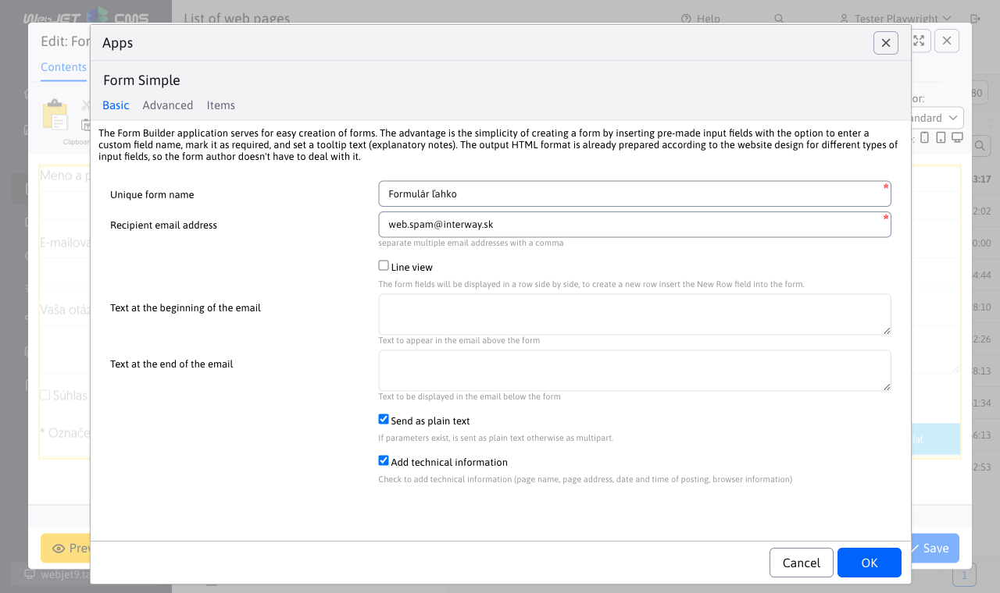
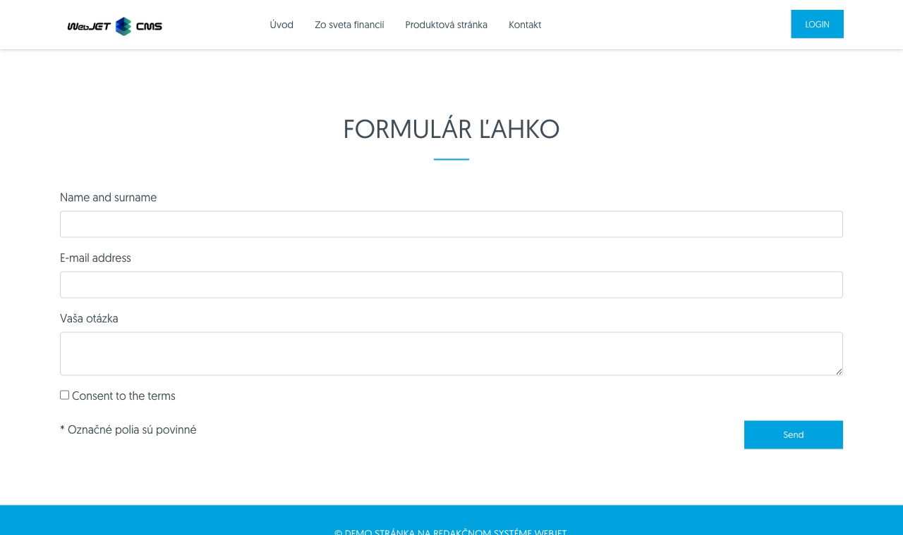
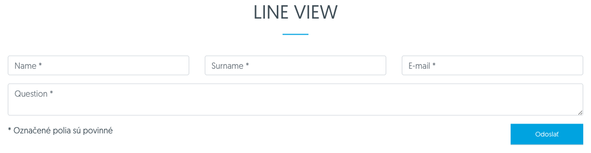
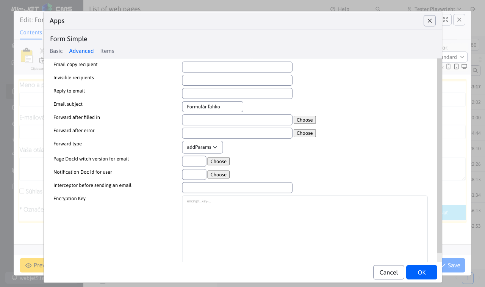

# Form easily

The form app is easy to use for simple form creation. The advantage is the simplicity of creating the form by simply inserting prepared input fields with the possibility of entering a different field name, indicating the obligation to fill in and setting the text of the explanatory note (`tooltip`). The author of the form does not have to deal with the output HTML format, it is prepared according to the web design for each type of input fields.

## Basic

The following values need to be set for the form.

- **Unique form name** - the form name entered should be unique for the entire site, under this name the form will be saved in the Forms application.
- **Email address of the recipient** - a comma-separated list of email addresses to which the completed form should be sent.
- **Line view** - the form fields are displayed in a row next to each other (otherwise each field is on a new row). To create a new row, insert a New Row field in the form.
- **Text at the beginning of the email** - text to be added to the email before the form fields.
- **Text at the end of the email** - text to be added to the email after the form fields.
- **Send email as text without formatting** - if checked the email is sent as unformatted text version (in field name: value format), otherwise it is sent as formatted HTML text as it is displayed on the web page.
- **Add technical information** - if checked, technical information (page name, page address, date and time of sending, browser information) will be added to the email.



By default, the form fields are displayed one below the other:



By selecting Row View, fields can be displayed side-by-side in a row. To create a new row, insert a field in the form **New line**:



## Advanced

The advanced tab contains advanced settings for settings that are not required.

- **Encryption key** - if you want to encrypt the form values, you can enter [encryption key](../../admin/README.md#Header).
- **Recipient of a copy of the email** - a comma separated list of email addresses to which a copy of the email should be sent.
- **Invisible recipients** - a comma-separated list of email addresses to which a hidden copy of the email should be sent.
- **Subject of the email** - email subject. If it is not filled in automatically it will be used according to the web page.
- **Redirection after completion** - url address to redirect to after saving the form. If not specified it will redirect to the original page.
- **Redirecting after an error** - url address to redirect to if the form fails to submit. If not specified, the same value is used as has **Redirection after completion**.
- **Redirection method** - type of redirection after the form is processed.
  - If the value is not entered, the form is processed and then redirection to the specified page with the set parameter of the sending status is performed (e.g. `formSend=true`).
  - Value `forward` means that an internal redirect is performed to the destination page. The target page can then access the identical parameters as the form and perform an additional action. Since this is an internal redirect, the value will remain in the browser's address bar `/formmail.do`.
  - Value `addParams` performs a redirect to the destination page with the addition of individual parameters to the URL. In this case, the browser performs the redirection and the address of the destination page remains in the address bar. However, since the parameters are added to the URL, the number of parameters is limited by the length of the URL, which is 2048 characters by default.
- **Doc id notifications for user** - if it is set to docId value of some web page, then after successful saving of the form, the visitor's email (from the field named `email / e-mail`) sent an email with the text of the web page. This could be a thank you for filling out the form, or further instructions on how to proceed. You insert the value from the form into the page as an expression `!field-name!`, which is the value in `name` attribute of the form field.
- **Doc id of page with email version** - doc ID of the page with version for email. The system needs the page to be able to generate the email version. If a value is specified `none` the web page designation for email is not used. If no value is specified at all, the value specified by the parameter `useFormDocId`. The value is useful if you have one contact form embedded in all pages, e.g. in the footer. When generating an email, the code of the page itself is used as the code, but the form is not located in it. This way you can tell it to use a different page for the email.
- **Doc id of the page where the form is located** - the page on which the form is located. It needs to be filled in if the form is embedded, for example, in the footer of a page and the system needs to know from which page to retrieve the form data when submitting it.
- **Interceptor before sending an email** - value is the name of the class that **must implement the interface `AfterSendInterceptor`**. After the email is sent, the code from this class is executed.



## Items

In the Items tab you can add/edit/duplicate form fields, move the order of fields (using drag & drop) or delete form fields.


When creating or editing items in a form, you can select one of the predefined field types in the Field Type drop-down box. Based on the type you select, additional options are then displayed that you can use to modify its properties:
- **Name** - represents the name of the form field (display name), if left blank the name from the Field Type selection menu is used. For information fields (labels), enter the text you want to display.
- **Value** - pre-filled value that will be displayed in the field when it is loaded.
- **Representative text** - for standard text fields represents the value of the placeholder text (`placeholder`), which is displayed when the field is empty.
- **Required field** - checking the box will mark the field as mandatory for submitting the form.
- **Tooltip** - if you enter a value, an information bubble (explanatory note) appears next to the field name with the text entered in this field. The display method depends on the design of the web page (typically requires support for [FontAwesome](https://fontawesome.com) to view the icon).


**Remark:** if it is in the field **Value** blank text and text is entered in the field **Representative text**, so when the form is displayed on the web page, the field name is not displayed separately but only as a placeholder text. This allows you to create a smaller form in terms of its space on the web page.

For **groups of fields (e.g. a group of selection or checkbox fields)** a list of options is defined in the Value field. The character is searched for as an option separator `|`, if not found the character is searched for `,`, if not found a space is used. So you can enter e.g. `Slobodný,Ženatý,Rozvedený`, or if you need to enter a comma in an option, use the separator `|` Like `Predjedlo|Polievku|Hlavné jedlo|Koláč, kávu` (option `Koláč, káva` will be one item).

For **Selection list - select** it is also possible to enter different text for the displayed information and the selected value. The displayed text and value are separated by a character `:`. Example: `Pomaranč:orange,Jablko:apple` prints a selection field (select) with text values Orange or Apple but when selecting the value is stored in the form `orange` or `apple`.


## Information for web designer

The HTML code for displaying fields and form is defined in Settings-Edit Text. Text keys have a prefix `components.formsimple.`.


The basic form code is in the keys:
- `components.formsimple.form.start` - HTML code for the beginning of the form (opening form tag)
- `components.formsimple.form.end` - HTML code for the end of the form (closing form tag)
- `components.formsimple.requiredLabelAdd` - text to be added to the text of the label element for the required field (typically the \* character)
- `components.formsimple.tooltipCode` - HTML code for generating ${tooltip} replacements
- `components.formsimple.techinfo` - HTML code for generating technical information in an email

You define individual items via keys:
- `components.formsimple.label.NAZOV` - item name (typically the value of the label element)
- `components.formsimple.input.NAZOV` - HTML code of the item
- `components.formsimple.hide.NAZOV` - list of fields that will not be displayed in the administration for this item (possible values: label,required,tooltip,placeholder)
- `components.formsimple.firstTimeHeading.NAZOV` - title above the field, only displayed when the field with this name is first listed (used for selection and checkbox fields)

Example:

```properties
//najjednoduchsi typ pola
components.formsimple.label.meno=Meno
components.formsimple.input.meno=<div class="form-group"><label for="${id}">${label}${tooltip}</label> <input class="${classes}form-control" data-name="${labelSanitized}" id="${id}" name="${id}" placeholder="${placeholder}" type="text" maxlength="20" />${cs-error}</div>

//pole, ktoremu sa nezobrazi moznost zadat ze sa jedna o povinne pole (moznost .hide)
components.formsimple.label.popiska=Popiska (info text)
components.formsimple.input.popiska=<div class="form-group"><label for="${id}">${label}${tooltip}</label></div>
components.formsimple.hide.popiska=required

//ukazka pouzitia nadpisu nad vyberovym polom, hodnota .firstTimeHeading sa zobrazi len pred prvym polom
components.formsimple.label.radio=Výberové pole
components.formsimple.input.radio=<div class="form-check"><input class="${classes}form-check-input" data-name="${labelSanitized}" id="${id}" name="${id}" type="radio" value="${value}"/> <label for="${id}" class="form-check-label">${value}${tooltip}</label> ${cs-error}</div>
components.formsimple.firstTimeHeading.radio=<div class="form-group mt-3 mb-0"><label class="first-time">${label}</label></div>
components.formsimple.hide.radio=placeholder

//ukazka pouzitia ${iterable} pre vypis zoznamu vyberovych poli. Z pola Hodnota sa vytvori zoznam, ako oddelovac sa hlada znak | ak sa nenajde pouzije sa , a ak sa ani ta nenajde pouzije sa ako oddelovac medzera
//v kluci components.formsimple.iterable.radiogroup sa definuje HTML kod opakovaneho zaznamu, ten sa vlozi na miesto ${iterable}
components.formsimple.label.radiogroup=Skupina výberových polí
components.formsimple.input.radiogroup=<div class="form-group"><label for="${id}">${label}${tooltip}</label>${iterable} ${cs-error}</div>
components.formsimple.iterable.radiogroup=<div class="form-check"><input class="${classes}form-check-input" data-name="${labelSanitized}" id="${id}-${counter}" name="${id}" placeholder="${placeholder}" type="radio" value="${value}"/> <label for="${id}-${counter}" class="form-check-label">${value}</label></div>
components.formsimple.hide.radiogroup=placeholder

//ukazka pouzitie ${iterable} pre vypis SELECT pola
components.formsimple.label.select=Výberový zoznam - select
components.formsimple.input.select=<div class="form-group"><label for="${id}">${label}${tooltip}</label><select name="${id}" id="${id}" class="form-control form-select">${iterable} </select>${cs-error}</div>
components.formsimple.iterable.select=<option value="${value}">${value-label}</option>

//example of wysiwyg/cleditor - it must contains class ending formsimple-wysiwyg to render cleditor on page
components.formsimple.label.wysiwyg=Formátované textové pole
components.formsimple.input.wysiwyg=<div class="form-group"><label for="${id}">${label}${tooltip}</label> <textarea class="${classes}form-control formsimple-wysiwyg" data-name="${labelSanitized}" id="${id}" name="${id}" placeholder="${placeholder}">${value}</textarea>${cs-error}</div>
components.formsimple.hide.wysiwyg=placeholder
```

The following tags can be used in the code and will be replaced when the form is displayed:
- `${formname}` - form name without spaces, diacritics, lowercase, used for form element in the name attribute (it should still start with formMail for use in the standard validation mechanism)
- `${savedb}` - the same value as `formname`, used for clarity in the URL of the form submission
- `${id}` - ID of the element generated from its name (Value field in the administration), without spaces, diacritics, lowercase letters
- `${label}` - text for label element, value from name field in administration
- `${labelSanitized}` - text for label element, value from name field in administration, modified special characters to use it in HTML attribute
- `${value}` - text from the value field in the administration
- `${placeholder}` - placeholder text, displayed when the field has an empty value
- `${classes}` - additional CSS styles, current `required` if Required field in administration is checked
- `${tooltip}` - HTML code for tooltip, value from Tooltip field in administration
- `${cs-error}` - generated HTML code for error message
- `${iterable}` - a repeating list of fields (e.g. a group of selection fields) is inserted at the specified location, the code to be repeated being defined by a key `components.formsimple.iterable.MENO_POLA`
- `${counter}` - sequence number for the repeating record, is needed to set a unique `id` a `for` attribute
- `${value-label}` - the text value (label) for the repeating record, if it contains a different value for `value` and for `label` (e.g. in `option` tag). The user specifies possible values as `label:value`, i.e. as e.g. `Pomaranč:orange,Jablko:apple` to view the options.
- `{enumeration-options|ID_CISELNIKA|MENO_VALUE|MENO_LABEL}` - link to get the list `option` values from the dialer application. The dial ID, the column name for the value, and the column name for the text are entered.

In the display to email, the value of the tooltip field is replaced with a blank character (so that the tooltip is not unnecessarily broken in the email).

### Connection to the dial

Selection field (`select`) can be easily connected to the dial:

```html
<div class="govuk-form-group">
  <label for="${id}" class="govuk-label govuk-heading-m">${label}</label>
  ${tooltip} ${cs-error}
  <select name="${id}" id="${id}" class="form-control form-select govuk-select">{enumeration-options|${value}|value|label_sk}</select>
</div>
```

using the expression `{enumeration-options|ID_CISELNIKA|MENO_VALUE|MENO_LABEL}` are created `<option>` elements, and when inserting the field, the user enters the ID of the dial type (e.g., 4) in the value in the form field dialog box. This is replaced in the expression with `${value}` and the system retrieves the values for `<option value="value">label_sk</option>`. The dial must have defined fields `value` with the value of a `label_sk` with the text. If you are using a form in multiple languages you may also have fields `label_en,label_cs` and use the correct values in the translation key in each language instead of `label_sk`.

Of course you can also create directly fields linked to a specific dial type (in example 4), then you don't use the value `${value}` but directly entered ID in the translation key. The user then does not have to enter anything when adding the field:

```html
<div class="govuk-form-group">
  <label for="${id}" class="govuk-label govuk-heading-m">${label}</label>
  ${tooltip} ${cs-error}
  <select name="${id}" id="${id}" class="form-control form-select govuk-select">{enumeration-options|4|value|label_sk}</select>
</div>
```
