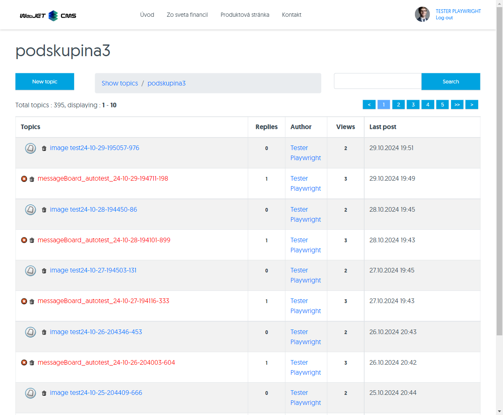
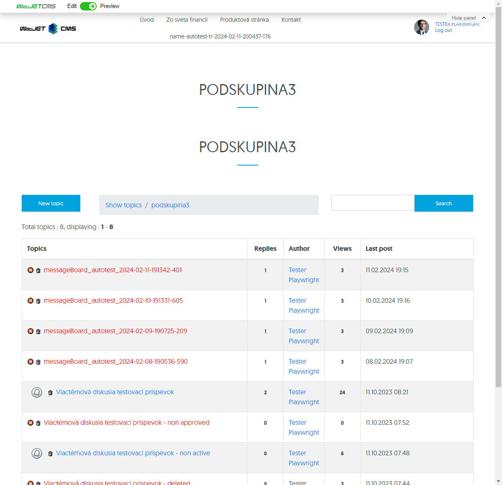
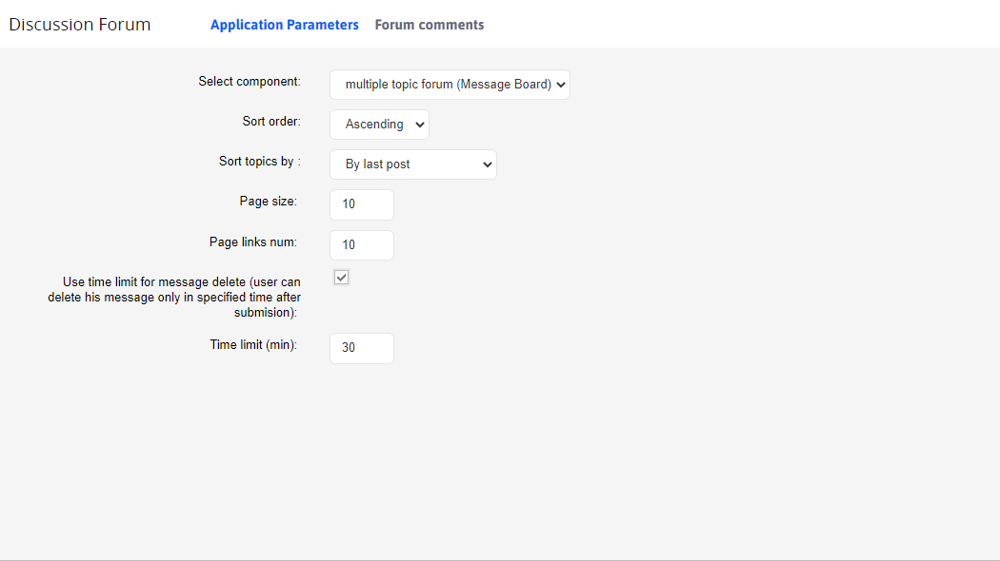

# Forum/Discussion

The Forum/Discussion application, which allows you to insert a discussion into the page, has the following display options:
- Discussion forum - a simple discussion under the article.
- Discussion board - multi-topic discussion (`Message board`), where the discussion is divided into groups and sub-topics, which will contain individual contributions. Sub-topics can also be added by the user.

## Discussion forum

A "discussion forum" is a type of simple discussion.

The application setup consists of two tabs **Application parameters** a **List of discussions**

### Tab - Application Parameters

The application parameters tab contains several additional parameters and restrictions:
- **Select a component** - choice between "Discussion forum" and "Discussion board" (choice of discussion type).
- **Arrange by time of post** - descending or ascending order.
- **The way the page text is displayed**
  - Embedded framework (`iframe`) - when the complete discussion listing is displayed, the content of the original page is displayed in the frame.
  - Showing the perex - when you view the full discussion listing, only the perex of the original page will be displayed.
  - Not displayed at all - only the discussion listing will be displayed.
  - Normal - when the full discussion listing is displayed, the full text of the original page is also displayed
  - The entire forum, including texts - a complete listing of the entire discussion will be embedded in the page.
- **Paginate the discussion** - an additional parameter appears when you enable pagination of the discussion **Number of posts on the page**, which determines how to paginate and its default value is 10.
- **Send a notification to the author of the page when a post is added to the discussion** - if selected, the author of the page where the discussion is located will be informed by e-mail about every post added to the discussion (the only exception is if the author of the page added the post).

!>**Warning:** if you want to **each** the author of the discussion page receives a notification, you can set this with a configuration variable `forumAlwaysNotifyPageAuthor`, which you set to `true`. If you set it to `false`, it will depend on the setup of each discussion. **The same applies to the Discussion Board**

If you want the author of a discussion page to always receive a notification, you can set the configuration variable `forumAlwaysNotifyPageAuthor` to the value of `true`.

### Tab - List of discussions

The Discussion List tab is a nested page listing all discussions (both the Discussion Board and the Discussion Board). You can learn more about the Discussion List here [List of discussions](forum-list.md).

## Discussion board

"Discussion Board", also referred to as `Message board`, is a type of multi-topic discussion. It can be embedded as an application in the page. The discussion is divided into groups (sections) and sub-topics. For each sub-topic, the number of posts added, the number of views and the date the last post was added are recorded and displayed under the topic title.

So a visitor can create a new topic and then discussion posts are added to the topic. This creates a kind of tree structure of discussion posts.

The application setup consists of two tabs **Application parameters** a **List of discussions**.

### Tab - Application Parameters

The application parameters tab contains several additional parameters:
- **Select a component** - choice between "Discussion forum" and "Discussion board" (choice of discussion type).
- **Direction of arrangement** - descending or ascending order.
- **Ordering of topics** namely
  - According to the last post.
  - By the date the topic was created.
- **Number of posts on the page** - enter the number of posts that will appear on a single page. The default value is 10.
- **Number of page numbers displayed** - specifies the number of direct numeric links to pages from the paginated list. The default value is 10.
- **Turn on the time. limit on deleting posts** - turn it on if you want to allow posts to be deleted only until the time limit expires. Only the author has the right to delete a post.
- **Time limit (min)** - specify the numerical value in min. The preset value is 30 minutes.
- **Send a notification to the author of the page when a post is added to the discussion** - if selected, the author of the page where the discussion is located will be informed by e-mail about every post added to the discussion (the only exception is if the author of the page added the post).

!>**Warning:** if you want the author of the discussion page to always receive a notification, you can set a configuration variable `forumAlwaysNotifyPageAuthor` to the value of `true`.

### List of discussions

The Discussion List tab is a nested page listing all discussions (both the Discussion Board and the Discussion Board). You can learn more about the Discussion List here [List of discussions](forum-list.md).
