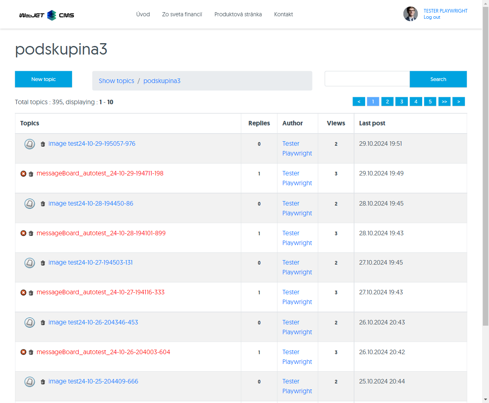
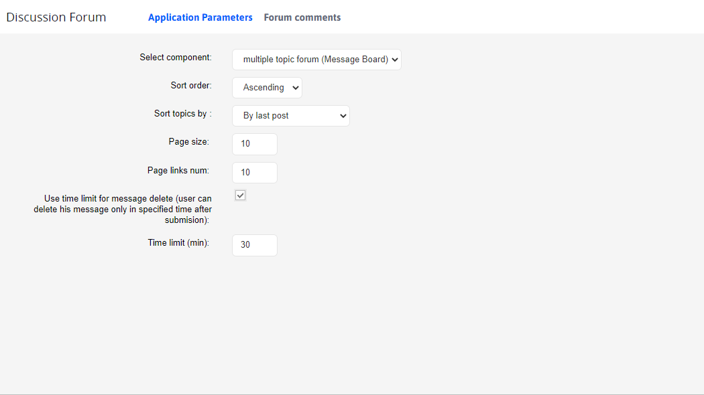

# Forum/Discussion

The Forum/Discussion application, which allows you to insert a discussion into a page, has the following display options:

- Discussion forum - simple discussion under the article.
- Discussion board - multi-topic discussion (```Message board```), where the discussion is divided into groups and sub-topics, which will contain individual posts. Sub-topics can also be added by the user.

## Discussion forum

A "discussion forum" is a type of simple discussion.


The application settings consist of two tabs **Application Parameters** and **Discussion List**


### Tab - Application Parameters

The application parameters tab contains several additional parameters and restrictions:

- **Select a component** - choose between "Discussion Forum" and "Discussion Board" (choose the discussion type).
- **Sort by post time** - descending or ascending order.
- **Page text display method**
  - Embedded frame (`iframe`) - when viewing the complete discussion summary, the content of the original page is displayed in a frame.
  - A preview is displayed - when viewing the complete discussion summary, only a preview of the original page is displayed.
  - It will not be displayed at all - only a summary of the discussion will be displayed.
  - Normal - when viewing the complete discussion summary, the complete text of the original page is also displayed
  - Entire forum, including texts - a complete transcript of the entire discussion will be inserted into the page.
- **Paginate discussion** - when paging the discussion is enabled, an additional parameter **Number of posts per page** will appear, which determines how the discussion will be paginated and its default value is 10.
- **Send notification to page author when adding a post to the discussion** - if this option is selected, the author of the page where the discussion is located will be notified by email about each post added to the discussion (the exception is only if the page author himself added the post).

!>**Note:** if you want **every** author of a discussion page to receive a notification, you can set this with the configuration variable ```forumAlwaysNotifyPageAuthor```, which you set to ```true```. If you set it to ```false```, it will depend on the settings of each discussion. **The same applies to the Discussion Board**

If you want the author of the talk page to always receive a notification, you can set the configuration variable ```forumAlwaysNotifyPageAuthor``` to the value ```true```.

### Tab - Discussion List

The Discussion List tab is a nested page with a list of all discussions (Discussion Forum and Discussion Board). You can learn more about the Discussion List here [Discussion List](forum-list.md).

## Discussion board

A "discussion board", also known as ```Message board```, is a type of multi-topic discussion. It can be embedded into a page as an application. The discussion is divided into groups (sections) and sub-topics. For each sub-topic, the number of posts added, the number of views, and the date of the last post are recorded, which are displayed under the topic name.



A visitor can create a new topic and then add discussion posts to the topic, creating a tree structure of discussion posts.


The application settings consist of two tabs **Application Parameters**, **Groups** and **Discussion List**.



!>**Warning:** the discussion application in the **Discussion Board** format (or **Message Board**) must be inserted into the already created page.

### Tab - Application Parameters

The application parameters tab contains several additional parameters:

- **Select a component** - choose between "Discussion Forum" and "Discussion Board" (choose the discussion type).
- **Sort Direction** - descending or ascending sort.
- **Topic sorting** and that
  - According to the last post.
  - By topic creation date.
- **Number of posts per page** - enter the number of posts to display on one page. The default value is 10.
- **Number of page numbers displayed** - determines the number of direct numeric links to pages from the paginated list. The default value is 10.
- **Enable time limit for deleting posts** - enable it if you want to allow posts to be deleted only until the time limit expires. Only the author has the right to delete a post.
- **Time limit (min)** - enter a numerical value in min. The default value is 30 minutes.
- **Send notification to page author when adding a post to the discussion** - if this option is selected, the author of the page where the discussion is located will be notified by email about each post added to the discussion (the exception is only if the page author himself added the post).

!>**Note:** if you want the author of the talk page to always receive a notification, you can set the configuration variable ```forumAlwaysNotifyPageAuthor``` to the value ```true```.

### Tab - Groups

The **Groups** tab is only displayed if the **Message Board** component is selected. It offers the ability to define the structure of a multi-topic discussion using groups and subgroups.

The default structure (if there is no other discussion in the folder) is:

```txt
Skupina1
 podskupina1
Skupina2
 podskupina1
 podskupina2
 podskupina3
```

!>**Warning:** subgroups must start with a space.

Of course, you can change this structure. After saving, the necessary structure will be automatically created in the folder of the page where the application was inserted.

### Tab - Discussion List

The Discussion List tab is a nested page with a list of all discussions (Discussion Forum and Discussion Board). You can learn more about the Discussion List here [Discussion List](forum-list.md).