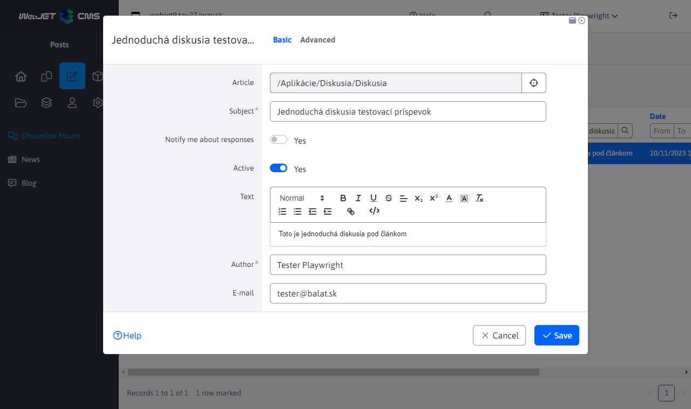
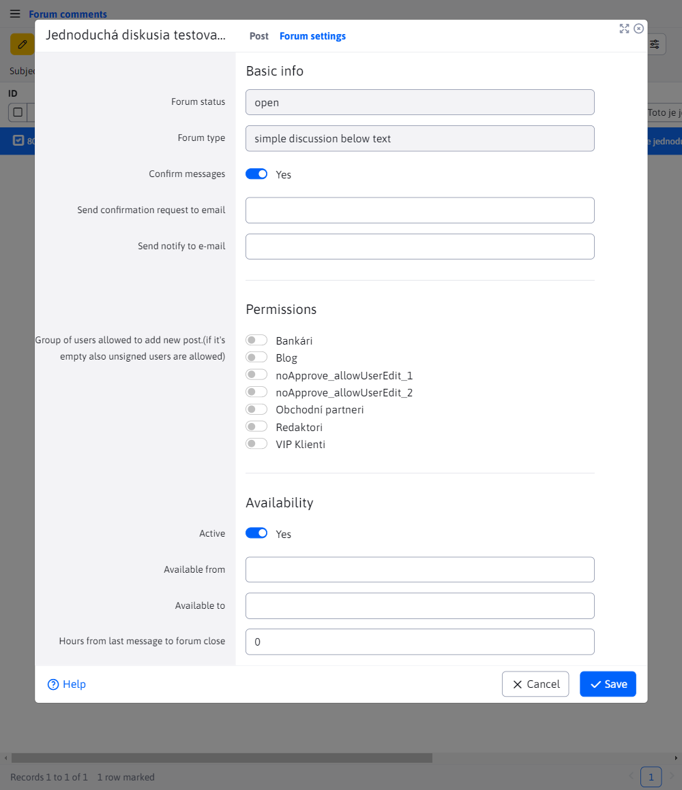
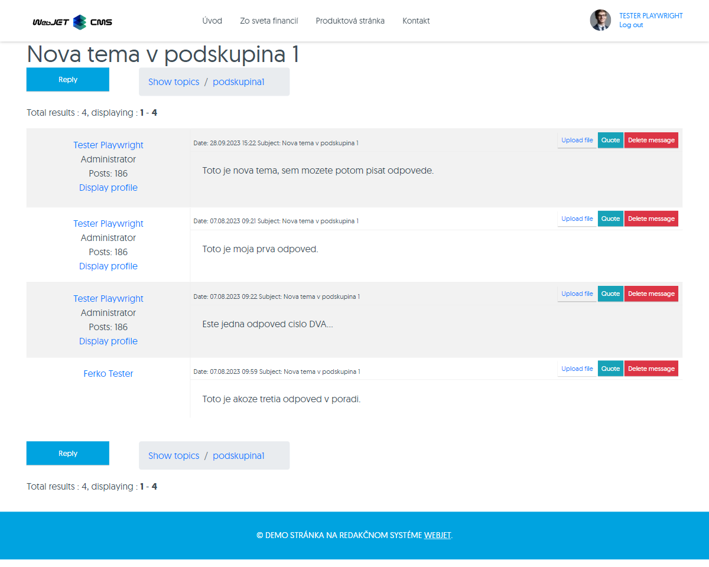
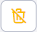
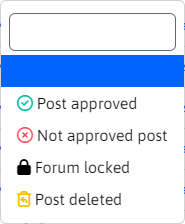
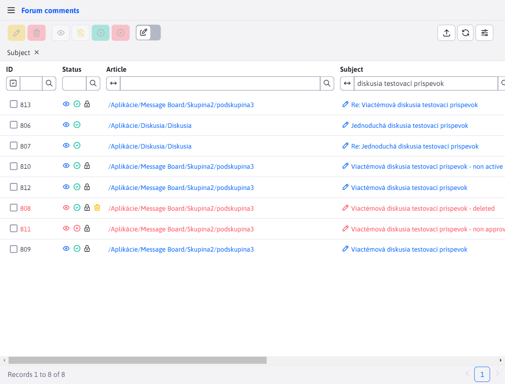
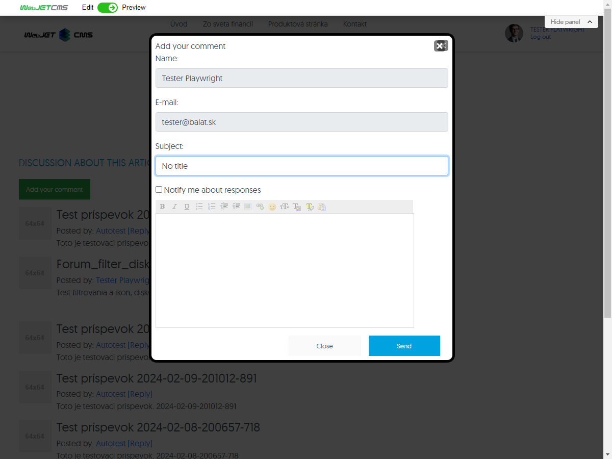
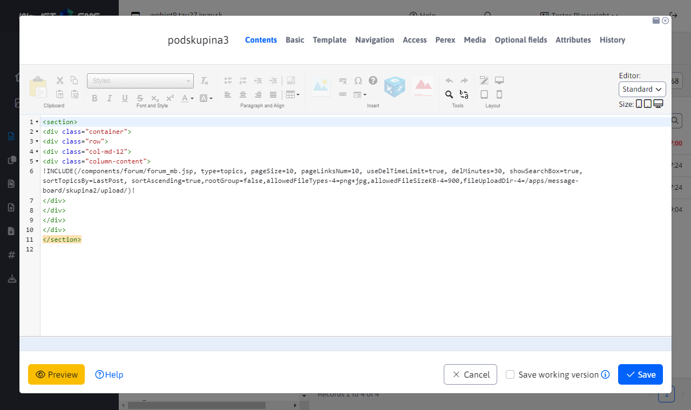

# List of discussions

A list of discussions can be found in the Contributions section. It contains a list of all posts that fall under **Discussion forum** a **Discussion Board**.


## Editing a post

Use the button to edit the post which invokes the editor and is active only if at least one post is selected. The editor can also be invoked by clicking on a column value **Headline** in the table.



Editing a post can be found in the editor tab **Post** and contains fields:
- **Article** - the web page to which the discussion is linked
- **Headline** - subject/title of the contribution
- **Send notification when replying to a post** - you can set to send a notification email
- **Active** - you can set the post activity
- **Text** - the text of the paper itself
- **Author** - name of the author of the paper
- **E-mail** - email address of the author of the post, notification is sent to it if the option to reply to the post is selected

## Discussion/forum settings

Setting the properties for the entire forum/discussion (all posts on one web page) can be found in the **Discussion settings**. It is divided into 3 sections.



### Section - Basic data

Contains basic information about the discussion forum in fields:
- **Status of the discussion forum** - informs about the activity of the discussion. If any of the limits are exceeded or activity is manually disabled, the status of the discussion board will be "closed" (more in [Section - Validity](#section-validity))
- **Forum type** - has the value of a "simple discussion under an article" or "multi-topic discussion (`Message Board`)"
- **Announcements - subtopics can only be created by administrators** - this field will only appear in the case of a "multi-topic discussion". If this option is selected, only administrators will be able to create announcements/sub-topics (see [Section - Access rights](#access-rights-section))
- **Validating contributions** - if you check this option, every time you add a new post, an email will be sent to the specified address with the text of the post and a link to this table, in which the post will be automatically filtered
- **Send confirmation request to e-mail** - a field containing the email where confirmation requests will be sent. The field itself will only be displayed if the option **Validating contributions** Selected. In this case, the editor will require you to enter this email.
- **Send notification to email** - this field has the same role as the field containing the email address to which an email is sent whenever any post is added to the discussion board.

### Section - Access rights

The section contains access rights settings. More specifically the selection of **Groups of users who can add a new post (if empty even unregistered users can)**. All groups, no groups or a combination of groups can be selected.

!>**Warning:** in the case of a "multi-topic discussion" forum, you also have the option to select **Groups of administrators**. If you are in the **Basic data** have chosen the option **Announcements - subtopics can only be created by administrators**, so by selecting these groups of administrators certainly, who will be able to create sub-topics.

### Section - Validity

The section contains fields:
- **Active** - you can set the discussion board activity. This is also subject to the following date and time restrictions.
- **Date of validity (from)** - set the date and time from which the forum should be active.
- **Date of validity (until)** - set the date and time of the forum expiration.
- **Number of hours since last post, to close the discussion** - if you set a value greater than 0, the constraint will be active.

## Post Views

Use the button to view the post  or directly clicking on the column value **Article** in the table.

The button is active only if at least one post is marked and works depending on the type of discussion the post belongs to.

**Discussion forum**

If the post belongs to the Discussion forum, pressing the icon  or a link in the column **Article** has the same result. You will be redirected to a web page where you will see all the posts, not just the one you got there through. This means that a particular post will not be filtered.


**Discussion board**

If the post belongs to the "Discussion Board", also referred to as `Message board`, the function will vary depending on what you press.

- If you use the link in the column **Article** you will be redirected to the main page of that multi topic discussion, where you will see a list of all topics in the discussion. From there, you can go directly to the topic by clicking on its title.


- If you use the button  you will be redirected directly to the discussion topic, where the list of posts will be. Again, the specific post will not be filtered but you will see the entire list.



## Actions over forums and posts

This chapter discusses the possible actions you can take over a forum post or an entire forum.

It should be remembered that **individual actions do not affect each other**. In practice, this means that a post that has already been deleted can also be rejected and locked. Or any combination of these actions.

### Deleting and restoring a post

Use the button to delete a post  and is only active if at least one post is marked. Deletion has two modes:
- Marked as deleted - the post will not be deleted from the database, only marked as deleted and will still be available in the table. Such a post can be restored again by clicking the restore button .
- Actual deletion from the database - the post will be deleted from the database and will never be accessible again.

Which background delete mode is used depends on the set configuration variable `forumReallyDeleteMessages`. If this configuration variable is set to `true` deleting the record from the database is also performed.

!>**Warning:**

- Both the delete action and the restore action are recursive actions. This means that not only the post itself is deleted/restored but the entire branch below it, so are all replies to that post and replies to replies.
- Deleted posts will no longer appear in the discussion and will reappear with the uploaded files when restored.

### Deleting and restoring the forum

If you decide to delete the entire forum, all posts under it will be deleted with it. The entire forum is hidden from visitors and it is not possible to return to it, even with a remembered url.

If you decide to restore the entire forum, all posts will be restored with it. The forum will be accessible to visitors again with all posts and uploaded files.

### Approval and rejection of the contribution

Use the button to approve the contribution  and the button to reject the contribution . Both of these buttons are only active if at least one post is selected. These actions are not limited and a post can be approved or rejected at any time.

!>**Warning:**

- Both the approve action and the reject action are recursive actions. This means that not only the post itself is approved/disapproved but the entire branch below it, so are all replies to that post and replies to replies.
- Rejected posts will no longer appear in the forum and will reappear in the forum with the uploaded files once they have been approved.

### Approval and rejection of the Forum

If you decide to reject the entire forum, all posts under it will be rejected along with it. The entire forum is hidden from the user and it is not possible to return to it, even with a remembered url.

If you decide to approve the entire forum, all posts will be approved with it. The forum will again be accessible to users with all posts and uploads.

### Locking and unlocking your allowance

To lock a post, you need to set the value of the field **Active** at `false` (do not select an option). The field is located in the post editor, more precisely in the tab **Basic**. When selecting the option **Active** (setting the value to `true`), the forum post will be unlocked.


!>**Notice**

- The lock action (setting a post as active) and the lock action (setting the forum as inactive) are recursive actions. This means that not only the post itself is locked/unlocked but the entire branch below it, so also all replies to that post and replies to replies ...
- locked posts continue to be displayed in the discussion, and uploaded files cannot be replied to, quoted, deleted or uploaded after unlocking, but all functions are enabled again for users

### Locking and unlocking the forum

Locking the entire forum is done by setting the value of the field **Active** at `false` (not selecting an option). The field is located in the post editor, more precisely in the tab **Discussion settings** and in section **Validity**. When selecting the option **Active** (setting the value to `true`), the entire forum is unlocked.


If you choose to lock the entire forum, or it locks after the expiration date, the forum is still displayed to visitors but cannot be edited in any way. This means that visitors cannot add/delete posts or upload files. The forum is marked in red and with an icon indicating the forum is locked.

If you decide to unlock the entire forum, or the expiration date occurs, the entire forum will be unlocked and editable again, as well as all posts in this forum (all posts will be preserved, even uploaded files, and all options will be enabled again for users).

## State of the debate

The table contains a special column **Status**, which contains icons indicating the status of the discussion.


Each record (regardless of status) contains a clickable "eye" icon that has the same function as the eye button  to view the post (more in the [Post Views](#view-contribution)).

The remaining status icons already have a meaning as well. A list of these icons as well as their description can be found in the filtering above the column **Status**.



From this list, the icon representing the Deleted post still functions as a button (as in the case of the eye icon) and has the same functionality as the corresponding button to refresh the post (more in the section [Deleting and restoring a post](#deleting-and-restoring-a-post)).

As mentioned with sections [Actions over forums and posts](#actions-over-forums-and-posts), the individual states do not affect each other and therefore a post can be locked and deleted at the same time or disapproved and locked at the same time. You can see this combination of states in the following figure.



## Working with the forum

In this section, I'll break down user work with the forum depending on its type. Or in other words, the user's options when working with the forum and posts/replies.

For more information on how the forum behaves in different states (the forum itself and the posts, not the user's options in the forum), see [Actions over forums and posts](#actions-over-forums-and-posts).

### A simple discussion

If it is a simple discussion forum, the visitor has only 2 options:
- adding a new post
- reply to an existing post

The average visitor does not see posts that are either deleted or disapproved (or replies to those posts). However, locked posts can be seen.


**Adding a new post**

Anyone can add a new post in a simple discussion. If it is a logged-in user, their name and email will be set automatically in the form. In the case of a non-logged-in user, the forum will require at least a name (email is optional). The newly added post will automatically be saved at the top of the list (or at the bottom of the list - this may depend on the order direction set).

It applies that adding a new post is only possible if **the forum is not locked** so it's active. Otherwise, the visitor will see all posts and replies, but will not be able to add new posts.



**Reply to an existing post**

When replying to an existing post, the same rules about the user apply as when adding a new post. You can only reply to a post (the amount is not limited) but you cannot reply to a reply.

The option to reply to posts GLOBALLY is only available if **the forum is not locked** so it's active. You can't reply to posts in a locked forum except to add a new post, so it's read-only.

The option to reply to individual posts (LOCAL) is only available if **post is not locked** so active. If only some posts are locked, they are visible with their replies but no further replies can be added to such a post.

### Multi-topic discussion (Message Board)

For a multi-topic discussion forum, the visitor has the following options:
- creating a new topic
- replying to a post
- answering the reply
- attaching the file to the reply/citation
- deleting a reply

The average visitor does not see posts that are either deleted or disapproved (or replies to those posts). However, locked posts can be seen.


**Replying to a post**

Replying to a post has the same rules as described for replying to a post in a simple discussion.

Also, as with a simple discussion, adding a new post (reply) is only possible if **the forum is not locked** so it's active. Otherwise, the user will see all posts and replies, but will not be able to add new posts (replies).

**Replying to replies (Quote)**

If we are directly in a discussion, responding to a topic of discussion is called a reply (as mentioned above). However, if we are already replying to replies, we call it **Citation**. You can cite all contributions and even other citations. In practice it may look something like this:

```
príspevok
|_odpoveď 1, na príspevok
| |_odpoveď (citácia) 1, na odpoveď 1
| |_odpoveď (citácia) 2, na odpoveď 1
|   |_odpoveď (citácia) 1, na citáciu 2
|_odpoveď 2, na príspevok
```

We get a tree of answers and citations to answers or citations to other citations. Such a tree can have several levels (it is not limited).

The option to quote answers GLOBALLY is only available if **the forum is not locked** so it's active. The locked forum is read-only.

The option to quote answers LOCALLY is only available if **reply (aka post) to a post is not locked**, so the answer is active. If only some answers are locked, they are visible with their citations, but additional citations cannot be added to such answers.

If all conditions are not met, the corresponding button to perform the action will not be displayed.

**Attaching a file to the reply/citation**

Files can be attached to the response as well as to the citation.

It is true that:
- attach file(s) can **logged in user only**
- the user must belong to a group that is allowed to attach a file
- the user is allowed to attach a file **only to your own answers/quotes**
- an unlimited number of files can be attached
- the file must meet the set limits as well as the type
- **Warning:** if the whole forum or only some replies/quotes are locked, the same logic applies as in the case of replying to a post or quoting.

If all conditions are not met, the corresponding button to perform the action will not be displayed.

Who can upload files, what files and what size is set in the discussion forum web page by setting the parameter `fileUploadDir-ID_SKUPINY=/files/cesta/k/priecinku/` as shown in the picture below.



**Deleting a reply/quote**

The forum provides the option to delete both the reply and the quote. For more information on the event itself, see [Deleting and restoring a post](#deleting-and-restoring-a-post).

It is true that:
- delete a reply/quote can **logged in user only**
- the user may only delete posts that he/she has created himself/herself

If all conditions are not met, the corresponding button to perform the action will not be displayed.

### Admin view vs user view

It is true that the administrator can do anything while working with the forum, without limitation. This means:
- sees all forums, even the deleted and unapproved ones (not visible to normal users)
- in a simple discussion can add posts and reply to posts without limit (the user is limited by the forum or post status)
- in a multi-topic discussion can reply/quote/upload/delete unlimitedly (the user is limited by the state of the forum, replies/quotes etc...)

Admin's only limitation is the fact that he can't see deleted/unapproved replies/quotes (aka posts) in a multi-topic discussion. The reason for this is so that these posts don't get in the way of him reading the discussion.

The administrator still has the ability to edit such posts. You can read more about these edits in [Actions over forums and posts](#actions-over-forums-and-posts).
